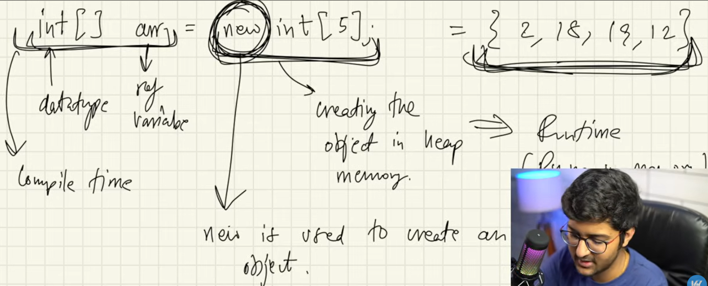
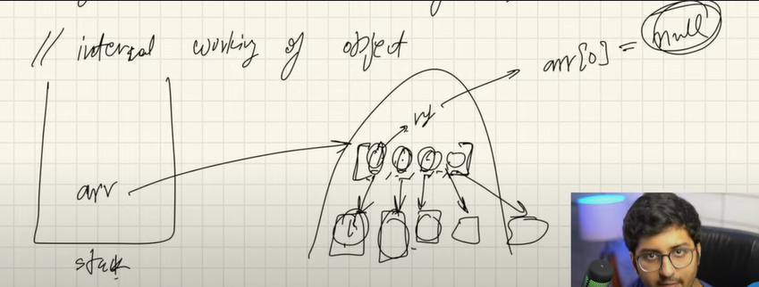
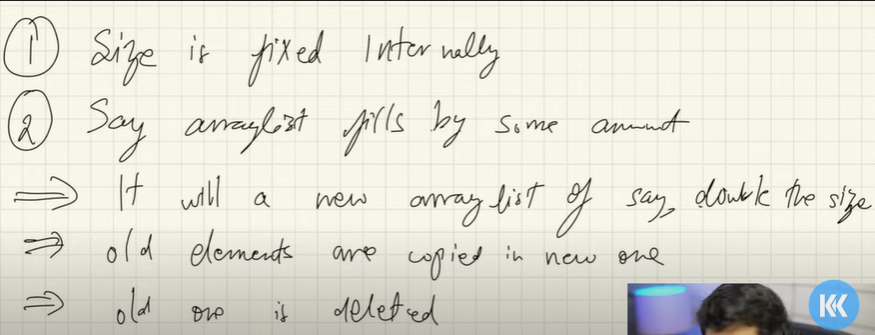
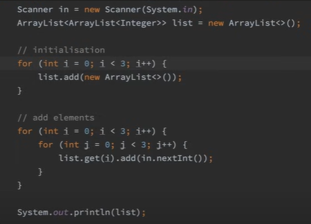

# Arrays and ArrayList

Int[] arr; => Declaration of array: arr is defined in the stack.

arr = new int[5]; => Initialization: object is been created in the heap

> Note : Specifying the length of arr is mandatory

Int[] arr = new int[5]

### In C/ CPP array is a continuous block of memory. In Java that’s not the case.
1. Ref variable are stored in Stack.
2. Array objects are stored in heap.
3. Heap object are not continuous is specified in JLS Java Language Specification.
4. Dynamic memory allocation.
5. Thus, Array allocation may not be continuous it depends on JVM.

## Defaults values of array:
1. Integer - 0
2. String - null    -------------------------> null is a special literal which can only be assigned to non-primitives. Any reference variables value before initialization is null.

> Note: In python there are no primitives everything is an object

## Array of Objects

*In Heap, array of reference variable will be stored which will again point to objects stored elsewhere in the heap memory.*

## ArrayList - Variable length array

ArrayList<Datatype Wrapper Class> variableName = new ArrayList<>(Initial Capacity);

There are various methods like - .add, .get, .contains, .set(index, value), .remove 

> Internal functionality for layman - It is achieved in O(1)

## Multi-Dimensional Array list

