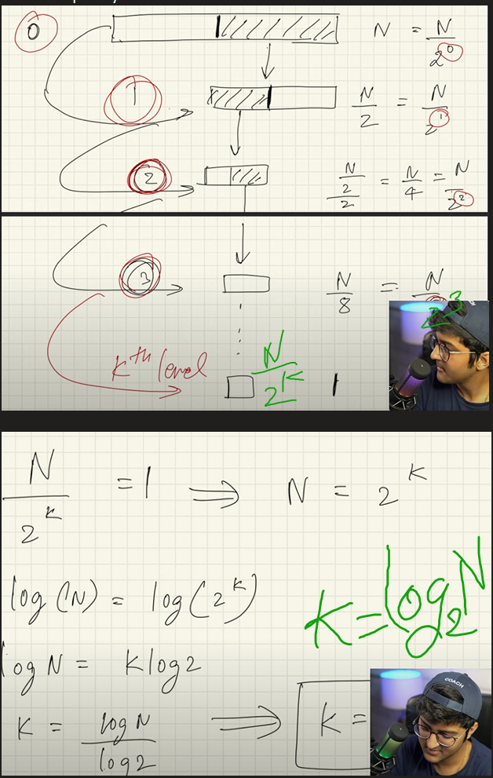
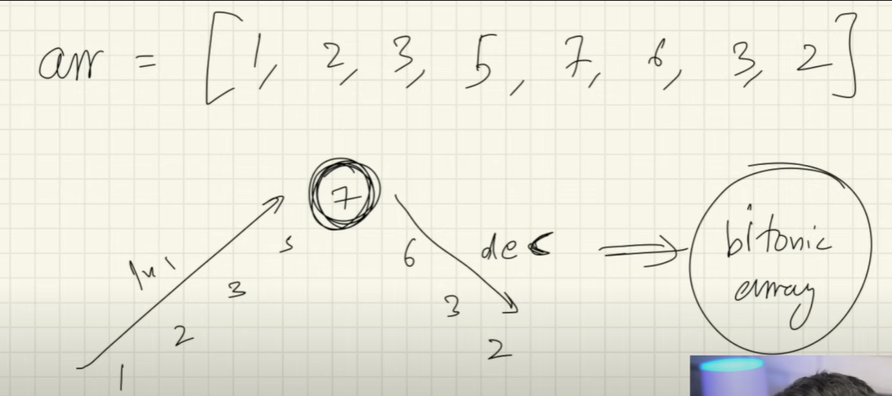

# Searching Algorithm

## Crazy Way to calculate

1. number of digits - 

    (int)(Math.log10(number)) + 1
    
    **But only works for positive numbers.**
    
2. Number of digits in binary representation
    
    (int)(Math.log2(number)) + 1
        
3. Number of digits in octal representation
    
    (int)(Math.log8(number)) + 1

## Linear Search

### Time Complexity:

1. Best Case: In the best case, the key might be present at the first index. So the best case complexity is O(1)
2. Worst Case: In the worst case, the key might be present at the last index i.e., opposite to the end from which the search has started in the list. So the worst-case complexity is O(N) where N is the size of the list.
3. Average Case: O(N)

## Binary Search

### Time Complexity: 
1. Best Case: O(1)
2. Average Case: O(log N)
3. Worst Case: O(log N)

### How time complexity is calculated


### Where to use Binary search -
1. Whenever sorted array is given
2. Whenever continuous sequence is followed e.g. Square root of number etc.

### Major Use Case of Binary number
1. Ceiling of number.
2. Bitonic array


### 2D Array Binary search

```java
int row = 0;
int col = matrix[0].length - 1;
while(row < matrix.length && col >= 0){
    if(matrix[row][col] == target){
        return matrix[row][col];
    }else if(matrix[row][col] < target){
        row ++;
    }else{
        col --;
    }
}
return -1;
```
