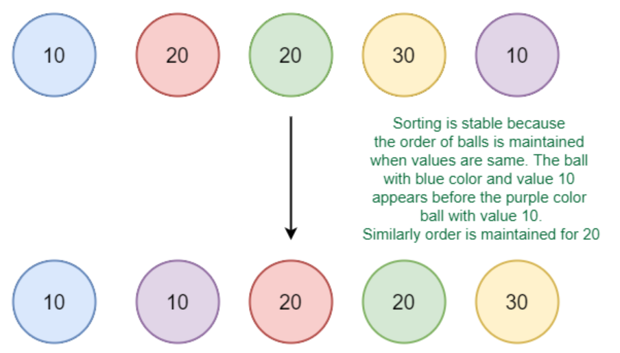
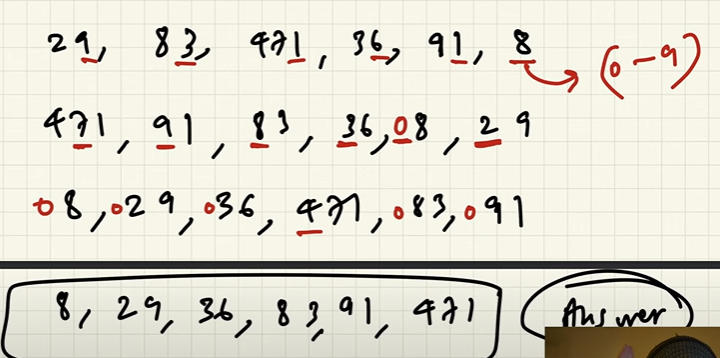

# Sorting Algorithm

## Stable Algorithm


### Which sorting algorithms are stable?
Some Sorting Algorithms are stable by nature, such as ***Bubble Sort, Insertion Sort, Merge Sort, Count Sort,*** etc. Other non-comparison-based sorts such as Counting Sort maintain stability by ensuring that the Sorted Array is filled in reverse order so that elements with equivalent keys have the same relative position. Some sorts such as Radix Sort depend on another sort, with the only requirement that the other sort should be stable.

### Which sorting algorithms are unstable? 
***Selection Sort, Quick Sort, Heap Sort etc.***, can be made stable by also taking the position of the elements into consideration. This change may be done in a way that does not compromise a lot on the performance and takes some extra space, possibly θ(n) .

## Bubble Sort

### Explaination

Bubble sort is a simple sorting algorithm that repeatedly compares adjacent elements in a list, swapping them if they are in the wrong order, until the entire list is sorted, essentially causing larger elements to "bubble up" at the end after each itteration.

### Time Complexity

1. Best Case Time Complexity Analysis of Bubble Sort: O(N)
    
    The best case occurs when the array is already sorted. So the number of comparisons required is N-1 and the number of swaps required = 0. Hence the best case complexity is O(N).

2. Worst Case Time Complexity Analysis of Bubble Sort: O(N2)
    
    The worst-case condition for bubble sort occurs when elements of the array are arranged in decreasing order.In the worst case, the total number of iterations or passes required to sort a given array is (N-1). where ‘N’ is the number of elements present in the array.

3. Average Case Time Complexity Analysis of Bubble Sort: O(N2)
    
    The number of comparisons is constant in Bubble Sort. So in average case, there are O(N2) comparisons. This is because irrespective of the arrangement of elements, the number of comparisons C(N) is same.

> Stable Algorithm

## Code
```Java
        for (int i = 0; i < arr.length; i++) {
            boolean swapped = false;
            for(int j = 0; j < arr.length - 1 - i; j++){
                if(arr[j] > arr[j + 1]){
                    int temp = arr[j];
                    arr[j] = arr[j + 1];
                    arr[j + 1] = temp;
                    swapped = true;
                }
            }
            if(!swapped){
                break;
            }
        }
        return arr;
```

## Selection Sort

### Explaination
Selection sort repeatedly finds the smallest/largest element in an unsorted part of an array and swaps it with the first/last element of that unsorted part, gradually building a sorted section until the entire array is sorted.

### Time Complexity Analysis of Selection Sort:
1. Best-case: O(n2), best case occurs when the array is already sorted. (where n is the number of integers in an array)
2. Average-case: O(n2), the average case arises when the elements of the array are in a disordered or random order, without a clear ascending or descending pattern.
3. Worst-case: O(n2), The worst-case scenario arises when we need to sort an array in ascending order, but the array is initially in descending order.

> Unstable ALgorithm

### Code
```Java
        for(int i = 0; i < arr.length; i++){
            int max = 0;
            for(int j = 1; j < arr.length - i; j ++){
                if(arr[max] < arr[j]){
                    max = j;
                }
            }
            int temp = arr[max];
            arr[max] = arr[arr.length - i - 1];
            arr[arr.length - i - 1] = temp;
        }
        return arr;
```

## Insertion Sort

### Explaination
Insertion sort is a sorting algorithm that iteratively builds a sorted list by taking one element at a time, comparing it to the already sorted portion, and inserting it in the correct position within that sorted section.

### Time Complexity
1. Best case: O(n) , If the list is already sorted, where n is the number of elements in the list.
2. Average case: O(n^2 ) , If the list is randomly ordered
3. Worst case: O(n^2 ) , If the list is in reverse order

>Stable Algorithm

### Code
```Java
        for(int i = 0; i < arr.length - 1; i++){
            //Make LHS as sorted array
           for(int j = i + 1; j > 0; j--){
            if(arr[j] < arr[j - 1]){
                int temp = arr[j - 1];
                arr[j - 1] = arr[j];
                arr[j] = temp;
            }else{
                break;
            }
           }
        }
        return arr;
```
## Cyclic Sort

### Explaination
Cyclic sort is an in-place sorting algorithm that iteratively places each element in its correct position by repeatedly swapping elements within a cycle formed by mismatched values, effectively "rotating" elements until the array is sorted, assuming the **elements are within a known range and unique**.

> ***Note:*** Whenever Question states that number exist between 1 to N always check if cyclic sort can be used.

### Time Complexity

1. Worst Case : O(n) 
2. Average Case: O(n) 
3. Best Case : O(n)

>Unstable Algorithm

### Code
```Java
        int i = 0;
        while(i < arr.length){
            if(arr[i] != i + 1){
                int realPosOfi = arr[i] - 1;
                int temp = arr[i];
                arr[i] = arr[realPosOfi];
                arr[realPosOfi] = temp;
            }else{
                i++;
            }
        }
        return arr;
```

## Count Sort

Non comparison sorting Algorithm good for small numbers.

### Explanation 

1. Find largest number.    
2. Create array of size largest number + 1.
3. Create frequency array count the number of occurrence of each number. Where index = original number.
4. Traverse the frequency array and replace the original array.
5. Instead of using array use hashMap. But items are not sorted. But as we no the maximum we can start map.get(i) i -> 0 to n.
6. Ideally best solution is array.

### Time Complexity

Time Complexity = O(length of original array + length of frequency array). Same for space complexity.

### Advantages 

It is a stable algorithm.

### Disadvantage

1. Doesn't work for decimal values.
2. Not suitable for large value.

### Code
```java
    public static void countSort(int[] arr){
        if(arr == null || arr.length <= 1){
            return;
        }

        int max = arr[0];
        for(int num : arr){
            if(num > max)max = num;
        }

        int[] countArr = new int[max + 1];

        for(int num : arr){
            countArr[num]++;
        }

        int index = 0;
        for(int i=0; i <= max; i++){
            while(countArr[i] > 0){
                arr[index] = i;
                index++;
                countArr[i]--;
            }
        }
    }
```

## Radix Sort

### Explanation

1. Find the largest number with most digits.
2. Run count sort on the basis of maximum digits amongst the number. `for(int exp = 1; max/exp > 0; exp *= 10)` Main key logic
3. Sort the array on the basis of bases.`count[ (arr[i]/exp) % 10]++;` key logic.

Sort the array using count sort digit by digit, sorting form least to max. Count sort can be used coz digits can vary between 0 to 9 only.



### Code

```java
    public static void RadixSort(int[] arr){
        int max = Arrays.stream(arr).max().getAsInt();

        //Count sort for every digit place.
        for(int exp = 1; max/exp > 0; exp *= 10){
            countSort(arr, exp);
        }
    }

    private static void countSort(int[] arr, int exp){
        int n = arr.length;
        int[] output = new int[n];
        //Max elements can be 10
        int[] count = new int[10];

        Arrays.fill(count, 0);

        for(int i = 0; i < n; i++){
            count[ (arr[i]/exp) % 10]++;
        }

        System.out.println("Count array for "+ exp+" : "+ Arrays.toString(count));
        //This counts overall position where the digits should be
        for(int i = 1; i < 10; i++){
            count[i] = count[i] + count[i - 1];
        }
        
        System.out.println("Count array updated for "+ exp+" : "+ Arrays.toString(count));

        for(int i = n -1; i >=0 ;i--){
            //Position of arr[i]'s base value in count matrix denotes the index in output
            output[count[(arr[i] / exp) % 10] - 1] = arr[i];
            count[(arr[i] / exp) % 10]--;
        }

        System.out.println("Output array for "+ exp+" : "+ Arrays.toString(output));

        System.arraycopy(output, 0, arr, 0, n);
    }
```

### Time complexity - 

Time - O(Digits * (N + base)) where base = 10

### Advantage -

Best for large datasets.

### Disadvantage - 

Not for small datasets. Space grows linearly for small dataset.

>**Note :** Difficult algorithm to code needs practice.