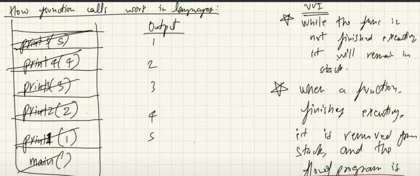
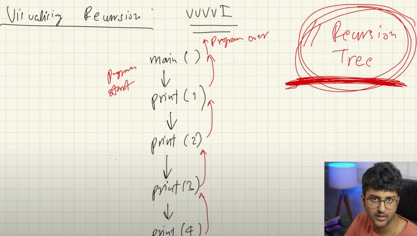
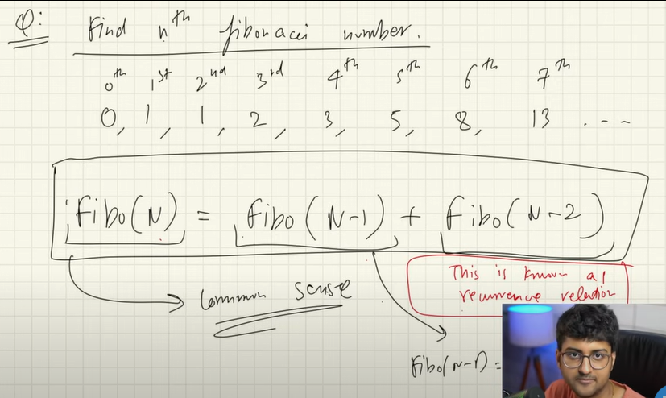
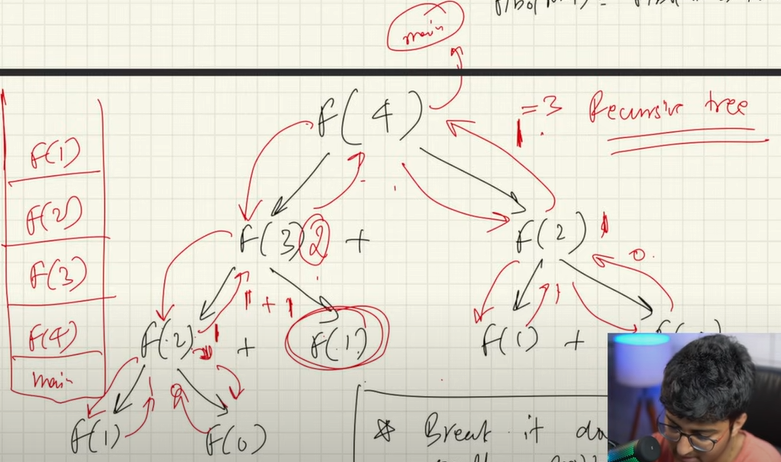

# Recursion

## Function Calls

Function Calls goes into stack memory. When funtion gets executed it gets popped from the stack and flow is returned from where it was called from.

## Recursion

Funtion which call itself which has terminating *Base Condition*. When same function is called again and again new function will take new memory in the stack for each call.

### Why Recursion?

- It helps in solving bigger/complex problems in a simple way
- All recursion solution can be converted into iteration i.e. loops and vice versa for optimized solution.
- Space Complexity of recursion is not constant because of calls whereas iteration gives constant space complexity.

## Recursion Tree

Visualizing Recursion is understanding Recursion tree. 

## Understanding Problem

1. Fibonacci Number

*Logic - Recurence Relation*

*Recursive Tree*

### Identify and understanding problems

1. Identify if problem can be broken down into smalled problem

2. Write the recurrence relation

3. Draw the recurrsive tree

4. About Recurrsive tree
    - Flow of the functions
    - Identify and focus on left and right tree calls
    - Draw the tree and pointers on the paper
    - Use debugger to cross check the result

5. Focus on returned value in each step
 
## Types of recurrence relation

1. Linear recurrence relation e.g. Fibonacci number where the recurrsive calls reduce by 1 each time ineffective way of recurssion without dynamic programming

2. Divide and conquer recurrence relation e.g. Binary search where the reduction is by factors