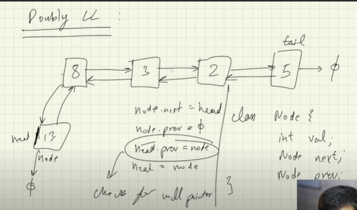
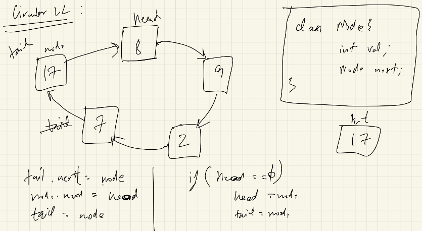
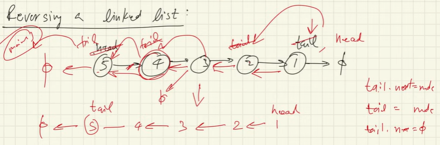
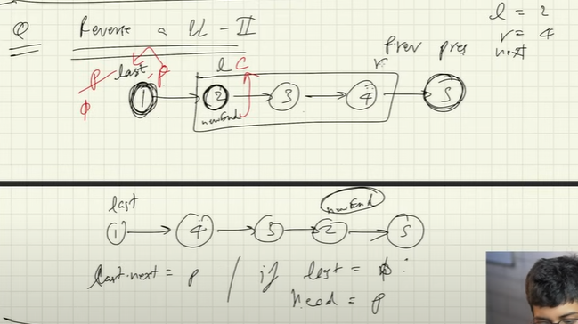
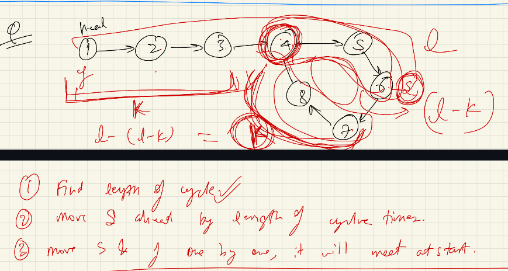
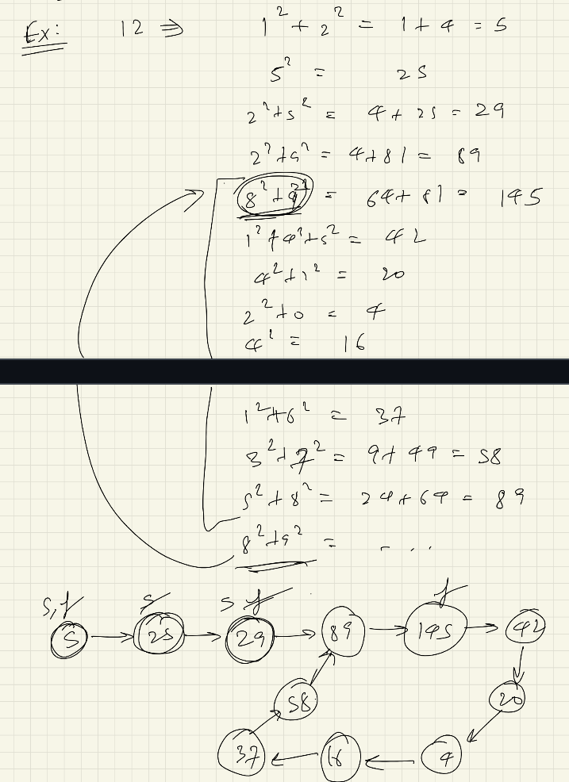

# Linked List

## Structure

Head -> Nodes -> Nodes -> Tail -> null

```java
class Node{
    int val;
    Node next;
}
```

# Doubly Linked List

## Structure


```java
private class Node{
    int value;
    Node next;
    Node prev;
}
```

# Circular Linked List



```java
class Node{
    int val;
    Node next;
}
```

# Recursion in Linked List

Two approach -

1. Void return type and make changes in linked list
2. Node return type that returns the list node to change the structure.

## Reverse using recursion with head and tail


1. First reach the end node make it head.
2. Going back from above call we reach 2nd last node make tail.next = node, and make new node as tail make it's next as null.
3. Repeat.

### Using iteration reversing part of linked list
 

[Code - reverseBetween](../LeetCode/ReverseLinkedList.java)

## Palindrome linked list

1. Find middle.
2. Reverse the second half.
3. Keep on checking from head and middle if the list is equal.

# Fast and Slow pointer

## Cycle detection

1. Contains cycle.
2. Calculate length of cycle.
3. Start point of cycle
    - When slow and fast coincide.
    - start from head and continue slow.
    - There intersection is start of cycle. 
    

## Happy Number

A happy number is a number defined by the following process:

1. Starting with any positive integer, replace the number by the sum of the squares of its digits.
2. Repeat the process until the number equals 1 (where it will stay), or it loops endlessly in a cycle which does not include 1.
3. Those numbers for which this process ends in 1 are happy.

*Non Happy number keeps on repeating value even happy number keep on repeating to 1*

>**Note :** Thus we can use fast and slow pointer.

## Middle of Linked List

If slow is traveling with x speed and fast is traveling with 2x speed so by the time fast reaches tail slow reaches half the list's distance.

>**Note :** Don't give direct solution first provide solution by calculation complete length then track to it's half then provide this solution where middle can be found by single traversal.

