# Tree

### Why ?

- Insertion, deletion and retrieval - O(log n).

## Binary Tree

### Why ?

- Binary Search Tree
    - Ordered Storage
        - Left will be less than root.
        - Right will be greater than root.
    - Cost Efficient
        - Adaptive insertion and deletion no restructuring required.

### Limitation

1. Unbalanced Binary tree can't retrieve in O(log n)

    
    *Retrieve in O(n)*

    > **Solution :** Self Balancing Binary tree.

2. Inefficient for sorted data.

### Usage

1. File systems
2. Databases
3. Algorithms/Networking
4. Maths
5. Machine Learning
6. File compression
7. Future DS - Hash, Graph.

### Structure

```java
```

### Properties

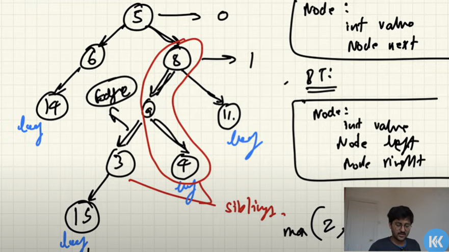

1. Size - Number of nodes.
2. Root - Topmost parent-less node.
3. Child and Parent - Root and its just subsequent nodes.
4. Siblings - Nodes having same parents.
5. Edges - Connecting link between two nodes.
6. Height - Maximum number of edges from node to leaf node. Top to Bottom
7. Leaf - Bottom-most nodes.
8. Level - Difference of height of root and height of node or maximum number of edges from node to root node. Bottom to top.

    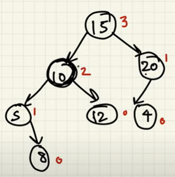

9. Ancestor and Descendant - Pre parent node and post child node.
10. Degree - Number of Edges or number of children. Degree of tree is the max degree amongst the nodes present in the tree.


### Types of Binary tree

1. Complete Binary tree 

    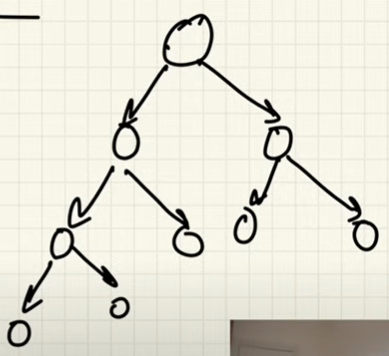

    - All the level are full except last level.
    - Last level is full from left to right.

2. Full/Strict binary tree

    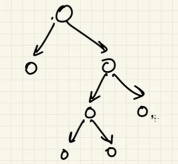

    - Each node has either 0/2 children no single child.

    >**Note :** Used in compression Huffman coding, Segment tree.

3. Perfect Binary tree
    - All levels are full.

4. Height Balanced Binary tree
    - Average height is O(log n).
    - Example - AVL, Red and Black.

5. Skewed Binary tree

    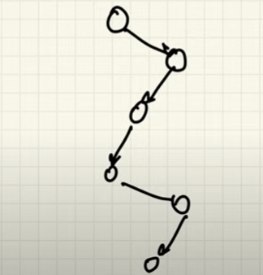
    
    - Every node has only 1 child
    - Height O(n) like Linked list

6. Ordered Binary tree
    - Every node has some property
    - Example Binary search tree.

7. Balanced Binary tree
    - Height difference between any two nodes should be less than or equal to 1

    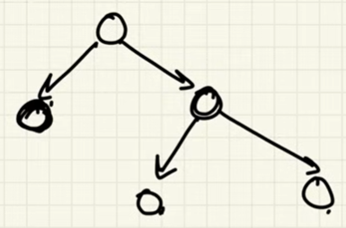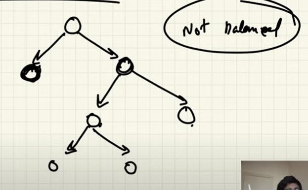

8. Binary Search tree
    - For every Node, all the children to the left have value less than the node, and value is greater on the right.
    - Comparison is being done with only element as any level thus the height is log(n) and hence operations require log(n) time complexity. 
    - Inserting Sorted array can be done by simply picking middle and then inserting it.

### Properties of types of Binary trees

1. Perfect Binary Tree
    - Total Nodes for PDT with height h = 2^(h + 1) - 1.
    - Perfect Binary tree has the most number of nodes.
    - Leaf Nodes = 2^h
    - Internal node = 2^(h + 1) - 1 - 2^h = 2^h - 1
    - With N number of leaves = log(N) + 1
    - N nodes = log(N + 1)

3. Strict Binary tree

    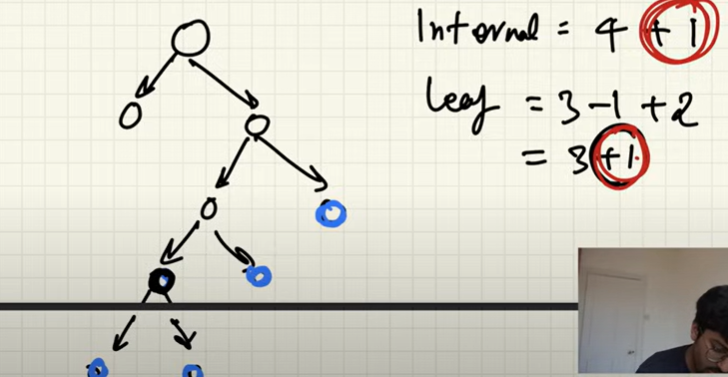
    *Both Internal and Leaf are increased with same value hence the formula holds true*
    - Internal nodes with N leaf nodes = N - 1
    - No of leaf nodes = No of internal node + 1
    - No of leaf nodes = 1 + No of internal node with 2 children (not including root)

### Implementation

1. Linked Representation i.e. using pointers.
2. Sequential i.e. using array.
    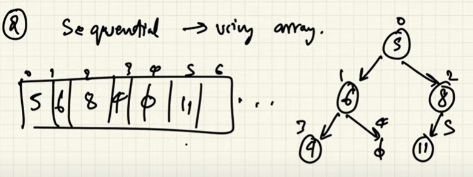
    *Can have less memory overhead e.g implementation of heap*
3. Time complexity - O(log n)
    
    Proof - 
    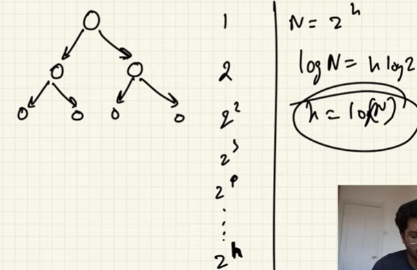
    *Height - log(N)*

4. Insertion - 
    - Check if insert left.
    - Check if insert right.


### Traversal

1. Pre-Order - Node -> Left -> Right
    
    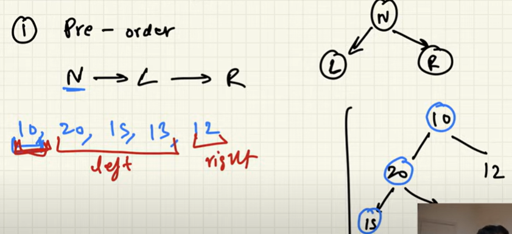

    **Uses** - Making copy of tree, mathematical expression and serialization. 

2. In-Order - Left -> Node -> Right

    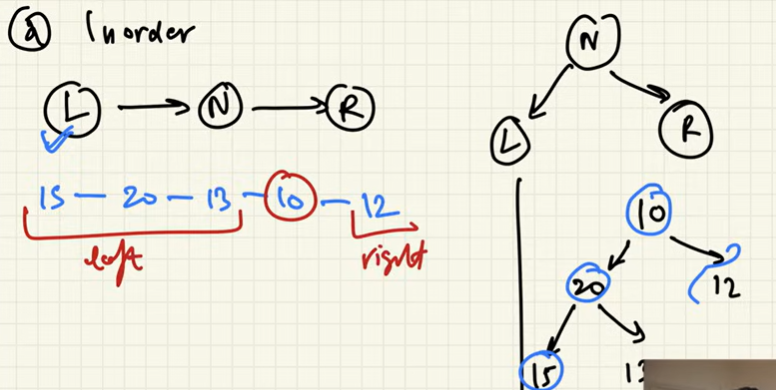

    **Uses** - In BST sorted printing.

3. Post-Order - Left -> Right -> Node

    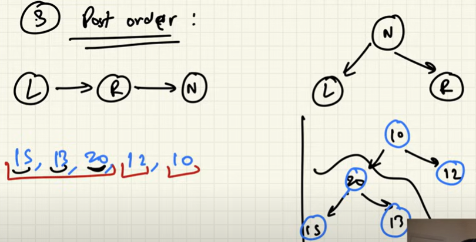

    **Uses** - Deletion in binary tree as dependencies needs to be eliminated, bottom-up calculation.

### Search/Traversal

1. Breath first search/ Breath first traversal

2. Depth first search/ Depth first traversal

## AVL(Adelson-Velskii and Lendis) - Self balancing binary tree.

**Balanced Tree -** For every node in the tree the difference in height of left and right subtree of that node should be less than equal to 1.

### Algorithm - 
1. Insert normally node N.
2. Start from the N move upward and find which node is making unbalance.

    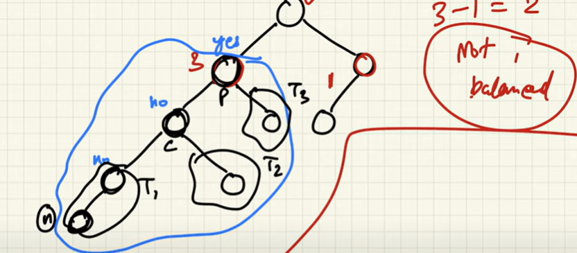

3. Use one of 4 rules rotate which keeps the logic of BST true while making things balance

    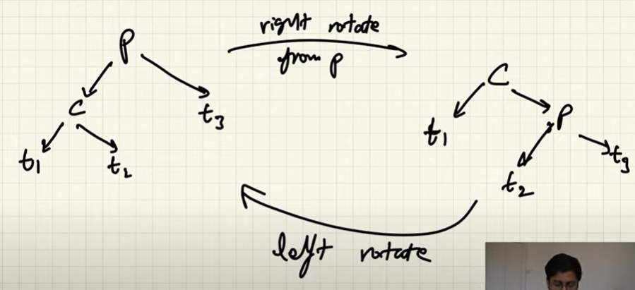

4. If tree is balanced then addition of node and balancing the subtree will in return balances the whole tree.

4. Rules

    - Left - Left case : Child and Grand-child in left.

        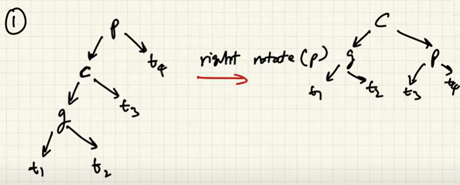
    
    - Left - Right case :

        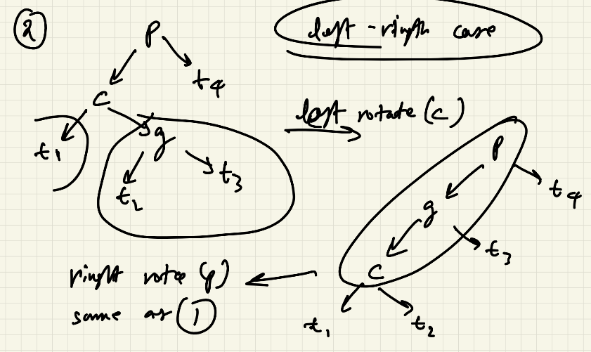
    
    - Right - Right case : 

        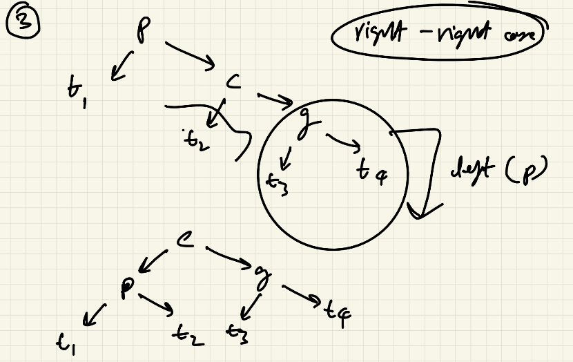

    - Right - Left case :

        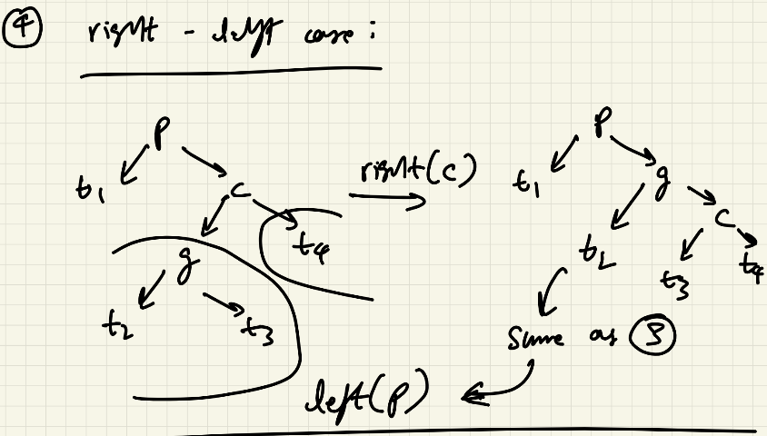

    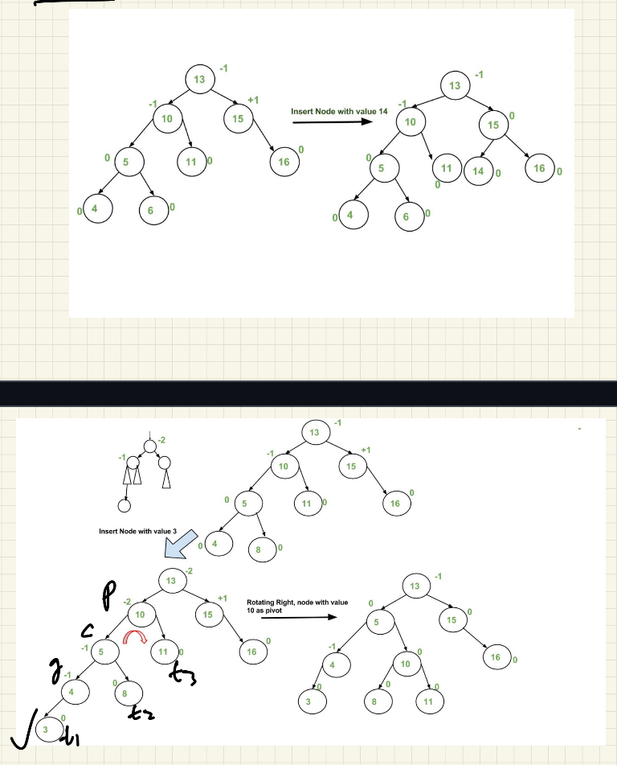

    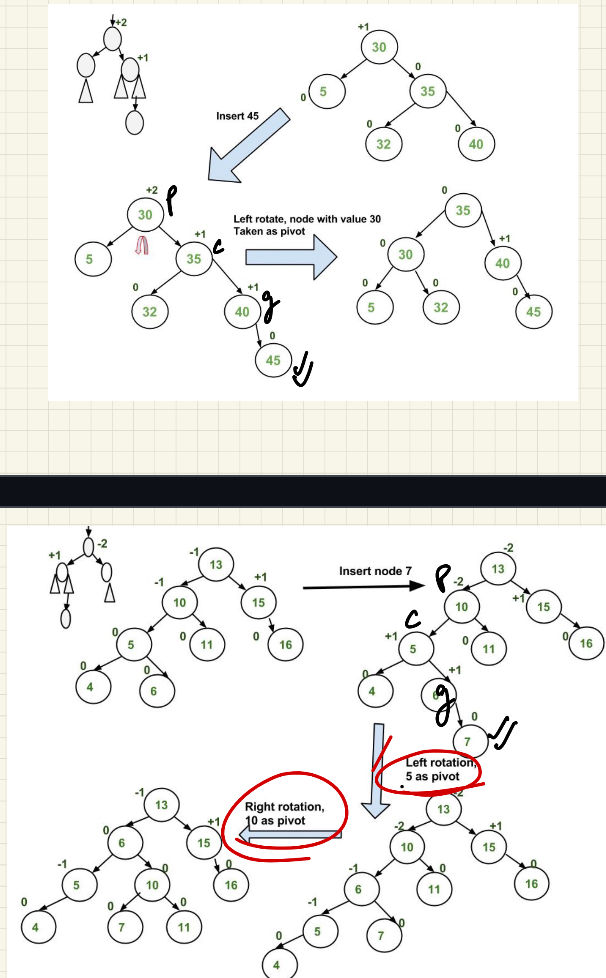

    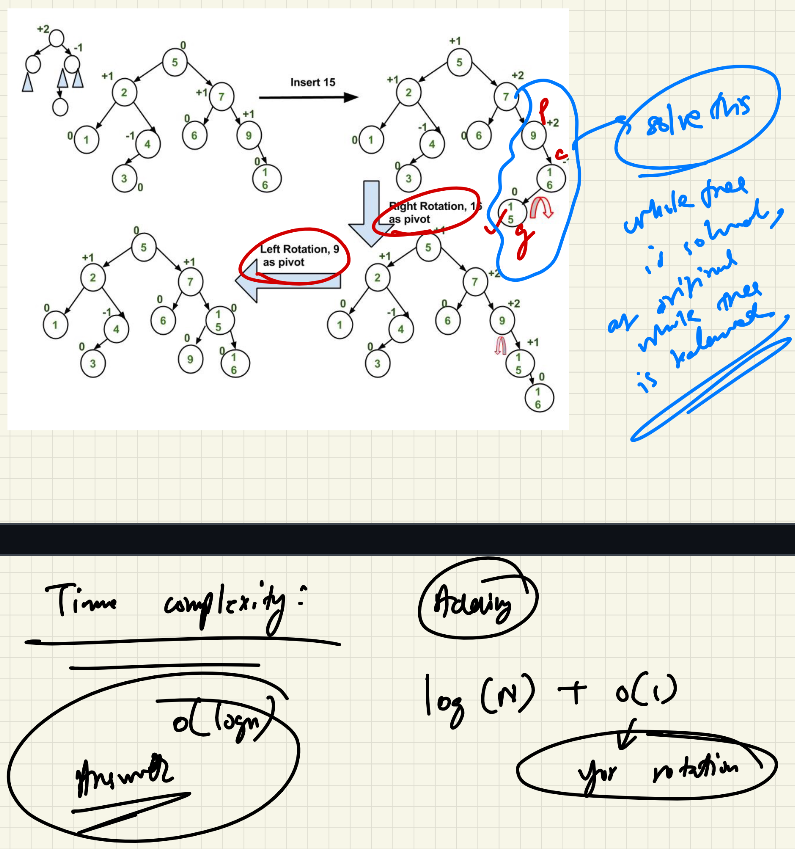

### Time Complexity

    Insertion - Log(N) & Rotation is static either 2 or 3 thus O(1). Thus Log(N)

## Segment Tree

Segment Tree is a binary tree which has interval info & operation.

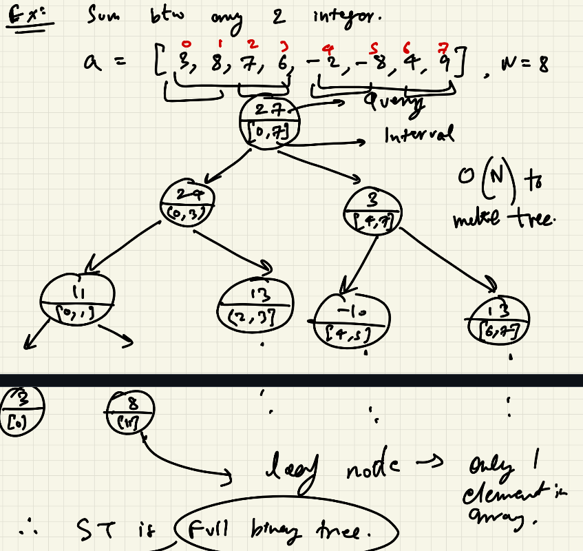


### When to use?

Perform query on a range - like sum, max, avg, min or prod e.g. sum of all the number within given indices in O(log(N)). 

>**Note :** Update also take O(log(N)).

### Creation 

    It takes O(n). But it is one time which makes things easy later on.

### Querying

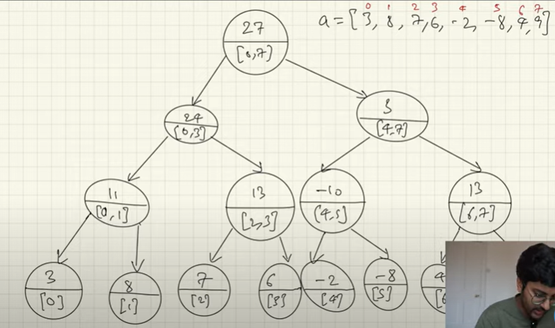

E.g. sum btw [2, 6] amongst [0, 7]

There can be 3 cases - 

1. Node interval is inside query interval - [2,3], [4,5], [6,6]
    
    - Return the value.

2. Node interval is completely outside query interval - [0,1], [7,7]

    - Return default value of the query, in this case 0.

3. Overlapping - [0,7], [0,3], [4,7], [6,7]

    - Call left and right.

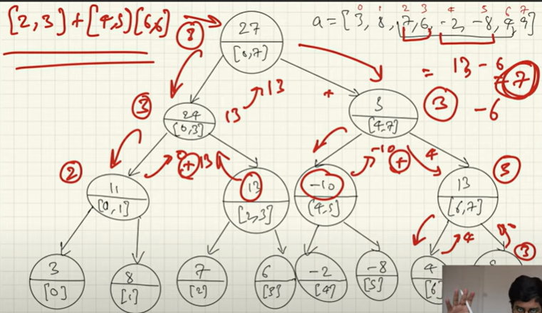

### Updating

E.g. Change index 3 with 14

Check whether index lies in range.
- Yes then check child nodes
    - If child range is out no change in value just return.
    - Eventually we will reach leaf, update leaf as recursion will update the tree.

    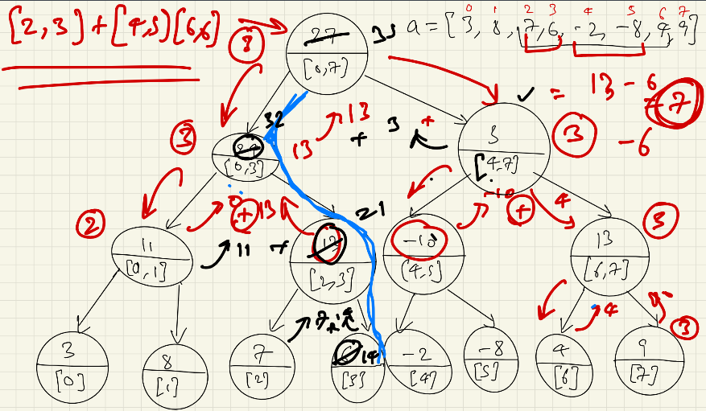
    *Blue marks the update*

## Breath First Search

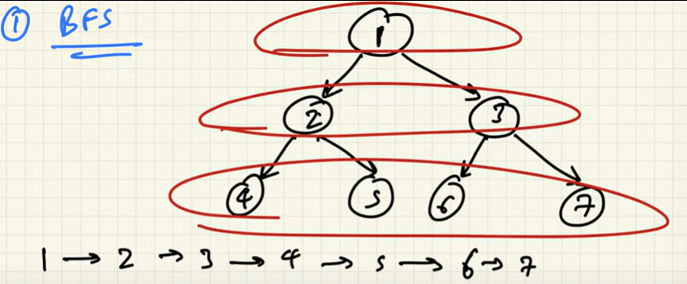

When to use - 
1. When answer lies near the root node.
2. When you are asked to search by level - like sum all the nodes in a level.

It can be done by using an array/queue to store the left and right nodes.

Time Complexity - O(n).
Space Complexity - O(n/2). As maximum number of nodes are Leaf nodes at a time thus having to store only them.

## Depth First Search

Pre, Post and In Order are example of DFS.
