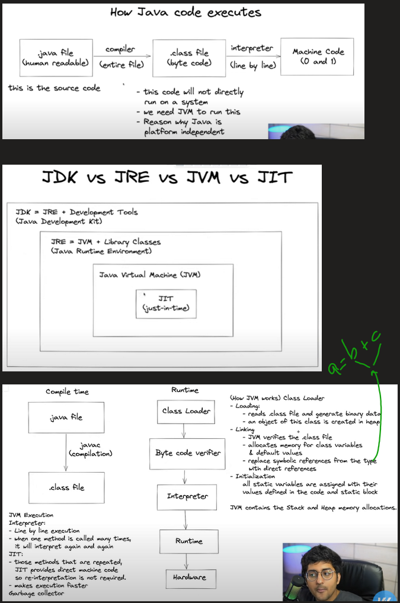
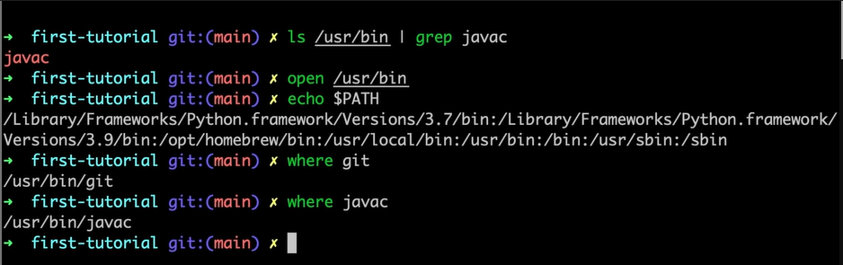
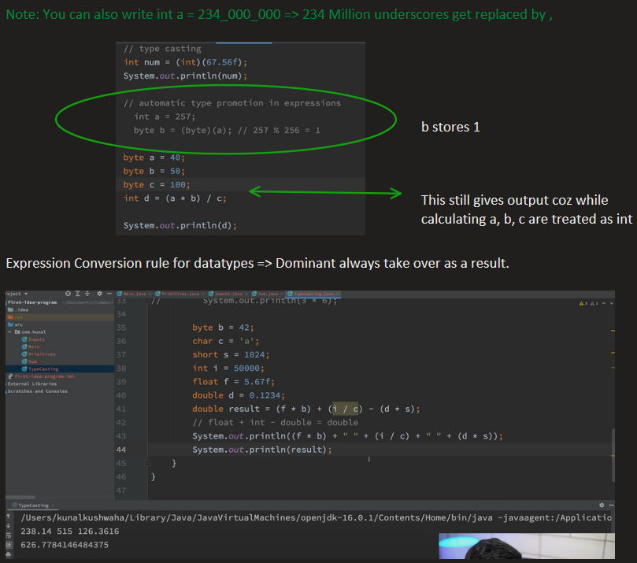

# Java Basics
## Java Conceptual

## Java First Program

*Javac is a executable whenever we write javac it basically double clicks on the javac file located in usr/bin. This is fetched from environment  variables mentioned in the system*

### DataTypes

Primitive => Can't be broken down into smaller datatype. String is not considered as primitive as it can be converted to Character.

Literals => In primitive datatype literals are syntactical representation of the datatype.
Identifier => Name of variable/Class etc.

Int a = 234 => a is identifier and 234 is a literal

> **_NOTE:_**  You can also write int a = 234_000_000 => 234 Million underscores get replaced by ,

## Expression Conversion Rule

