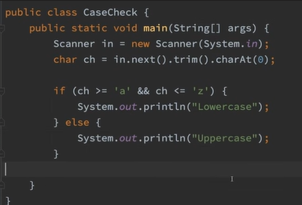
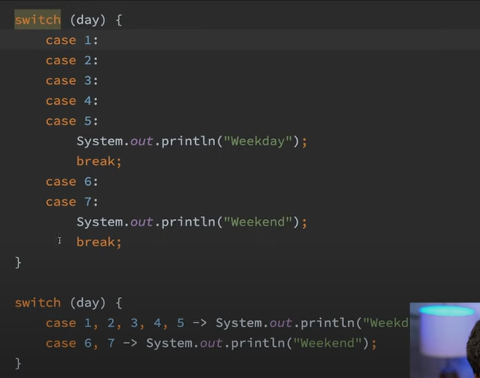
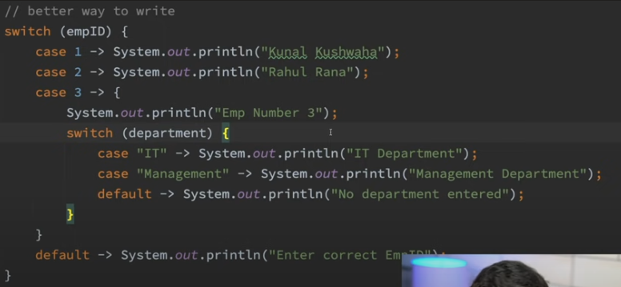

# Loops and Conditionals

## While taking input as string we can use .trim() to eliminate all the blank spaces.

## Difference between == & .equals

- == -> Checks the reference and the value returns true only when same object is being pointed by both party
- .equals -> only compares the value of the two string.

## Something Different Switch case example

## Nested Switch case Example

*In enhanced switch case Every statement as a break statement associated with it*
