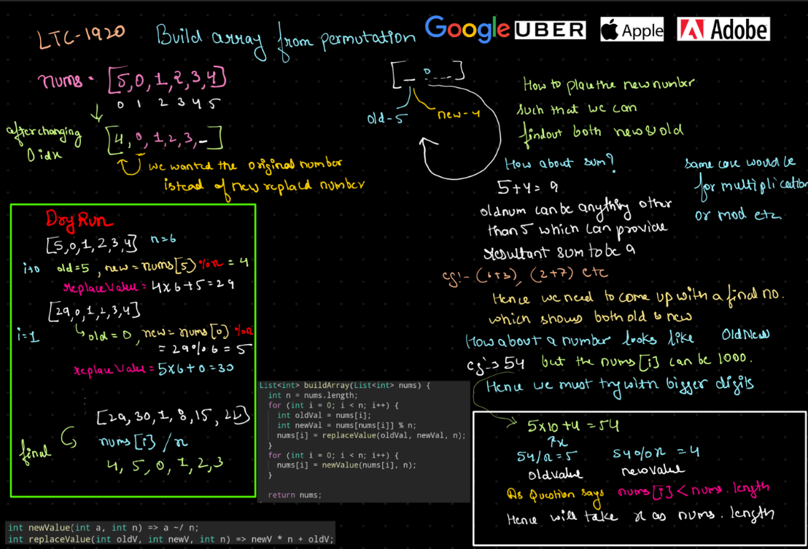

# [Video Link](https://youtu.be/n60Dn0UsbEk)

## Submit the following on your Leetcode profile itself.

## Total Questions - 41

### Easy
1. [X] [Build Array from Permutation](https://leetcode.com/problems/build-array-from-permutation/)
    
2. [X] [Concatenation of Array](https://leetcode.com/problems/concatenation-of-array/)
3. [X] [Running Sum of 1d Array](https://leetcode.com/problems/running-sum-of-1d-array/)
4. [X] [Richest Customer Wealth](https://leetcode.com/problems/richest-customer-wealth/)
5. [X] [Shuffle the Array](https://leetcode.com/problems/shuffle-the-array/)

    ```java
    //True in-place solution
    public static int[] shuffleInPlace(int[] nums, int n) {
        for(int i = n; i < nums.length; i++){
            //Populate all the values post n with data choose 1001 as 1000 is max value nums can have
            nums[i] = nums[i]*1001 + nums[i - n];
        }
        int index = 0;
        for(int i = n; i < nums.length; i++, index+=2){
            nums[index] = nums[i]%1001;
            nums[index + 1] = nums[i]/1001;
        }
        return nums;
    }
    //Bitwise Solution
    public static int[] shuffleBitwise(int[] nums, int n) {
        for(int i = n; i < nums.length; i++){
            nums[i] = (nums[i] << 10) | nums[i - n];
        }
        int index = 0;
        for(int i = n ; i < nums.length; i++, index += 2){
            nums[index] = nums[i]&1023;
            nums[index + 1] = nums[i]>>10;
        }
        return nums;
    }    
    ```
    - In-place : This works by storing all the data at the end using multiplication and modulo.
    - Bit-wise : This works by storing using bits as 1000 occupies 10 bits out of 32 so we can push it left and store the other one by performing OR without overwriting it. Original array - {1 2 3 4 4 3 2 1} After bit manipulation - {1 2 3 4 [4,1] [3,2] [2,3] [1,4]}. To fetch original number right-shift, for added number and it with the number itself. 

6. [X] [Kids With the Greatest Number of Candies](https://leetcode.com/problems/kids-with-the-greatest-number-of-candies/)
7. [X] [Number of Good Pairs](https://leetcode.com/problems/number-of-good-pairs/)
8. [X] [How Many Numbers Are Smaller Than the Current Number](https://leetcode.com/problems/how-many-numbers-are-smaller-than-the-current-number/)
9. [X] [Create Target Array in the Given Order](https://leetcode.com/problems/create-target-array-in-the-given-order/)
10. [X] [Check if the Sentence Is Pangram](https://leetcode.com/problems/check-if-the-sentence-is-pangram/)
11. [X] [Count Items Matching a Rule](https://leetcode.com/problems/count-items-matching-a-rule/)
12. [X] [Find the Highest Altitude](https://leetcode.com/problems/find-the-highest-altitude/)
13. [X] [Flipping an Image](https://leetcode.com/problems/flipping-an-image/)
14. [X] [Cells with Odd Values in a Matrix](https://leetcode.com/problems/cells-with-odd-values-in-a-matrix/)
15. [X] [Matrix Diagonal Sum](https://leetcode.com/problems/matrix-diagonal-sum/)

    Proud of me for coming up with it

    ```java
    int lastRow = mat.length - 1; 
    int col = 0;
    int diagonalSum = 0;
    for(int i = 0; i < mat.length; i++){
        diagonalSum += (i != lastRow)? mat[i][col] + mat[lastRow--[col++] : mat[lastRow--][col++];
    }
    return diagonalSum;
    ``` 

16. [X] [Find Numbers with Even Number of Digits](https://leetcode.com/problems/find-numbers-with-even-number-of-digits/)
17. [X] [Transpose Matrix](https://leetcode.com/problems/transpose-matrix/)
18. [X] [Add to Array-Form of Integer](https://leetcode.com/problems/add-to-array-form-of-integer/)
    >**Note :** It troubled me for no reason visit this again. List do have method like addFirst
19. [X] [Maximum Population Year](https://leetcode.com/problems/maximum-population-year/)
    >**Note :** This also troubled me.
20. [X] [Determine Whether Matrix Can Be Obtained By Rotation](https://leetcode.com/problems/determine-whether-matrix-can-be-obtained-by-rotation/)
    >**Note :** This also troubled me.
21. [X] [Two Sum](https://leetcode.com/problems/two-sum/)
    >**Note :** Can be solved efficiently using hashmap.
22. [X] [Find N Unique Integers Sum up to Zero](https://leetcode.com/problems/find-n-unique-integers-sum-up-to-zero/)
23. [X] [Lucky Number In a Matrix](https://leetcode.com/problems/lucky-numbers-in-a-matrix/)
24. [x] [Maximum Subarray](https://leetcode.com/problems/maximum-subarray/)
    >**Note :** Already solved but can't solve now it uses Kadane's Algo.
25. [X] [Reshape the Matrix](https://leetcode.com/problems/reshape-the-matrix/)
26. [X] [Plus One](https://leetcode.com/problems/plus-one/)
27. [X] [Remove Duplicates from Sorted Array](https://leetcode.com/problems/remove-duplicates-from-sorted-array/)
28. [X] [Minimum Cost to Move Chips to The Same Position](https://leetcode.com/problems/minimum-cost-to-move-chips-to-the-same-position/)

### Medium
1. [X] [Spiral Matrix](https://leetcode.com/problems/spiral-matrix/)
2. [Spiral Matrix II](https://leetcode.com/problems/spiral-matrix-ii/)
3. [Spiral Matrix III](https://leetcode.com/problems/spiral-matrix-iii/)
4. [Set Matrix Zeroes](https://leetcode.com/problems/set-matrix-zeroes/)
5. [Product of Array Except Self](https://leetcode.com/problems/product-of-array-except-self/)
6. [Find First and Last Position of Element in Sorted Array](https://leetcode.com/problems/find-first-and-last-position-of-element-in-sorted-array/)
7. [Jump Game](https://leetcode.com/problems/jump-game/)
8. [Rotate Array](https://leetcode.com/problems/rotate-array/)
9. [Sort Colors](https://leetcode.com/problems/sort-colors/)
10. [House Robber](https://leetcode.com/problems/house-robber/)

### Hard
1. [Max Value of Equation](https://leetcode.com/problems/max-value-of-equation/)
2. [First Missing Positive](https://leetcode.com/problems/first-missing-positive/)
3. [Good Array](https://leetcode.com/problems/check-if-it-is-a-good-array/)