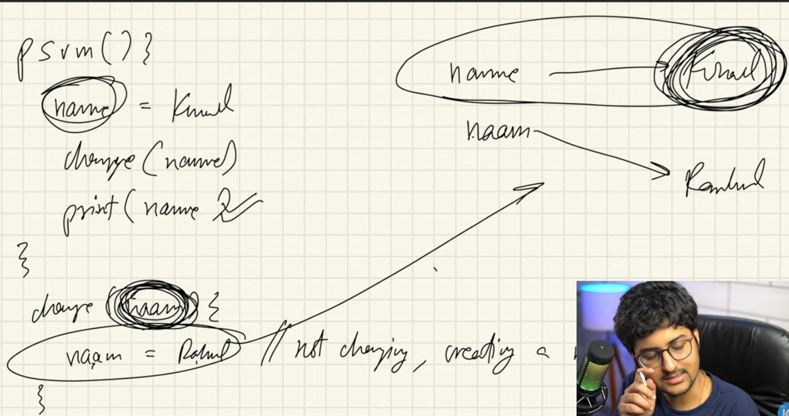
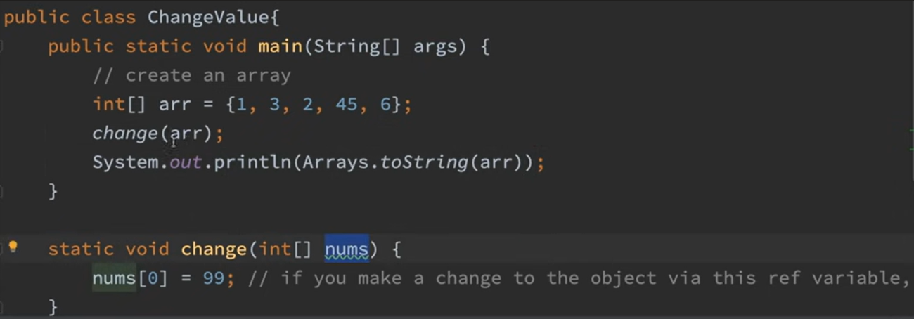
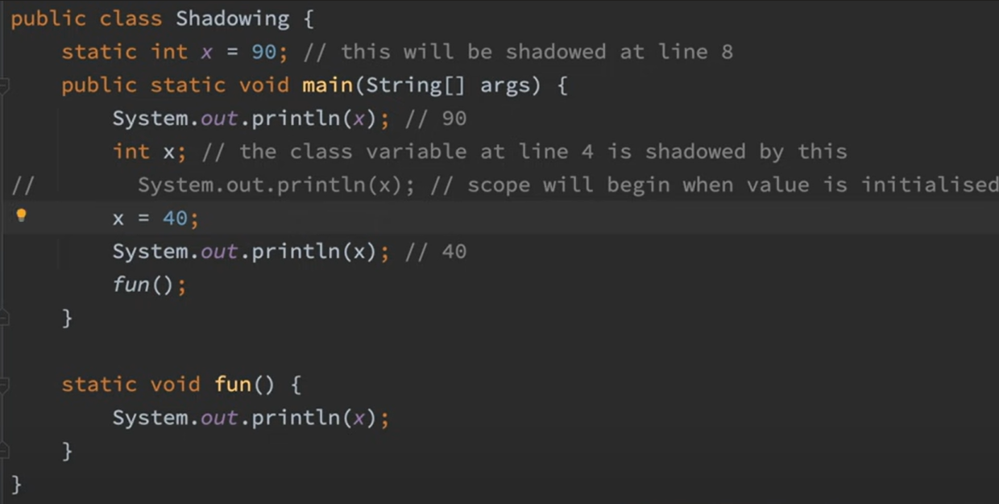
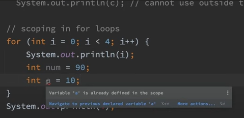

# Functions and Methods

> ***Note*** : Java doesn’t support pass by reference it only support pass by value.

> ***Note*** : Change to an object in another method makes it permanent.

*Output arr => 99, 3, 2, 45, 6*

> ***Note*** : Class variables can be shadowed.
Methods cannot have same variable initialized in sub scope.

> ***Note*** : Variable Arguments can have empty parameter while function call. But while over-loading it can't be empty it creates ambiguity.