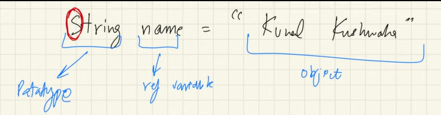
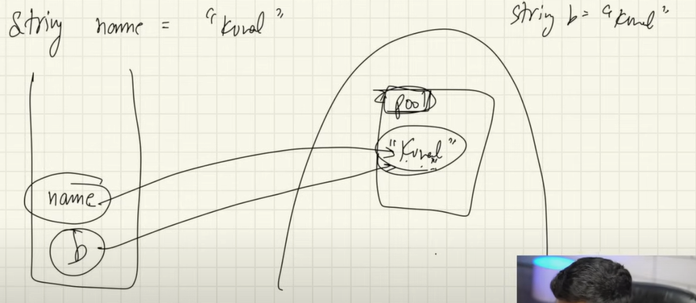
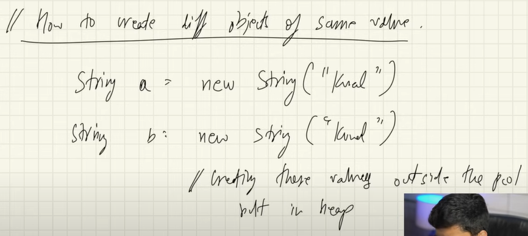
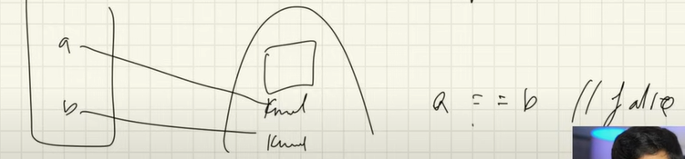
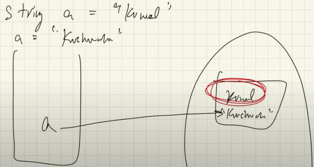
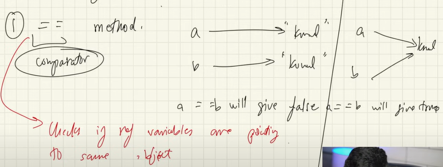
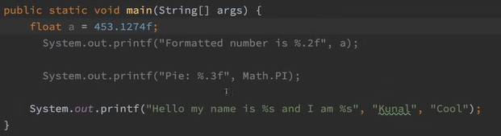
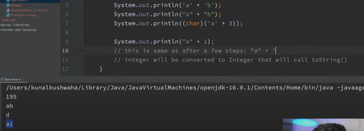
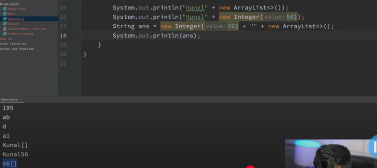

# String and String Builder

## String Basics

## Key Concepts of String
1. String Pool

    

    In Heap memory there is separate memory area known as String pool whenever a string is created it's store in there. Before creating new pool, it is been checked in the string pool if the value pre-exist. Same Object is assigned to the new variable.

    ### Create new object String with same value outside heap pool

    

    

2. Immutable

    

    Strings are immutable, everytime new value is assigned to a string variable it creates new String alltogether. Unused string is thrown in garbage if with time it is still unused.

## Comparision of Strings

1. ==

    

2. .equals
    
    When only value of the string is concerned.

## Using [printf](https://www.baeldung.com/java-printstream-printf)

*%.2f represents number of digits after decimal*

There are various placeholders to be used with printf like
- s formats strings.
- d formats decimal integers.
- f formats floating-point numbers.
- t formats date/time values.

## String Concatenation

*Char is converted to ascii values and it's addition take place String is never converted instead it's concatinated everything after it is called with toString method of that thing*

*+ Operator is being overloaded for String example of Operator Overloading*

>*Note :* CPP and Python provide operator overloading Java only provide few operator overloaded but doesn't provide user the flexibilty of operator overloading to protect code's sanity.

## String Complexity

Strings are immutable thus modifying a string takes O(n^2) space complexity.

## String Builder

**Mutable String**

