# Recursion

## Function Calls

Function Calls goes into stack memory. When funtion gets executed it gets popped from the stack and flow is returned from where it was called from.

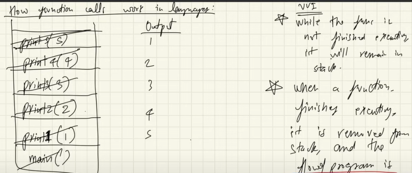

## Recursion

Funtion which call itself which has terminating *Base Condition*. When same function is called again and again new function will take new memory in the stack for each call.

### Why Recursion?

- It helps in solving bigger/complex problems in a simple way
- All recursion solution can be converted into iteration i.e. loops and vice versa for optimized solution.
- Space Complexity of recursion is not constant because of calls whereas iteration gives constant space complexity.

## Recursion Tree

Visualizing Recursion is understanding Recursion tree. 


## Understanding Problem

1. Fibonacci Number


*Logic - Recurence Relation*


*Recursive Tree*

### Identify and understanding problems

1. Identify if problem can be broken down into smalled problem

2. Write the recurrence relation

3. Draw the recurrsive tree

4. About Recurrsive tree
    - Flow of the functions
    - Identify and focus on left and right tree calls
    - Draw the tree and pointers on the paper
    - Use debugger to cross check the result

5. Focus on returned value in each step
 
## Types of recurrence relation

1. Linear recurrence relation e.g. Fibonacci number where the recurrsive calls reduce by 1 each time ineffective way of recurssion without dynamic programming

2. Divide and conquer recurrence relation e.g. Binary search where the reduction is by factors

## Passing Number

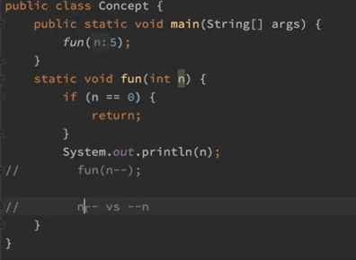
*n-- gives infinite loop of op 5 as it is post operator but --n is a pre operator which gives desired op*

## Creating List in the body and then returning it.

### Challenges - 
1. Every Call will generate new list.
2. No other function call will have the value of individual function call's list.

### Solution -
1. Check if current function call has any value then append it to any below function call's ans. 

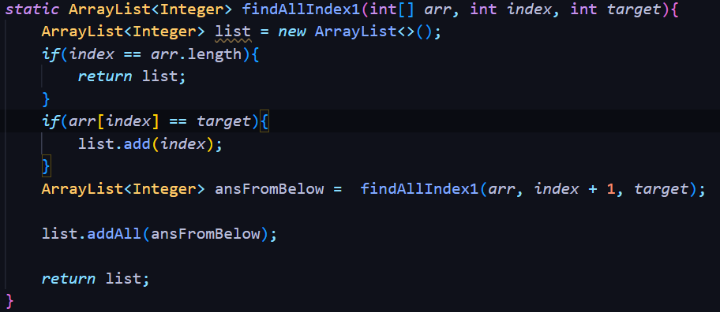
*Not at all space optimized solution*

## Merge Sort

### Steps - 

1. Divide array in 2 parts.
2. Get both parts sorted via recursion.
3. Merge the sorted part.

### Complexity - 

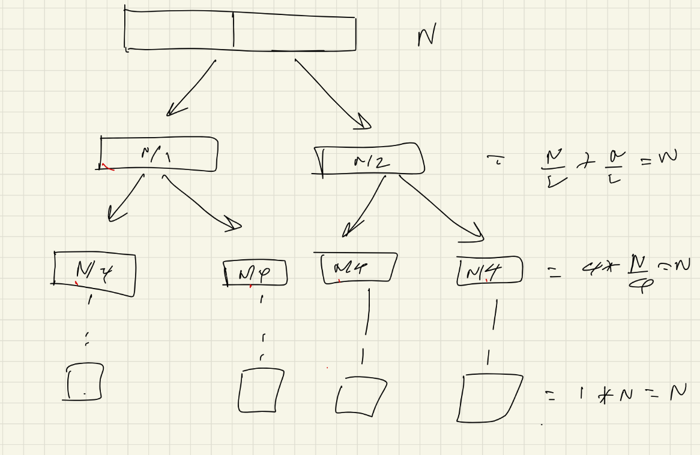
*At every level N-elements are merged*

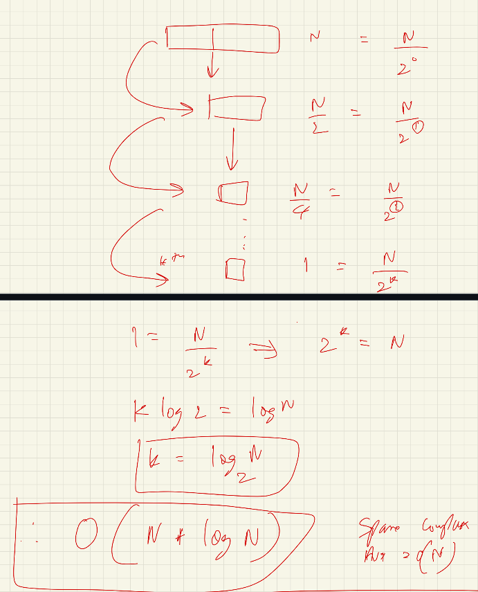

Proof with Akra-bazi

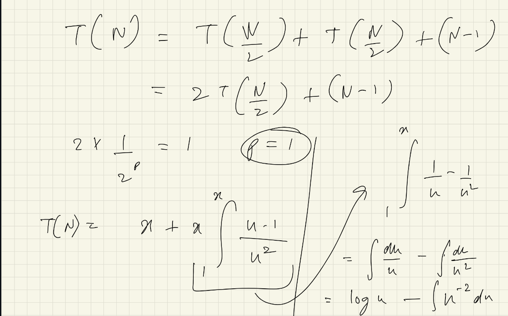

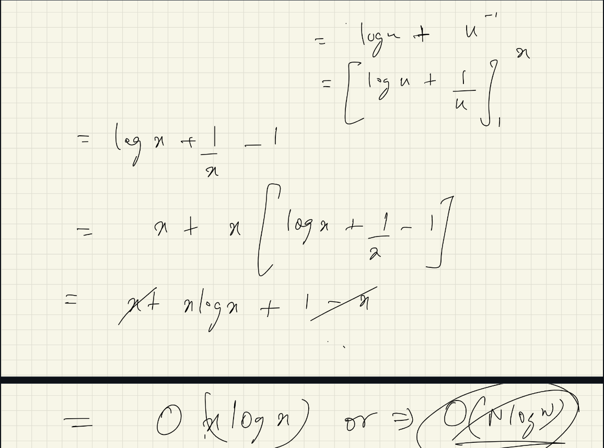

Space Complexity - Maximum height of the tree - O(n)

### Code

```java
    static void mergeSortInPlace(int[] arr, int start, int end){
        if(end - start == 1){
            return;
        }
        int mid = (start + end)/2;

        mergeSortInPlace(arr, start, mid);

        mergeSortInPlace(arr, mid, end);

        mergeInPlace(arr, start, mid, end);
    }

    static void mergeInPlace(int[] arr, int start, int mid, int end){
        int[] mix = new int[end - start];
        int i = start;
        int j = mid;
        int k = 0;
        
        while(i < mid && j < end){
            if(arr[i] < arr[j]){
                mix[k] = arr[i];
                k++;
                i++;
            }else{
                mix[k] = arr[j];
                k++;
                j++;
            }
        }

        while(i < mid){
            mix[k] = arr[i];
            k++;
            i++;
        }
        while(j < end){
            mix[k] = arr[j];
            k++;
            j++;
        }
        // for(int l = 0; l < mix.length; l++){
        //     arr[start + l] = mix[l];
        // }
        System.arraycopy(mix, 0, arr, start, mix.length);
    }
```

## Quick Sort

### Steps - 

1. Choose any element as pivot.
    - How to take pivot?
    - It's basically a random number.
    - It can be corner or middle element. 
2. After 1st pass all the element less than pivot will be on it's LHS and others on RHS.
    - How to put pivot at correct position.
    - Take S and E compare and swap.
    - Add a part where it skips all the elements which are already less than pivot in LHS and similarly for RHS.
3. Recursion then handles LHS and RHS part of the array.

### Complexity

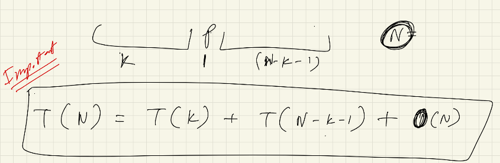

**Worst Case:** Pivot is largest or smallest.

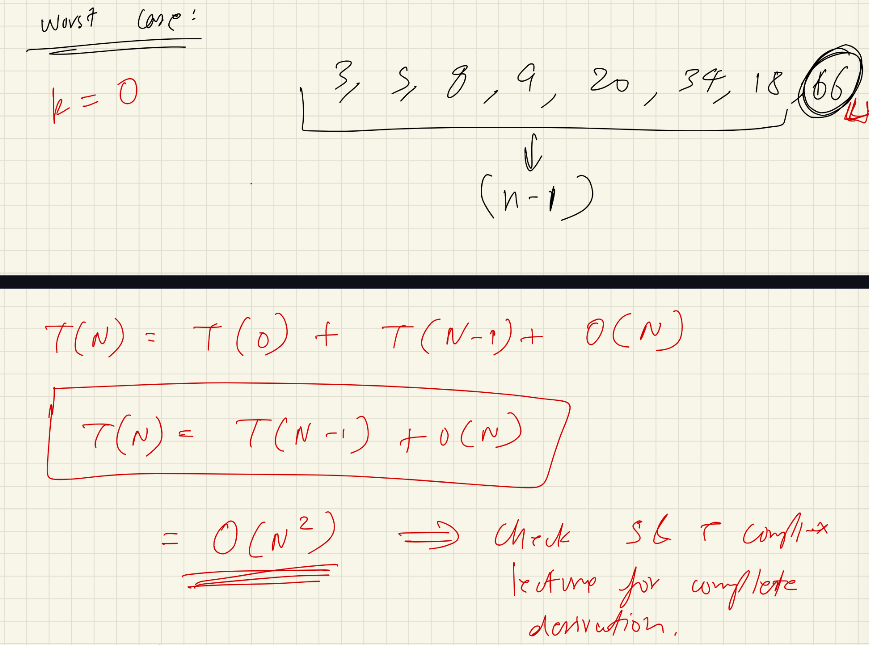

**Best Case:** Pivot is exactly middle element

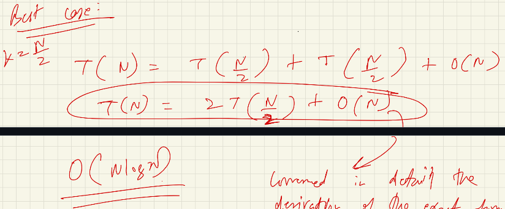

### Notes

1. Not Stable
2. In-Place : Doesn't take extra space, Merge sort takes extra place.
3.Merge Sort is better in linked list due to memory allocation is not continuous.

## Hybrid sorting algorithm (Tim Sort)

### Merge Sort + Insertion Sort - *Insertion sort worls well with partially sorted data*

## String, Subsequence and Subset

### Strings

**String are immutable**

Important methods of String class - 

1. .isEmpty
2. .charAt
3. .substring
4. .startsWIth

>**Note:** Get ASCII value of charachter
```java
    static int ascii(char ch){
        return ch + 0;
    }
```

### Subsets

Non - adjacent collection.
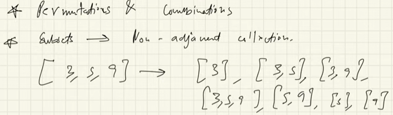

abc = a,b,c,ab,ac,bc,abc 

>**Note:** ca can't be a subset as we are taking set and not permutation thus order cannot be changed.

>**Note:** The pattern of taking some element & removing some is known as subset pattern.

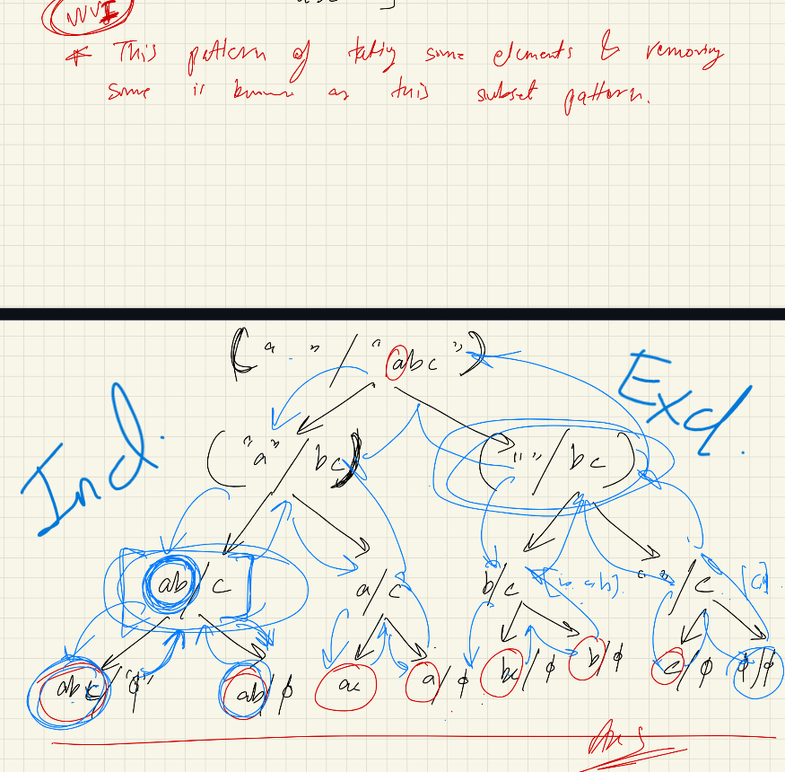


## Three different type of solution approach

### No return type just logic

```java
    static void permutation(String str, String ans){
        if(str.isEmpty()){
            System.out.println(ans);
            return;
        }

        for(int i = 0; i <= ans.length(); i++){

            //Crazy deduction of logic
            String potentialString = ans.substring(0, i) + str.charAt(0) + ans.subSequence(i, ans.length());

            permutation(str.substring(1), potentialString);
        }

    }
```
### Returning value mainly for CP

```java
    static ArrayList<String> returnPermutation(String str, String ans) {
        ArrayList<String> result = new ArrayList<>();
        if (str.isEmpty()) {
            result.add(ans);
            return result;
        }

        for (int i = 0; i <= ans.length(); i++) {
            String potentialString = ans.substring(0, i) + str.charAt(0) + ans.substring(i);
            result.addAll(returnPermutation(str.substring(1), potentialString));
        }

        return result;
    }
```

addAll might create error with debugger but while compilation gives no error.

### Using input parameter can be used for easy helper function approach

```java
    static void permutation(String str, String ans){
        ArrayList<String> result = new ArrayList<>();
        permutationHelper(str, ans, result);
        return result;
    }
    static void permutationHelper(String str, String ans, ArrayList<String> result) {
        if (str.isEmpty()) {
            result.add(ans);
            return;
        }

        for (int i = 0; i <= ans.length(); i++) {
            String potentialString = ans.substring(0, i) + str.charAt(0) + ans.substring(i);
            permutationHelper(str.substring(1), potentialString, result);
        }
    }
```

Return the List from calling function, makes program easy.

## Maze

### Right Down are normal easy case.

### All direction makes it stack overflow as we end up visiting all the visited cells again and again

>**Note:** We need to use backtracking.

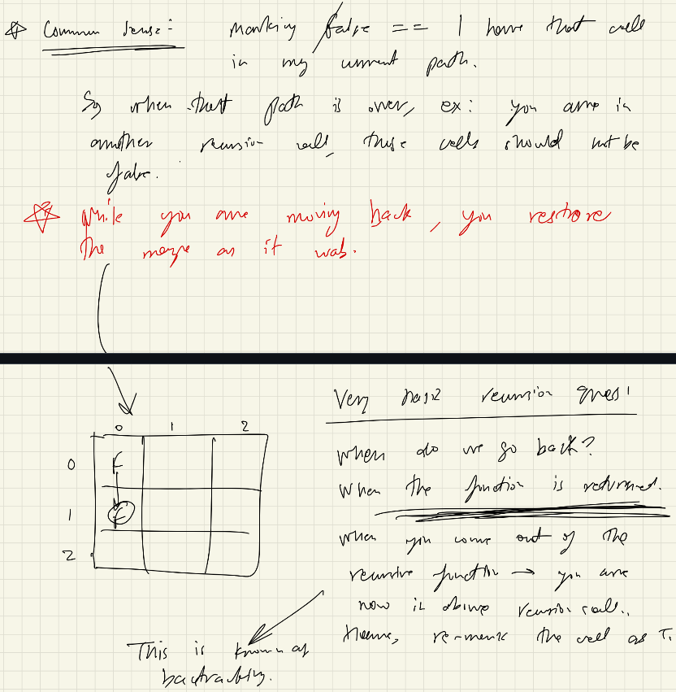


## N Queens

### Time Complexity

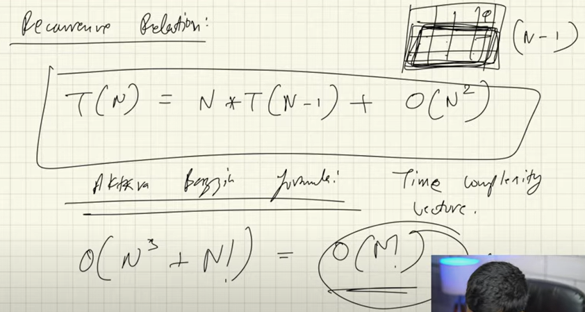