# Object Oriented Programming

## Introduction - 

**Class** - Namegroup of property and function i.e. template. It is a logical construct.

**Object** - Instance of the class i.e. physical form of class. Occupies space in memory. They are store in heap memory. Its reference is stored in Stack memory.

1. State of Object.
2. Identity of Object.
3. behavior of Object.

**Instance variable** - Variable inside the object.

**. Operator/Separator** - Links reference to its instance variable. 

>**Note :** When Objects are not initialized it is defaulted as null.

**new Operator** - Dynamically allocates memory and returns a reference of it.

## Constructor

**Constructor**: It's a function which run's at the moment of object creation which governs the functionality.

**this**: Accessing instance variable for each individual object.

>**Note:** Every Class as a default constructor. But once a parameterized constructor is created, original constructor will be over-ride. Thus passing parameters will be made mandatory.

### Calling a constructor from another constructor

```java
Student(){
    //This calls the constructor
    //Internally: new Student(13, "Default Person", 100.0f)
    this(13, "Default Person", 100.0f)
}

Student(int rno, String name, float marks){
    this.rno = rno;
    this.name = name;
    this.marks = marks;
}
```

## Final

```java
//This wont swap the a, b passed in parameter as in java primitives support pass by value
void swap(int a, int b){
    int temp = a;
    a = b;
    b = temp;
}
//This also doesn't swap the passed variables although Integer is an object and java supports only pass by reference for objects.
void swap(Integer a, Integer b){
    Integer temp = a;
    a = b;
    b = temp;
}
```

>**Note:** Above phenomenon is because Integer is a **final** class.

Final variables can't be modified and need to be initialized during declaration only.

Final guarantees immutability only when instance variable are primitive datatype and not reference datatype.

In reference datatype, its pointing reference may not change ever but value can be changed.

```java
final Car honda = new Car("Honda");
//This is allowed
honda.name = "Suzuki";
//This is not allowed
honda = new Car("Maruti");
```

## Garbage Collection

>**Note:** C++ provides destructor, java doesn't provide anything like this but does the object destruction automatically.

### Finalize
```java
protected void finalize() throws Throwable{
    System.out.println("Object is destroyed");
}
```

Java deletes the object on it's own but whenever it does, it calls finalize function before destroying it.

## Java Packages

**Packages:** Container/Folder for unique classes.

### Inbuilt packages
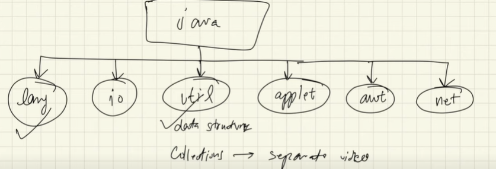

### Object class

It's inside lang pkg, every class extends object class; topmost in inheritance hierarchy. Indirectly every class even if its subclass extends object class.

>**Note :** `class SubClass extends A,Object` this occurs internally thus internally java do indirectly support multiple inheritance.

Default methods in Object class

1. hashCode() => unique numerical representation of an object.
    >**Note:** It is not the address, java doesn't provide access to address. It is algorithmic generated unique value.
2. toString()
3. finalize()
4. equals()
    >**Note:** == checks reference pointing to same object. .equals() method which can be checking the context.

## Static

Accessing/ Using something without creating object.

Everything is compile time data.

### Variable

Object independent variables

```java
Class Human{
    static int population;
    public Human(){
        Human.population += 1;
    }
}
```

>**Note:** Conventionally static variables must be accessed using class name and not this.

### Method

>**Note:** Main is the first function which runs and if its not static then to run main we need to create object of the class, but as main is the first function thus it cant be non-static

Static method can only access static data/ methods. Non-static data belongs to an instance. 

```java
//Using non-static methods in main
public class Main{
    public static void main(String[] args) {
        Main obj = new Main();
        obj.greeting();
    }
    void greeting(){
        System.out.println("Hello from non-static method");
    }
}
```

>**Note:** .this cannot be used inside static.

### Block

```java
public class Main{
    static int a = 4;
    static int b;
    static{
        System.out.println("Hello from static block");
        b = a*5;
    }
    public static void main(String[] args) {
        Main obj1 = new Main();
        obj1.greeting();

        Main obj2 = new Main();
        obj1.greeting();
    }
    void greeting(){
        System.out.println("Hello from non-static method");
    }
}
```
**Result -**
```cmd
Hello from static block
Hello from non-static method
Hello from non-static method
```

>**Note:** Static block runs only when the first object is created i.e. classes is loaded for the first time.

### Class

>**Note:** Outside class cannot be static. But every inner class needs to be static.

```java
class Outside{
    String name;
    public Outside(String name){
        this.name = name;
    }
}
public class Main{
    static class Inside{
        String name;
        public Inside(String name){
            this.name = name;
        }
    }
    public static void main(String[] args) {
        Outside obj1 = new Outside("Obj1");
        Outside obj2 = new Outside("Obj2");

        Inside obj3 = new Inside("Obj3");
        Inside obj4 = new Inside("Obj4");

        System.out.println(obj1 + " " + obj2);
        System.out.println(obj3 + " " + obj4);
    }
}
```

**Output -**
```
obj2 obj2
obj3 obj4
```

**Reason -**

Outside class has static variable thus once it's changed the changes gets applied to all the objects.

Static inside class means it is not dependant on parent class i.e. main here but the object created by this class are independent.

>**Note:** Static definition depends on the context where it is used.

## Singleton class

Only one instance i.e. one object can be created. For restricting creating object we make constructor Private. 

```java
public class Singleton{
    public Singleton(){
        
    }

    //Can be static as it will be object independent
    private static Singleton instance;

    public static Singleton getInstance(){
        if(instance == null){
            instance = new Singleton();
        }

        return instance;
    }
}
public class Main{
    public static void main(String[] args) {
        Singleton obj1 = Singleton.getInstance();
        Singleton obj2 = Singleton.getInstance();
        Singleton obj3 = Singleton.getInstance();
    }
}
```

>**Note:** All object will point to same instance.

# Properties of OOPS

## Inheritance

>**Note :** To inherit a class, you simply incorporate the definition of one class into another by using the extends keyword.

You can only specify one superclass for any subclass that you create. Java does not support the inheritance of
multiple superclasses into a single subclass. You can, as stated, create a hierarchy of inheritance in which a subclass
becomes a superclass of another subclass. However, no class can be a superclass of itself.

Although a subclass includes all of the members of its superclass, it cannot access those members of the superclass
that have been declared as private.

### A Superclass Variable Can Reference a Subclass Object:
It is important to understand that it is the type of the reference variable—not the type of the object that it refers
to—that determines what members can be accessed.
When a reference to a subclass object is assigned to a superclass reference variable, you will have access only to
those parts of the object defined by the superclass.

plainbox      =  weightbox;
(superclass)     (subclass)
```java
SUPERCLASS ref = new SUBCLASS();    // HERE ref can only access methods which are available in SUPERCLASS
```

### Using super:

Whenever a subclass needs to refer to its immediate superclass, it can do so by use of the keyword super.
super has two general forms. The first calls the superclass’ constructor.
The second is used to access a member of the superclass that has been hidden by a member of a subclass.

```java
BoxWeight(double w, double h, double d, double m) {
    super(w, h, d); // call superclass constructor
    weight = m;
}
```

Here, BoxWeight( ) calls super( ) with the arguments w, h, and d. This causes the Box constructor to be called,
which initializes width, height, and depth using these values. BoxWeight no longer initializes these values itself.
It only needs to initialize the value unique to it: weight. This leaves Box free to make these values private if desired.

Thus, super( ) always refers to the superclass immediately above the calling class.
This is true even in a multileveled hierarchy.

```java
class Box {
     private double width;
     private double height;
     private double depth;

     // construct clone of an object

     Box(Box ob) { // pass object to constructor
       width = ob.width;
       height = ob.height;
       depth = ob.depth;
     }
}

class BoxWeight extends Box {
     double weight; // weight of box

     // construct clone of an object

     BoxWeight(BoxWeight ob) { // pass object to constructor
        super(ob);
        weight = ob.weight;
     }
}
```

>**Note :** that super() is passed an object of type BoxWeight—not of type Box.This still invokes the constructor Box(Box ob).

>**NOTE:** A superclass variable can be used to reference any object derived from that class.
Thus, we are able to pass a BoxWeight object to the Box constructor.Of course,Box only has knowledge of its own members.

### A Second Use for super
The second form of super acts somewhat like this, except that it always refers to the superclass of the subclass in
which it is used.
```java
super.member
```
Here, member can be either a method or an instance variable. This second form of super is most applicable to situations
in which member names of a subclass hide members by the same name in the superclass.


### Type of Inheritance

1. Single Inheritance
2. Multi-level Inheritance
3. Multiple Inheritance

    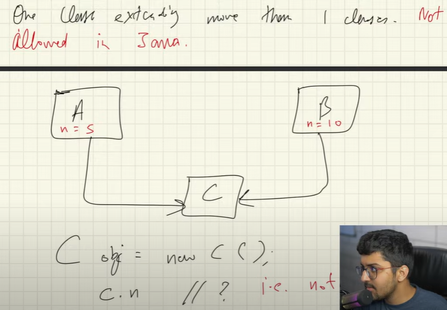

4. Hierarchical Inheritance

    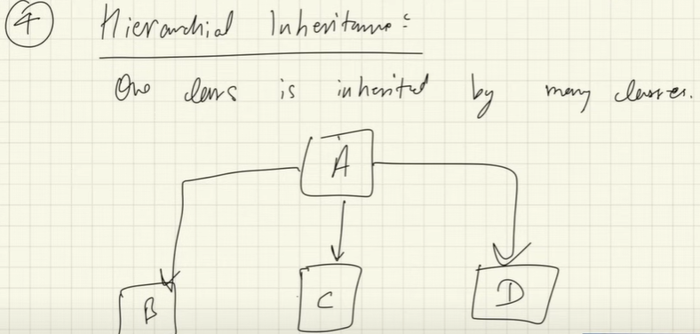

5. Hybrid Inheritance - 

    >**Note:** Combination of single and multiple inheritance, as later is not supported in java this is also not supported in java.

    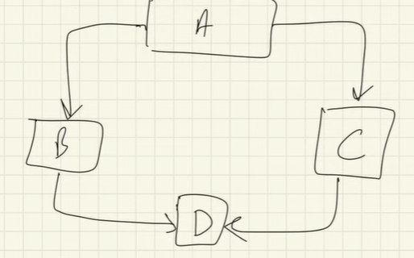

>**Note:** instanceof keyword checks object and classes bond.

### Using final with Inheritance:

The keyword final has three uses:

1. First, it can be used to create the equivalent of a named constant.

2. Using final to Prevent Overriding:
To disallow a method from being overridden, specify final as a modifier at the start of its declaration.
Methods declared as final cannot be overridden.
Methods declared as final can sometimes provide a performance enhancement: The compiler is free to inline calls to them because it “knows” they will not be overridden by a subclass. When a small final method is called, often the Java compiler can copy the bytecode for the subroutine directly inline with the compiled code of the calling method, thus eliminating the costly overhead associated with a method call. Inlining is an option only with final methods.
    >**Note :** Normally, Java resolves calls to methods dynamically, at run time. This is called late binding. However, since final
methods cannot be overridden, a call to one can be resolved at compile time. This is called **early binding**.

>**Note:** Late binding are runtime polymorphism i.e. method over-ridding.

3. Using final to Prevent Inheritance:
Sometimes you will want to prevent a class from being inherited. To do this, precede the class declaration with final.
    >**NOTE:** Declaring a class as final implicitly declares all of its methods as final, too.

    As you might expect, it is illegal to declare a class as both abstract and final since an abstract class is incomplete by itself & relies upon its subclasses to provide complete implementations.

    >**NOTE:** Although static methods can be inherited ,there is no point in overriding them in child classes because the method in parent class will run always no matter from which object you call it. That is why static interface methods cannot be inherited because these method will run from the parent interface and no matter if we were allowed to override them, they will always run the method in parent interface.
    That is why static interface method must have a body.


>**NOTE :** Polymorphism does not apply to instance variables.

## Polymorphism

>**Note :** Any language which does not support polymorphism is not considered as OOP language rather is referred as Object based language e.g. Ada.

### Type of polymorphism

1. Compile time/ static polymorphism
    - Method Overloading
        - Same method name, with different signature.
    - Operator Overloading 
        - Not supported in java.

2. Run time/ Dynamic polymorphism
    - Method Overriding
        - @Override is the annotation used.

    ```java
    Parent obj = new Child(); //Method will be depend on child.

    obj.fn() // Parent and child both has fn but even though object is of parent it calls child's fn
    ```
    >**Note:** Above thing is called up-casting. Java determines it using Dynamic method dispatch.

    example of this is toString method, default object class method is used but whenever we write our own toString it uses it.

### Dynamic Method Dispatch

```java
Class Engine(){
    void start(){
        System.out.println("Engine running");
    }
}

Class Car(){
    String paint = "Black";
    void start(){
        System.out.println("Car running");
    }
}

public static void main(){
    Engine car = new Car();
    System.out.println(car.paint); //Gives error as reference Engine doesnot know what paint is.
    car.start(); //Car is running. This is because of dynamic memory dispatch.
}
```

>**Note :** Reference decides which variables it can object can access and type of object decides the version of data it will access. 

## Encapsulation

Wrapping implementation of data member and methods in a class. Hides code/data into a single entity.

>**Note:** Access Modifier are key features of encapsulation.

### Access Control
```txt
            │ Class │ Package │ Subclass │ Subclass │ World         | Uses
            │       │         │(same pkg)│(diff pkg)│(diff pkg      |
            |       |         |          |          |& not subclass)|
────────────┼───────┼─────────┼──────────┼──────────┼───────────────┼────────────────────────
public      │   +   │    +    │    +     │     +    │   +           | Everywhere
────────────┼───────┼─────────┼──────────┼──────────┼───────────────┼────────────────────────
protected   │   +   │    +    │    +     │     +    │               | Access to all subclass
────────────┼───────┼─────────┼──────────┼──────────┼───────────────┼────────────────────────
no modifier │   +   │    +    │    +     │          │               | Not outside the pkg
────────────┼───────┼─────────┼──────────┼──────────┼───────────────┼────────────────────────
private     │   +   │         │          │          │               | Sensitive data

+ : accessible
blank : not accessible
```


### Protected 
```java
package packageOne;
public class Base
{
    protected void display(){
        System.out.println("in Base");
    }
}

package packageTwo;
public class Derived extends packageOne.Base{
    public void show(){
        new Base().display();       // this is not working
        new Derived().display();    // is working
        display();//is working
    }
}
```

protected allows access from subclasses and from other classes in the same package.
We can use child class to use protected member outside the package but only child class object can access it.
That's why any Derived class instance can access the protected method in Base.
The other line creates a Base instance (not a Derived instance!!).
And access to protected methods of that instance is only allowed from objects of the same package.

display();
-> allowed, because the caller, an instance of Derived has access to protected members and fields of its subclasses,
even if they're in different packages


new Derived().display();
-> allowed, because you call the method on an instance of Derived and that instance has access to the protected methods
of its subclasses

new Base().display();
-> not allowed because the caller's (the this instance) class is not defined in the same package like the Base class, so this can't access the protected method. And it doesn't matter - as we see - that the current subclasses a class from that package. That backdoor is closed ;)

Remember that any time talks about a subclass having an access to a superclass member, we could be talking about the subclass inheriting the member, not simple accessing the member through a reference to an instance of the superclass.
```java
class C
    protected member;

// in a different package

class S extends C

    obj.member; // only allowed if type of obj is S or subclass of S
```
The motivation is probably as following. If obj is an S, class S has sufficient knowledge of its internals,
it has the right to manipulate its members, and it can do this safely. If obj is not an S, it's probably another subclass S2 of C, which S has no idea of. S2 may have not even been born when S is written. For S to manipulate S2's protected internals is quite dangerous.
If this is allowed, from S2's point of view, it doesn't know who will tamper with its protected internals and how,
this makes S2 job very hard to reason about its own state.

Now if obj is D, and D extends S, is it dangerous for S to access obj.member? Not really. How S uses member is a shared knowledge of S and all its subclasses, including D. S as the superclass has the right to define behaviours, and D as the subclass has the obligation to accept and conform.

For easier understanding, the rule should really be simplified to require obj's (static) type to be exactly S.
After all, it's very unusual and inappropriate for subclass D to appear in S. And even if it happens,
that the static type of obj is D, our simplified rule can deal with it easily by upcasting: ((S)obj).member

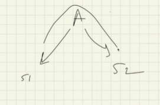
*Downward can be accessed n not upward flow*

## Abstraction

Hiding unnecessary detail and showing valuable information.

>**Note:** getter/setter are key features of Abstraction.

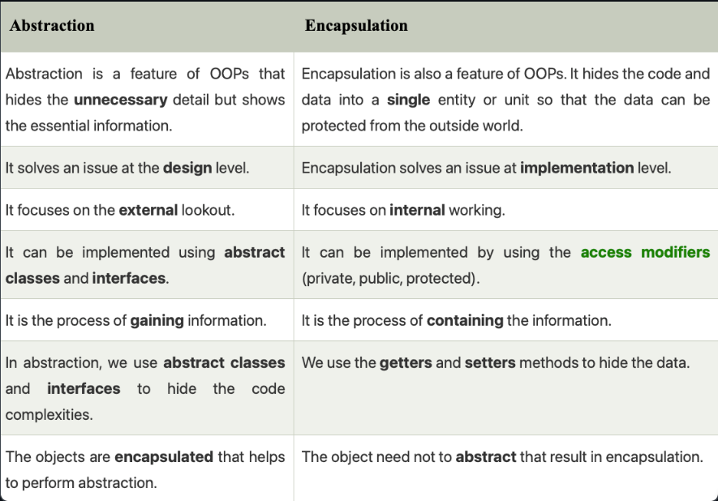

## Abstract Class

### Method

Empty method in parent classes, which are meant to be over-ridden by the child class. 

### Class

If a class has one or more than one class needs to be declared as abstract class. There can be normal methods too.

```java
public abstract class Parent{
    abstract void career(String name);
}

public class child extends Parent{
    @Override
    void career(String name){
        System.out.println(name);
    }
}
```

>**Note :** Abstract class can have it's variable, also it can have it's own constructor but constructor cannot be abstract. An object of abstract class cannot be created but can be referenced.

>**Note :** Abstract static methods can be created. But abstract classes can have static method.

No multiple inheritance is supported even with the help of abstract class.

>**Note :** A public constructor on an abstract class doesn't make any sense because you can't instantiate an abstract class directly 
(can only instantiate through a derived type that itself is not marked as abstract)
Check: https://stackoverflow.com/questions/260666/can-an-abstract-class-have-a-constructor

## Interface

Abstract class with only abstract methods, variables in interface are static and final. INterface cannot have constructor. It uses implements keyword and multiple interfaces can be implemented by a class.

>**Note :** Abstract class can provide implementation of interface but not vice-versa.

Members of interface are public by default.

```java
public interface Engine{
    // No need to implicitly state static and final
    static final int milage = 10;
    void start();
    void stop();
}
public interface Brake{
    void stop();
}
public class car implements Engine, Brake{
    
    //Even though stop is available in both parent interface its definition is present only here.
    @Override
    public void stop(){
        System.out.println("Stopped");
    }
}

```

>**Note :** In interface method look-up happens in runtime thus there is overhead present as compared to normal java methods, carefully not to use interfaces in performance intense code.

>**Note :** If interface B extends interface A, then the class which implements class B, need to over-ride both the methods of A and B.

>**Note :** On the power scale all the over-ridden methods need to have access modifier less restrictive than the parent methods access modifier thus parent can't have public method as nothings more superior than that.


>**Note :** Annotations are also interface internally.

### Default and static methods in Interface.

https://www.geeksforgeeks.org/default-methods-java/

### Default method / Defender methods

After java 8, interfaces can have default method in them which enables the interfaces to extend without breaking individual code. Lets see we have deep inheritance of interface and new feature is to be added to the original interface then all the classes need to over-ride it.

>**Note :** Two interface which are implemented simultaneously cannot have same named default method.

### Static method

Static interface method will always have body. And there function call must be called by the interface name and not the object name.

### Nested interface

```java
// This class contains a member interface.
class A {
  // this is a nested interface
  public interface NestedIF {
    boolean isNotNegative(int x);
  }
}
// B implements the nested interface.
class B implements A.NestedIF {
  public boolean isNotNegative(int x) {
    return x < 0 ? false: true;
  }
}
class NestedIFDemo {
  public static void main(String args[]) {
    // use a nested interface reference
    A.NestedIF nif = new B();
    if(nif.isNotNegative(10))
      System.out.println("10 is not negative");
    if(nif.isNotNegative(-12))
      System.out.println("this won't be displayed");
  }
}
```

>**Note :** Nested Interfaces can be public, private or protected. Top level interface must always be public or default.

### Interfaces are designed to support dynamic method resolution at run time.

Normally, in order for a method to be called from one class to another, both classes need to be present at compile time so the Java compiler can check to ensure that the method signatures are compatible. This requirement by itself makes for a static and nonextensible classing environment. Inevitably in a system like this, functionality gets pushed up higher
and higher in the class hierarchy so that the mechanisms will be available to more and more subclasses. Interfaces are designed to avoid this problem. They disconnect the definition of a method or set of methods from the inheritance hierarchy. Since interfaces are in a different hierarchy from classes, it is possible for classes that are unrelated
in terms of the class hierarchy to implement the same interface. This is where the real power of interfaces is realized.

## Abstract class vs Interface:

### Type of methods:
Interface can have only abstract methods. From Java 8, it can have default and static methods also.
Abstract class can have abstract and non-abstract methods. 

### Final Variables:
Variables declared in a Java interface are by default final.
An abstract class may contain non-final variables.

### Type of variables:
Abstract class can have final, non-final, static and non-static variables.
Interface has only static and final variables.

### Implementation:
Abstract class can provide the implementation of interface.
Interface can’t provide the implementation of abstract class.

### Inheritance vs Abstraction:
A Java interface can be implemented using keyword “implements” and abstract class can be extended using keyword “extends”.

### Multiple implementation:
An interface can extend another Java interface only,
an abstract class can extend another Java class and implement multiple Java interfaces.

### Accessibility of Data Members:
Members of a Java interface are public by default.
A Java abstract class can have class members like private, protected, etc.

### Overhead
Because dynamic lookup of a method at run time incurs a significant overhead when compared with the normal method invocation in Java, you should be careful not to use interfaces casually in performance-critical code.


# Miscellaneous

## Generics

Provide parameterized type, for different datatype. 
>**Note :** Generics are dealt at runtime thus cannot be used to instantiate. For using Generics we have to make use of Object class.

### Wild card

Restricts the type of variable

`<? extends Number>` - Number is a default java class.

## Comparable

An interface which is responsible for object comparison.

```java
public class Student implements Comparable<Student>{
    int rollno;
    int marks;

    public Student(int rollno, int marks){
        this.rollno = rollno;
        this.marks = marks;
    }

    @Override
    public int compareTo(Student o){
        int diff = (int)(this.marks - o.marks);

        return diff;
    }
}
```

>***Note:*** Main Logic of compareTo follows if function returns 0 then they are equal, if < 0 o is bigger else smaller.

>**Note :** CompareTo is also required for sort, or we have to declare a Comparator. E.g. of comparator with lambda function.

`Arrays.sort(list, (o1, o2) -> -(int)(o1.marks - o2.marks))`

## Lambda function

Inline/ One line function, they can be given to interfaces

(Parameter) -> Returning body of the function

```java

public class LambdaFunctions {

    public static void main(String[] args){
        Operation sum = (a, b) -> a + b;
        Operation prod = (a, b) -> a * b;
        Operation sub = (a, b) -> a - b;

        LambdaFunctions myCalci = new LambdaFunctions();

        System.out.println(myCalci.operate(5, 3, sum));
        System.out.println(myCalci.operate(5, 3, prod));
        System.out.println(myCalci.operate(5, 3, sub));
    }

    private int operate(int a, int b, Operation op){
        op.operation(a, b);
    }
}

interface Operation{
    int operation(int a, int b);
}
```

## Exception Handling

Error -> Program cannot be resumed
Exception -> Issue which can be dealt with.

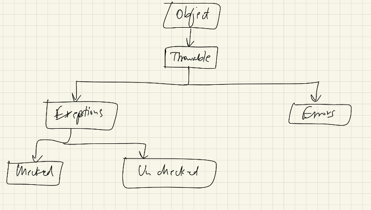*Checked are compiler time exceptions and unchecked are run-time*

### Try-Catch-Finally block

**Try**

Tries the code specified.

**Catch**

Gets executed whenever exception is encountered. Exception e -> e.getMessage() prints the message in beautified manner.

**Finally**

Gets executed no matter what. There can be only one finally block.

>**Note :** Try should be accompanied by either catch or finally or both.

### throws Exception

When a method is suspected to throw exception we use throws Exception

```java

static in divide(int a, int b) throws ArithmeticException{
    if(b == 0){
        throw new ArithmeticException("Deno can't be 0")
    }

    return a/b;
}
```

>**Note :** In catch block more strict exceptions to be mentioned first then generalize exception block should be written
```java
try{

}catch(ArithmeticException e){
}catch(Exception e){
}
```

### Custom Exception

```java
public class MyException extends Exception{
    public MyException(String message){
        supper(message);
    }
}

try{
    throw new MyException("I am new Exception");
}
```

## Object Cloning

Creating exact clone of the object without using new as it is time consuming it is done by extending Cloneable interface.

```java
public class Human implements Cloneable{
    @Override
    public Object clone() throws CloneNotSupportedException{
        return super.clone()
    }
}

Human a = new Human();

Human b = (Human)a.clone();
```

We have to mention of the Exception it might throw if we don't add implements Clonable it will throw CloneNotSupportedException

### Shallow vs Deep Copy

**Shallow copy**

.clone() makes shallow copy 
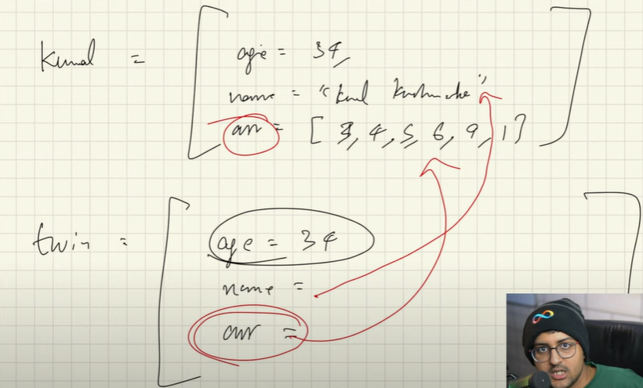*Primitive have there independent copy but Non-Primitives are referenced to the same object no new copy is made for it*

**Deep Copy**

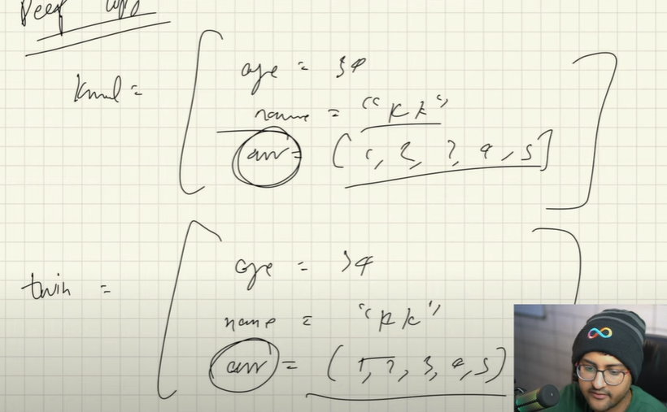*It needs to be hard coded*

## Collections and Map

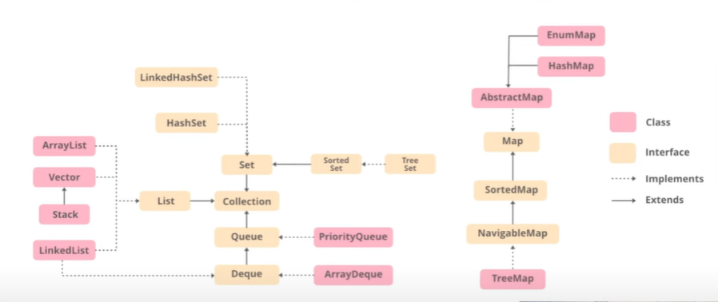

Common interface for all the data-structure as every data-structure contains common type of functions.

### Vector

Vector is synchronized, Arraylist can be accessed by all the threads simultaneous. Vector gives access to only one thread at a time.

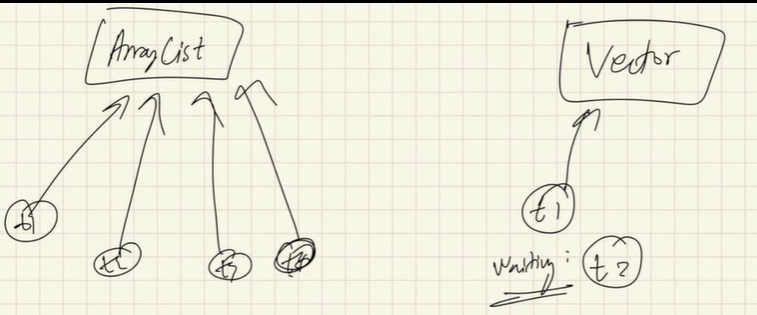

>**Note :** ArrayList is fast with collection we can make it thread safe also.

Map is also similar kind of common interface for all the mapping data-structure.

## Enumeration

Group of variables which are constant.

```java
enum Week{
    Mon, Tue, Wed.....;

    Week(){
        system.out.println("Constructor");
    }
}

Week week = Week.Monday;

//Internally - public static final Week week = new Week();
```
```
output - (Constructor)x7
```

Above mentioned values are called enum constants. They are public, static and final. There type is Week. Enum has various methods like ordinal, iterator, valueOf.

>**Note :**Enum constructor are not public or protected
, only private or default as we don't want to create new objects. Enum constructor is called automatically for all the objects.

All Enum extends java.lang.Enum thus enum cannot multiple classes. It cannot be a super class. But we can implement interfaces using enum.

