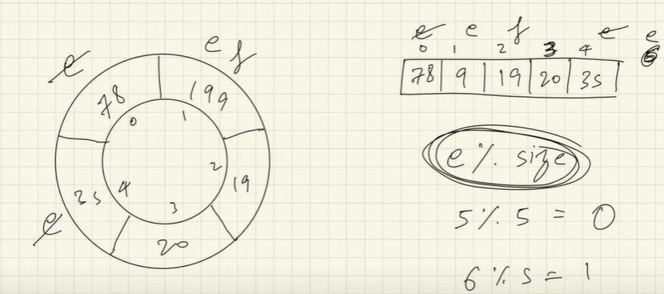

# Stack

Topmost data is accessible - LIFO/FILO. PUSH and POP are the two actions associated with it.

>**Note :**Internally stack is a class which extends vector arrays.

# Queue

Insertion from the end and Removal from the start - FIFO/LILO. 

Queue uses methods like offer and poll. Offer is used to insert in queue while poll removes from the queue. It is done primarily to not through error, add throws error if queue is full or insertion is not possible while remove does the same. But offer returns true or false if insertion was success or not and poll returns null if no element present.

>**Note :** Queue doesn't use .length() it uses .size()

>**Queue :** Queue is an interface which extends LinkedList, thus Queue can be referenced but object can't be created of queue.

```java
//Allowed
Stack<Integer> stack = new Stack<>();

//Not Allowed
Queue<Integer> queue = new Queue<>();

//Allowed
Queue<Integer> queue = new LinkedList<>();
```

## Implementation - Circular Queue



# Deque

Insert from front as well as back. We make Object of ArrayDeque. 

>**ArrayDeque -** Are resizable array implementation which support both end insertion and deletion, this class is faster thant stack and even faster than Linkedlist used as queue. Null insertion is prohibited and its not thread safe.

# When to use stack and Queue?

1. When data is stored and extracted in orders.
2. Logic is like answer so far.