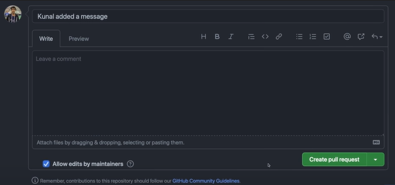
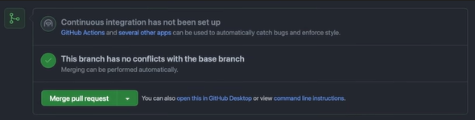

# Git and Github

## Git Commands
- $git init => Initialized git in a folder.
        
    Hidden file is created which can be accessed using $ls -a 
    
- $git status => Checks the status of the project

- $git add . Or $git add <file name>  => Stages file to be committed

- $git restore --staged <file name> => Destages the changes

- $git commit -m "<Message>" => Captures the changes

- $git log => Gives the history of commit

- $git reset <Hash id of previously logged commit> => Git commit works on LIFO so all the above commits would vanish from which it's been reset

- $git stash => Creates a temporary  storages for your changes and reverts back to the last commit. It should be followed by $git add .

- $git stash pop => Pops the stored changes 

- $git stash clean => Deletes the temporary changes

## Git Hub

- $git remote add origin <repo link> => Links the current file to GitHub repo, origin is the pseudo name of the URL (It can be anything but by convention all the repo in the personal account should have the name as origin)

- $git push <URL name> <branch name> => Pushes the file from local machine onto Git Hub

    $git push -u origin main => -u flag is used to set origin as the upstream remote in your git config so git pull can be used without any arguments in the future.

- $git remote -v => Gives the history of the commits, you can visit the repo by accessing the link

## Open Sourcing Projects

### Fork the project > It becomes part of your GitHub profile  

- $git clone <URL> => Downloads the forked project

- $git remote add upstream <URL> => Add the parent repo URL from where it has been forked, upstream represents parent repo and Origin is personal.

### Always make changes in a different branch

- $git branch <branch name> => Creates a new branch

- $git checkout <branch name> => Moves the head to the mentioned branch

- $git push origin <branch name> => Merges the changes in the branch onto the origin.

### This needs to be confirmed via Creating pull request on github

### One Branch can be associated to only one pull request once merge permission is provided all the subsequent push will be auto merged.

### Thus each new feature must have its unique branch for better segregation of code.

- $git reset <log id> => Goes to previous commit

- $git push origin -f => Force pushes a commit

## Merge the pull Request

- $git fetch --all --prune => Fetch everything from upstream branch --prune specifying even the deleted stuff to make local fork up to date with parent repo

- $git reset --hard upstream/main => reset's my main branch to upstream main branch after pulling it 

    OR
    
- $git pull upstream main => Does the same thing as fetch, reset and push.

- $git push origin main => Push the changes to your main branch.

## Pick and Squash

Merge multiple commits in one commit -

1. Reset to bottommost commit then add and commit all the changes in single commit.

2. $git rebase -i <bottommost log id> => -i opens interactive environment make the commits as 's' the one you want to merge and keep the commit as 'pick' into which you want to merge. :x to add message and then insert custom message.