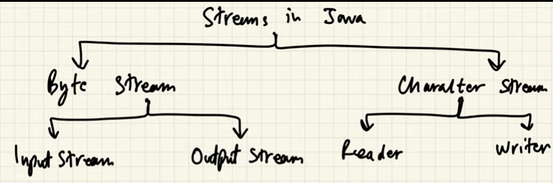

# String Buffer

Mutable sequence of character while strings are immutable.

## Advantages over string - 

1. Mutable
2. Efficient
3. Thread safe
    - Multiple threads are working on same data, it will allow only 1 thread to access it.
    - String Builder is not thread safe while String Buffer is.
    
# BigInteger

Extends Number and implements Comparable. Range - (-2^(INTEGER.MAX_ValUE), 2^(INTEGER.MAX_ValUE))

# BigDecimal

```java
double x = 0.03;
double y = 0.04;
double ans = y - x;
System.out.println(ans);
```
Expected answer - 0.01
```cmd
$0.0100000000000000002
```

Why? FLoat and Double are floating point numbers while integer and others are fixed point number. Binary representation of a fraction and a exponent. i.e. why they give some error (10^-19).

But Big Decimal gives exact answer.


Range - It contains a random precision int unscaled value & 32 bit int scale. 

- >= 0 -> Scale = no.of digits right of decimal point.
- <0 -> Unscale value = 10 ^ - scale.

# File Handling

Streams -> Sequence of data can be byte/Character.

Streams are abstraction provided by java, it implements these within class hierarchies in java.io package.

## Types of stream in Java


*In some cases character stream is efficient*

>**Note -** File ending with stream is for byte, if ends with reader/writer char type.

## IO-Exception

Corrupt file, not able to read or file not find

## Predefined Streams

1. System.out -> Standard Output stream -> console
2. System.in -> Standard Input stream -> keyboard
    - It is not necessary that for byte data we can't input characters
3. System.err -> Standard Error -> console

out and err are part of print stream while in is part of input stream. Being class stream means they are byte stream.

Passing argument in Scanner constructor specifies from where to take data. 

InputStreamReader -> Its a bridge between byte and char stream.

For every stream we must close it to free resource.

>**Note :** Any class which extends AutoCloseable are mandatory to be closed.

