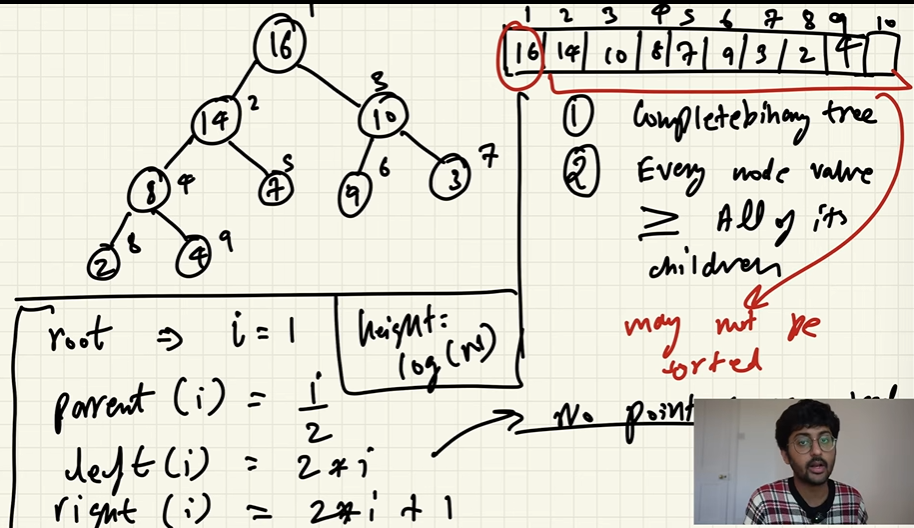
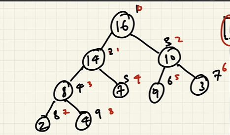
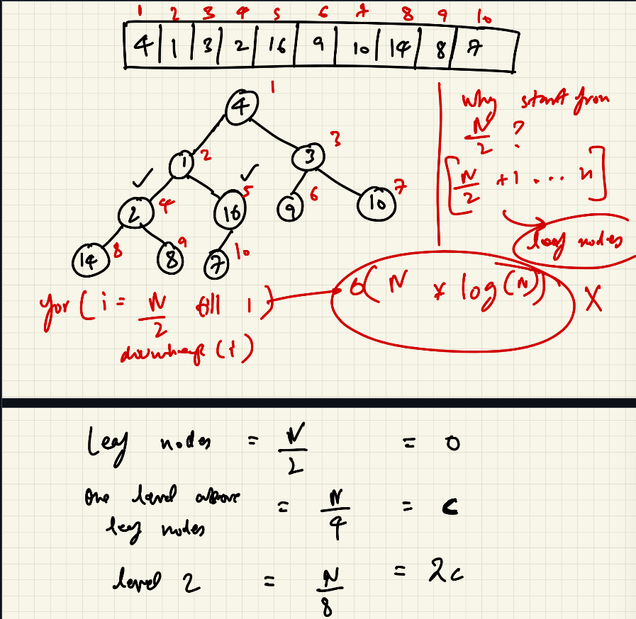
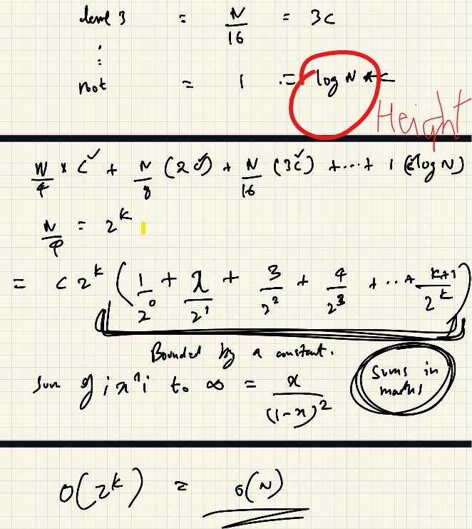

# Heaps

The most efficient method of extracting condition based argument on an N number of items in constant time where insertion takes minimum amount of time like O(log n)

## Properties

1. Heap is stored in Array but is represented as tree.
2. It is complete binary tree.
3. Max Heap - every node value is greater than all its children.
4. Array to tree representation.
    - root => i for convenience 1
    - parent(i) = i/2
    - left(i) = 2*i
    - right(i) = 2*i + 1;

5. Array to tree representation 0th index.
    - root => i for convenience 0
    - parent(i) = (i - 1)/2
    - left(i) = 2*i + 1
    - right(i) = 2*i + 2;

## Min heap -

### Insertion

1. Insert Normally
2. Check with its parent if its value is smaller than recently added if not swap.
3. Repeat again till all the children of every node are greater than nodes.
4. Height is O(log n) thus it will take log n in the worst case.

### Deletion

1. Delete the desired node in most cases root node will be used because this is the reason why heaps are used.
2. Check if left/ right is smaller swap it.
3. Continue till that leaf path.

# Heap Sort.

Remove items from heap and store in array done sorted. Removal take log(n) and we traverse n elements thus O(n*Log(n))

# Priority Queue

Priority Queue is actually heap. Priority queue can be made using linked list. But it takes O(n) for insertion which is not good. Thus we will use priority queue from heap.

## Creating heap from unsorted array

*In complete Binary Tree leaf nodes are always N/2*

