# HashMap

Hashmap can access data in constant amount of time. Hashmap stores key value pairs. 

## Use case

1. Compilers and interpreter for mapping variable to it's name
2. Network router.
3. Virtual memory.
4. Cryptography
5. String search grep command in terminal.

## Working Methodology

1. Hashcode function - It converts any element in positive integer.
    >**Note :** Object class has Hashcode function which can generate hashcode of any primitive/non-primitive data type.
2. HashCode can be very large needs to be reduce, this is known as hashing.
3. Hashing - Hashing reduces the hashcode to fit in our hashMap.
4. Collision - When hashing of two objects creates same index. New object can not be accommodate.

    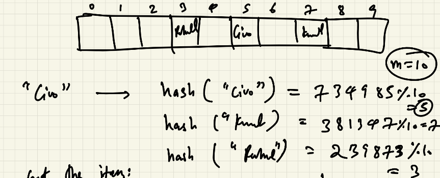

### Collision Prevention/Resolution

1. Chaining 
    - At every index of an array there is a linked list

    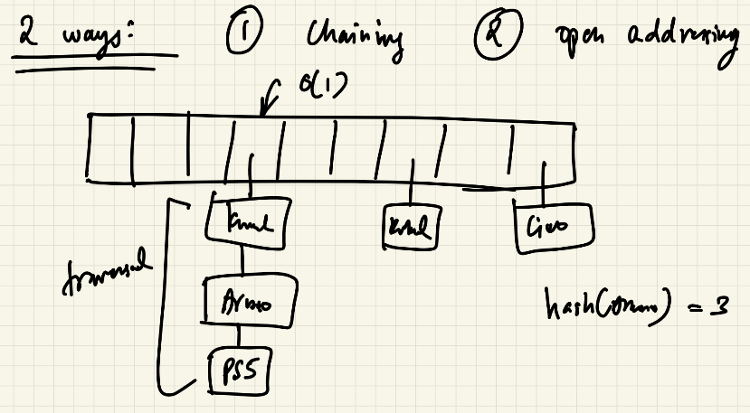

    - Worst case every item assign to same position
    - ***Solution -*** Simple uniform hashing
        - Assumption: Every key is equally likely to hash independent of previously hashed keys.

        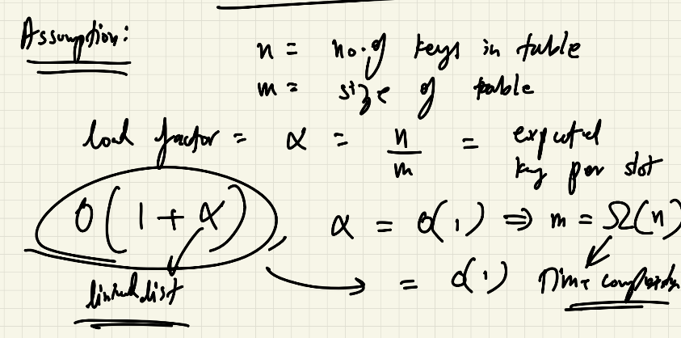

2. Open Addressing
    - Only one item per slot.
    - It will probe i.e. try to insert item if not possible insert in next item.
    - We can't delete items directly need to place ptr indicating the field was deleted earlier

    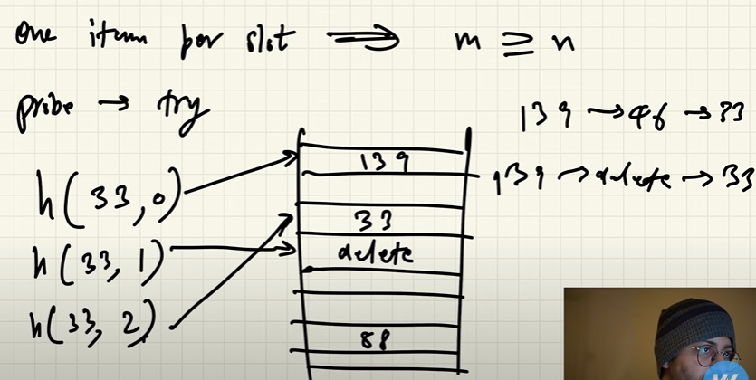

    **Probing strategy -**

    1. Linear Probing
        - **Formula -** h(k, i) = (h(k) + i)%m
        - Cluster is been formed
        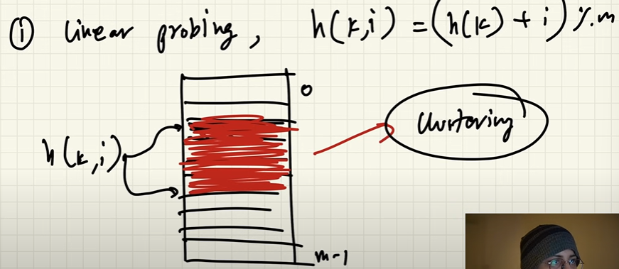

    2. Double Hashing
        - **Formula -** h(k, i) = (h1(k) + i*h2(k))%m
        - It is optimum is h2(k) is relatively prime to m for all k this will hit all the slots.
        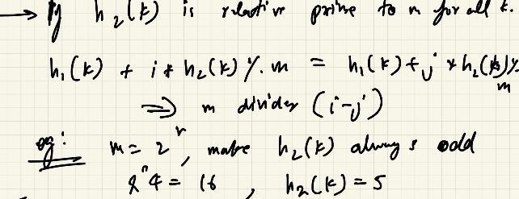

    **Uniform hashing assumption**
    
    Every key is equally likely to have m! permutation

    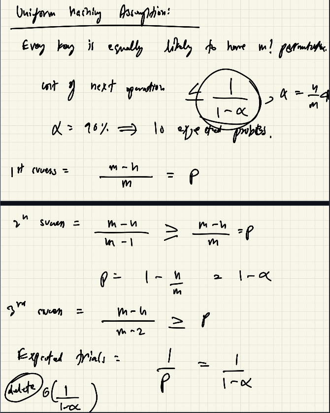

**When to use which?**

Open Hashing => Better cache performance because ptr are not needed.

Chaining => Less sensitive to hash functions.

### Hash Functions

1. Division method : 
    - > **Formula -** h(k) = k%m
    - where m can be size of array but size of array is not efficient. 
    - **Using m = prime number gives more uniformize hashing but this prime number must not be close to power of 2 or 10**

2. Multiplication Method
    - > **Formula -** h(k) = [(a*k)%2^m]>>(w-r)
    - where 
        - a = random number
        - w = number of bits in k
        - m = 2^r
    - Practical when a is odd, 2^(w- 1) < a < 2^w, a is not close to 2^(w-1) or 2^w
    - **This is popular than division as multiplication and bit shifting is faster**

3. Universal Hashing

    - > **Formula -** h(k) = [(a*k + b)%p]%m
    - where 
        - a & b are random number belongs to [0, 1, ..., p - 1]
        - p is large prime number
    - **Using this formula probability[h(k1) = h(k2)] = 1/m**

    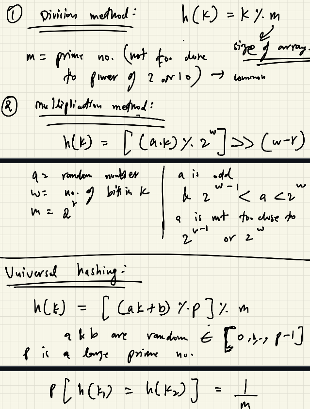

### Size of table

**Formula -** m = theta(n)

If m is small then linked list traversal time will be more resulting is slow processing. If large than wasteful.

**Main ideology to follow start small and then grow**

Once the table is full double the size of array. Cost to insert N items comes to O(n).
Thus we can speculate that cost to insert 1 item will be O(1).

>**Note :** This is known as Amortized constant time. i.e. Average constant time.

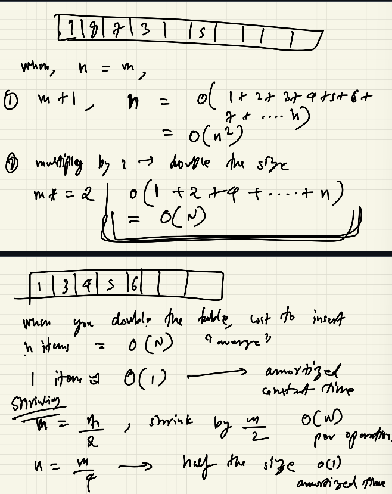

**Shrinking -**

Half the size of array when elements are halved but this is ineffective thus half the size of array when the size is m/4. This results in Amortized constant time.

## Java Implementation

1. Set Interface -
    It stores unique values but doesn't store key value pairs.

2. Map Interface -
    Key Value pairs. Hashmap, TreeMap class. TreeMap stores data in sorted order.

Difference between Hashmap and HashTable -

Hashmap is not synchronized hence cannot be shared between the threads but HashTable is synchronized. Hashmap allows 1 null key and multiple null value. HashTable doesn't allow storage of null. HashTable implements HashCode and Equals methods of object as null is not an object thus it does not permits its storage.Hashmap is preferred over hashTable is thread synchronization is not a priority. Hashmap is advance method over hashTable.

## Problems

### Karp-Rabin String Matching Algorithm

Finding String in a bigger string.

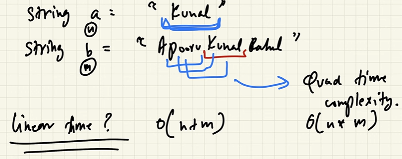

It compares hash value of a with hash value of b but not the entire string but i = i + len(a).

This is true coz hash values are usually unique and if hash value matches maybe the strings are same.

If hash value matches then check character.

If each character is not matched then the probability of this happening is 1/len(a)

Thus expected cost per i index = O(i)

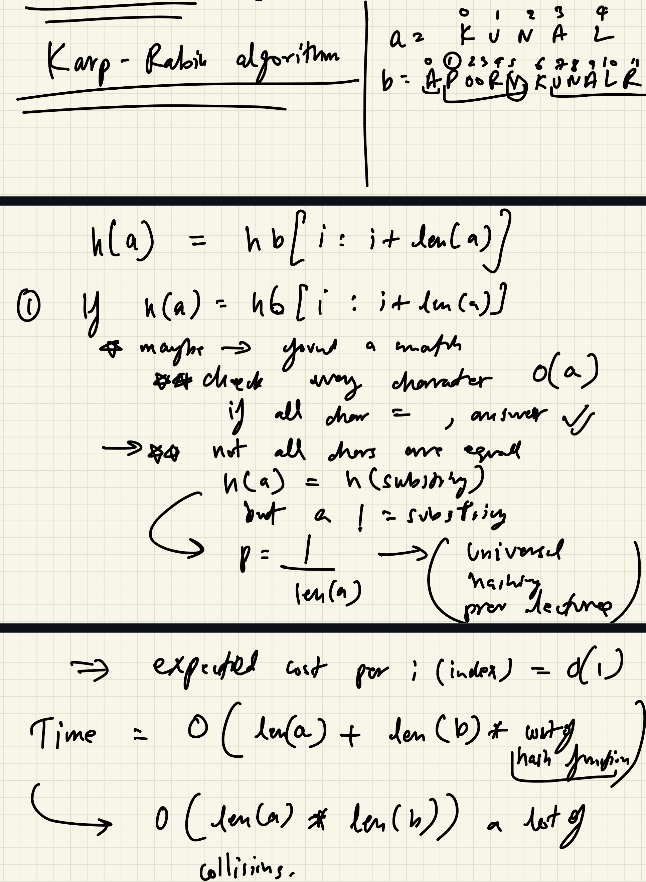

>**Note :** To tackle false positive we can use advance technique - Monte Carlo Variant i.e. Multiple hashing or Las Vegas Variant