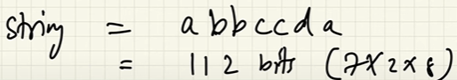
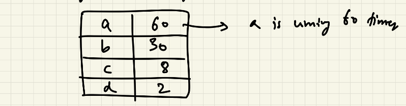
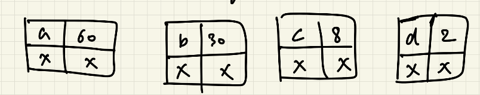
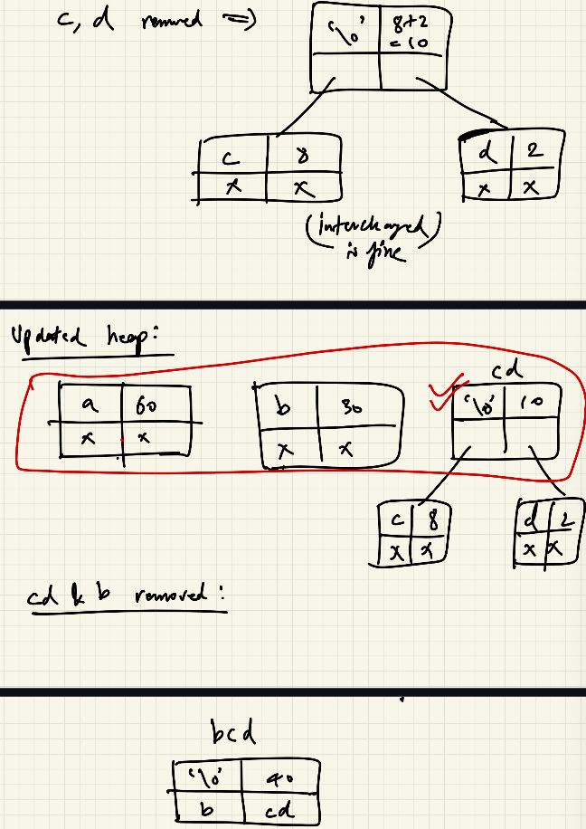
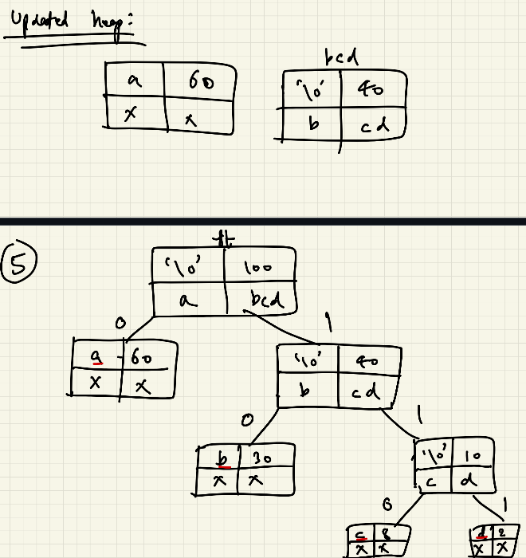
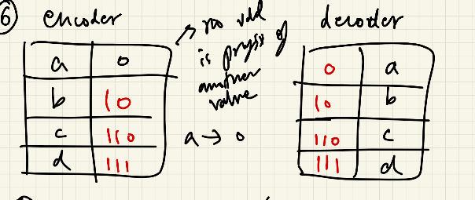
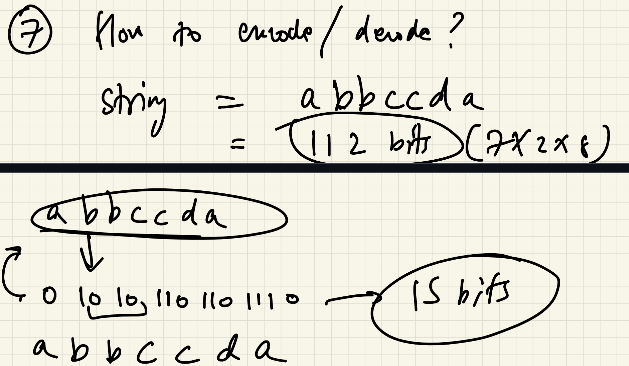
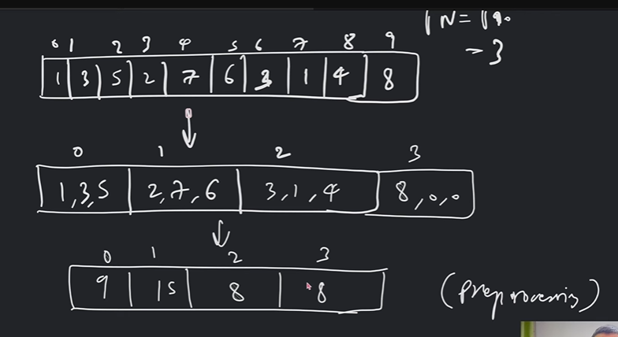
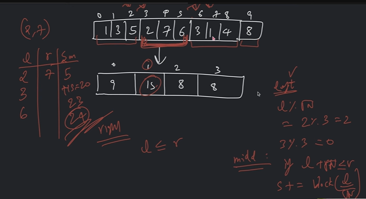

# Algorithms

## Huffman Coding 

Its a lossless algorithm, used for data compression.

### Steps - 

1. Pass the string.
    
    
2. Make frequency Map.
    
3. For every key in frequency map, create a node and insert that node in a min heap/Priority Queue.
    - Node => char data; int cost i.e. frequency; Node left and right.
    
4. Remove 2 elements, it will be removed on the base of cost as its a min heap and combine them to left and right order doesn't matter.
    
    
5. Create full tree and assign left as 0's and right as 1's
6. Find path from root to that character.
    
7. Encode and Decode -
    - Encode -> Represent char in form of their encoder value.
    - Decode -> Check in the Decoder table if 0 exist? YES, then 1 exist? NO 10 exists? YES thus b and so on.

    >**Note :** Tree makes it sure that no value is prefix of other value.
    

### Complexity 

Space - O(N).
Time - 2(n-1) times insertion and removing from heap. Cost for insertion and removal in heap. => O(n*log(n))

## Range Query Question

Find sum from index i to j worst case O(n). Better approach.

## SQRT Decomposition

Used to optimize queries between ranges, reduces complexity to O(n)

### Steps 

1. Divide the array into block of size rt(n).
2. Compute ans for every block
3. GIven the query for L to R combine block which contains solution.

*Pre-processing*

Cases - 
1. Whole chunk is taken.
2. Partial overlap with answer.
    - This slicing will never exceed rt(n).
    - Maximum can be rt(n) in that case we take whole block.

Block containing index i = i/rt(n)

### Update

1. Replace element
2. Add difference in block.

