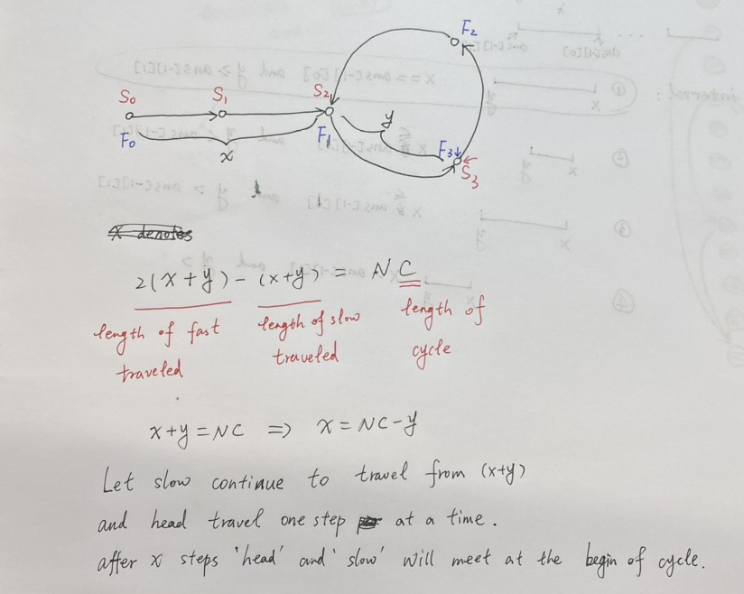

# Problems

## Easy
1. [X][Convert Binary Number in a Linked List to Integer](https://leetcode.com/problems/convert-binary-number-in-a-linked-list-to-integer/) `leetcode`
1. [X][Reverse Linked List](https://leetcode.com/problems/reverse-linked-list/) `leetcode`

	```java
	ListNode reverseHelper(ListNode head, ListNode temp){
        if(temp == null || temp.next == null) return head;
        ListNode nextTemp = temp.next;
        temp.next = temp.next.next;
        nextTemp.next = head;
        head = nextTemp;
        return reverseHelper(head, temp);
    }
	```
	

1. [X][Middle of the Linked List](https://leetcode.com/problems/middle-of-the-linked-list/) `leetcode`
1. [X][Merge Two Sorted Lists](https://leetcode.com/problems/merge-two-sorted-lists/) `leetcode`
1. [X][Delete Node in a Linked List](https://leetcode.com/problems/delete-node-in-a-linked-list/) `leetcode`

    >**Note :** Medium and crazy no head given and we need to delete the node given. Keep on assigning `node.val = node.next.val`

1. [X][Palindrome Linked List](https://leetcode.com/problems/palindrome-linked-list/) `leetcode` `Snapdeal`
    >**Note :** For even mid
    ```java
    //For first mid in even.
    ListNode slow = head;
    ListNode fast = head.next;
    ```
1. [X][Intersection of Two Linked Lists](https://leetcode.com/problems/intersection-of-two-linked-lists/) `leetcode`

	>**Note :** https://youtu.be/D0X0BONOQhI?si=QL9I1r2vnX3zQ7BI Good Solutions. https://leetcode.com/problems/intersection-of-two-linked-lists/description/ Can't code it in workspace that neatly.
	
1. [X][Linked List Cycle](https://leetcode.com/problems/linked-list-cycle/) `leetcode` `Samsung`
	Use 2 ptr slow and fast if both meet each other before fast hitting null then cycle exist
1. [X][Remove Duplicates from Sorted List](https://leetcode.com/problems/remove-duplicates-from-sorted-list/)`leetcode`
1. [X][Find All Numbers Disappeared in an Array](https://leetcode.com/problems/find-all-numbers-disappeared-in-an-array/) `leetcode`
	
	Using normal swap algorithm is linked list style solution https://leetcode.com/problems/find-all-numbers-disappeared-in-an-array/solutions/6837974/even-faster-cpython-on-time-o1-space-usi-n81a/

1. [X][Remove Linked List Elements](https://leetcode.com/problems/remove-linked-list-elements/) `leetcode`

## Medium
1. [X][Design Twitter](https://leetcode.com/problems/design-twitter/) `leetcode`

	>**Note :** Good example of how to write a class inside class `DesignTwitter dt = new DesignTwitter();Twitter twitter = dt.twitter;` for map `userMap.putIfAbsent(userId, new ArrayList<>());` create dynamic List if absent. Remove a value from arrayList `following.remove(Integer.valueOf(followeeId));`. Check if a value is present in arrayList `following.contains(t.userId)`.

1. [X][ Design Linked List](https://leetcode.com/problems/design-linked-list/) `leetcode`
1. [X][Reverse Linked List II](https://leetcode.com/problems/reverse-linked-list-ii/) `leetcode`

	>**Note :** Use dummy head node

1. [X][Reorder List](https://leetcode.com/problems/reorder-list/) `leetcode`
	Find the middle using hair and tortoise. Reverse string from mid. Merge two string one from head and other from middle.

1. [O][Remove Nth Node From End of List](https://leetcode.com/problems/remove-nth-node-from-end-of-list/) `leetcode` `HSBC`

	>**Note :** Tricky problem move fast pointer first only n + 1 times then move slow and fast till fast is null

1. [x][Swapping Nodes in a Linked List](https://leetcode.com/problems/swapping-nodes-in-a-linked-list/) `leetcode`

	Tried difficult approach of not just swapping value but swapping nodes which feel difficult.

1. [X][Add Two Numbers](https://leetcode.com/problems/add-two-numbers/) `leetcode` `TCS` `Amazon` `Microsoft` `Facebook` `Qualcomm`
1. [X][Add Two Numbers II](https://leetcode.com/problems/add-two-numbers-ii/) `leetcode`
	Not reversing the string makes it slower
1. [X][Linked List Cycle II](https://leetcode.com/problems/linked-list-cycle-ii/) `leetcode`
	
1. [ ][Flatten a Multilevel Doubly Linked List](https://leetcode.com/problems/flatten-a-multilevel-doubly-linked-list/) `leetcode` `Amazon`
1. [ ][Rotate List](https://leetcode.com/problems/rotate-list/) `leetcode` `Microsoft`
1. [ ][Copy List with Random Pointer](https://leetcode.com/problems/copy-list-with-random-pointer/) `leetcode`
1. [ ][LRU Cache](https://leetcode.com/problems/lru-cache/) `leetcode`
1. [ ][Remove Duplicates from Sorted List II](https://leetcode.com/problems/remove-duplicates-from-sorted-list-ii/) `leetcode` `Amex`
1. [ ][Design Browser History](https://leetcode.com/problems/design-browser-history/) `leetcode`
1. [ ][Partition list](https://leetcode.com/problems/partition-list/) `leetcode`
1. [ ][Find first node of loop in a linked list](https://www.geeksforgeeks.org/find-first-node-of-loop-in-a-linked-list/) `GFG`
1. [ ][Swap Nodes in Pairs](https://leetcode.com/problems/swap-nodes-in-pairs/)`leetcode`
1. [ ][Remove Zero Sum Consecutive Nodes from Linked List](https://leetcode.com/problems/remove-zero-sum-consecutive-nodes-from-linked-list/) `leetcode`
1. [ ][Insertion Sort List](https://leetcode.com/problems/insertion-sort-list/)`leetcode`
1. [ ][ Reverse Nodes in Even Length Groups](https://leetcode.com/problems/reverse-nodes-in-even-length-groups/)`leetcode` 
1. [ ][ Linked List Random Node](https://leetcode.com/problems/linked-list-random-node/)`leetcode`
1. [ ][Sort List](https://leetcode.com/problems/sort-list/)`leetcode`
1. [ ][ Merge In Between Linked Lists](https://leetcode.com/problems/merge-in-between-linked-lists/)`leetcode`
1. [ ][Design Browser History](https://leetcode.com/problems/design-browser-history/)`leetcode`
1. [ ][Delete the Middle Node of a Linked List](https://leetcode.com/problems/delete-the-middle-node-of-a-linked-list/)`leetcode`
1. [ ][Next Greater Node In Linked List](https://leetcode.com/problems/next-greater-node-in-linked-list/)`leetcode`
1. [ ][ Odd Even Linked List](https://leetcode.com/problems/odd-even-linked-list/)`leetcode`
1. [ ][Linked List Random Node](https://leetcode.com/problems/linked-list-random-node/)`leetcode`
1. [ ][Split Linked List in Parts](https://leetcode.com/problems/split-linked-list-in-parts/)`leetcode`
1. [ ][ Find the Minimum and Maximum Number of Nodes Between Critical Points](https://leetcode.com/problems/find-the-minimum-and-maximum-number-of-nodes-between-critical-points/)`leetcode`

## Hard
1. [ ][Reverse Nodes in k-Group](https://leetcode.com/problems/reverse-nodes-in-k-group/) `leetcode`
1. [ ][LFU Cache](https://leetcode.com/problems/lfu-cache/) `leetcode` `Google`
1. [ ][Merge k Sorted Lists](https://leetcode.com/problems/merge-k-sorted-lists/) `leetcode`
1. [ ][Clone a linked list with next and random pointer](https://www.geeksforgeeks.org/clone-linked-list-next-random-pointer-o1-space/) `GFG` `Google` `Flipkart`
1. [ ][All O'one Data Structure](https://leetcode.com/problems/all-oone-data-structure/) `leetcode`
1. [ ][Design Skiplist](https://leetcode.com/problems/design-skiplist/) `leetcode`

1. [X][Reverse Linked List](https://leetcode.com/problems/reverse-linked-list/) `leetcode`