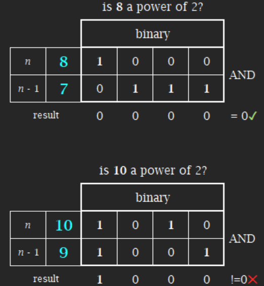
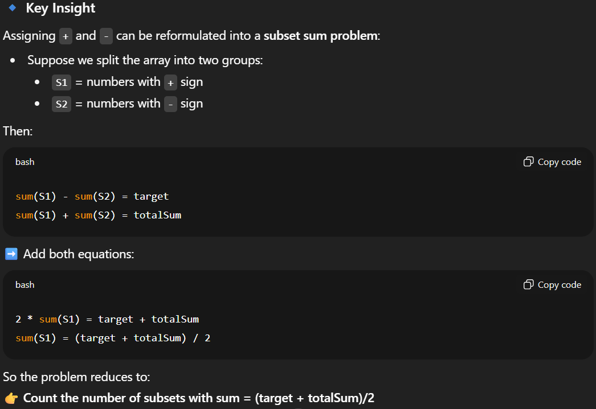
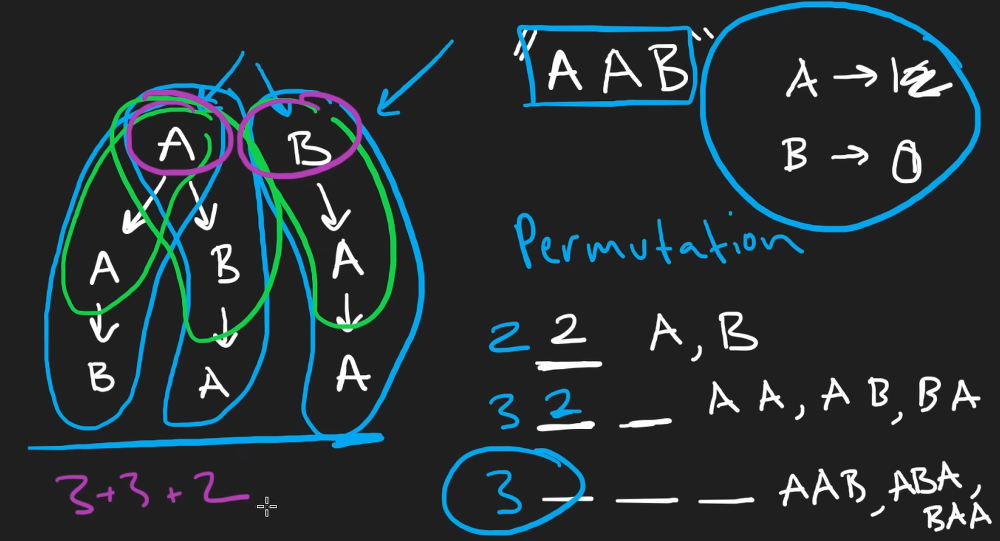

# Videos
1. [ ][Complete Recursion Course](https://www.youtube.com/playlist?list=PL9gnSGHSqcnp39cTyB1dTZ2pJ04Xmdrod)

# Problems

Total Problems - 79

Completed Problems - 37

## Easy
1. [X][Sum Triangle from Array](https://www.geeksforgeeks.org/sum-triangle-from-array/) `GFG`
1. [X][Maximum and Minimum value in an array](https://www.geeksforgeeks.org/recursive-programs-to-find-minimum-and-maximum-elements-of-array/) `GFG`
1. [X][Binary Search using recursion](https://leetcode.com/problems/binary-search/) `leetcode`
1. [X][First Uppercase Letter in a String](https://www.geeksforgeeks.org/first-uppercase-letter-in-a-string-iterative-and-recursive/) `GFG`
1. [X][Reverse String](https://leetcode.com/problems/reverse-string/) `leetcode`
1. [X][Print 1 To N Without Loop](https://practice.geeksforgeeks.org/problems/print-1-to-n-without-using-loops-1587115620/1/) `GFG`
1. [X][Fibonacci Number](https://leetcode.com/problems/fibonacci-number/) `leetcode`

    ```java
    public int fib(int n) {
        if(n == 0) return 0;
        if(n == 1) return 1;
        return fib(n - 2) + fib(n - 1);
    }
    ```
1. [X][Special Fibonacci](https://www.codechef.com/problems/FIBXOR01/) `CodeChef`
1. [X][Length of string using Recursion](https://www.geeksforgeeks.org/program-for-length-of-a-string-using-recursion/) `GFG`
1. [X][Geek-onacci Number](https://practice.geeksforgeeks.org/problems/geek-onacci-number/0/) `GFG`
1. [X][Recursive Bubble Sort](https://www.geeksforgeeks.org/recursive-bubble-sort/) `GFG`
1. [X][Recursive Insertion Sort](https://www.geeksforgeeks.org/recursive-insertion-sort/) `GFG`

    Interesting

1. [X][Sum of digit of a number using Recursion](https://www.geeksforgeeks.org/sum-digit-number-using-recursion/) `GFG`
1. [X][Product of two numbers using Recursion](https://www.geeksforgeeks.org/product-2-numbers-using-recursion/) `GFG`
1. [X][Check Prime or not](https://www.geeksforgeeks.org/recursive-program-prime-number/) `GFG`
1. [X][Sum of Natural numbers using Recursion](https://www.geeksforgeeks.org/sum-of-natural-numbers-using-recursion/) `GFG`
1. [X][Power of Two](https://leetcode.com/problems/power-of-two/) `leetcode`

    Some Crazy solution - `return n>0 && (n & (n-1))==0;`
    

1. [X][Power of Three](https://leetcode.com/problems/power-of-three/) `leetcode`

    Recursive solution is not optimize looping is more optimized

    Crazy Solution - `return n > 0 && 1162261467 % n == 0;`
    3^19 = 1162261467 is the largest factor of 3 in 32 bits

1. [X][Power of Four](https://leetcode.com/problems/power-of-four/) `leetcode`
    - Write a recursive function for given n and a to determine x:
    ```java
        n = a ^ x 
        a = 2, 3, 4
        (2 ^ -31) <= n <= (2 ^ 31) - 1      
    ```
1. [X][Write a recursive function that returns the factorial of a number.](https://www.hackerrank.com/challenges/30-recursion/problem) `HackerRank`
1. [X][Write a recursive function to check whether an array is sorted or not.](https://www.geeksforgeeks.org/program-check-array-sorted-not-iterative-recursive) `GFG`

    ```java
        if(n == 0) return true;
        return arr[n] >= arr[n - 1] && helper(arr, n - 1);
    ```
    Use of && is important

1. [X][Number of Steps to Reduce a Number to Zero.](https://leetcode.com/problems/number-of-steps-to-reduce-a-number-to-zero/) `leetcode`
1. [O][Check for balanced paranthesis using recursion without stack.](https://www.geeksforgeeks.org/check-for-balanced-parenthesis-without-using-stack/) `GFG`
    
    Difficult

1. [X][Remove consecutive duplicate characters from a string.](https://www.geeksforgeeks.org/remove-consecutive-duplicates-string/) `GFG` 
1. [O][Print all possible palindromic partitions of a string.](https://www.geeksforgeeks.org/given-a-string-print-all-possible-palindromic-partition/) `GFG`

    Good question needed help which shouldn't be taken

1. [O][Power Set of permutations of a string in Lexicographic order.](https://www.geeksforgeeks.org/powet-set-lexicographic-order/) `GFG`

    Misread question and focus on backtrack

## Medium
1. [X][Combination Sum](https://leetcode.com/problems/combination-sum/) `leetcode`

    `combination.add(new ArrayList<>(currCombination));` is different from `combination.add(currCombination);`

1. [X][Word Search](https://leetcode.com/problems/word-search/) `leetcode`

    >**Note :** To avoid backtrack use vis matrix and remove visited once UDRL is been traversed
    
1. [X][Target sum](https://leetcode.com/problems/target-sum/) `leetcode`

    https://youtu.be/b3GD8263-PQ?si=88MM9vV1XaHC9itz

    

1. [X][Find Kth Bit in Nth Binary String](https://leetcode.com/problems/find-kth-bit-in-nth-binary-string/) `leetcode`

    Do solve - Oh this is that PS
    Sexy Question Love it
    ```java
    public char findKthBit(int n, int k) {
        if(n == 1) return '0';

        // Key logic
        int len = (1 << n) - 1;
        int mid = len/2 + 1;

        if(mid == k) return '1';
        else if(k < mid)
            return findKthBit(n - 1, k);
        else{
            int mirrorBit = mid - (k - mid);
            //Reverse the bits
            return findKthBit(n - 1, mirrorBit) == '0'? '1': '0';
        }
    }
    ```

1. [X][K-th Symbol in Grammar](https://leetcode.com/problems/k-th-symbol-in-grammar/) `leetcode`

    Fun question
    >**Note :** `int mid = 1 << (n - 2);` good trick
    ```java
    public int kthGrammar(int n, int k) {
        if(n == 1) return 0;
        int mid = 1 << (n - 2);
        
        if(k <= mid) return kthGrammar(n - 1, k);
        return kthGrammar(n - 1, k - mid) == 1? 0: 1;
    }
    ```

1. [X][Count Good Numbers](https://leetcode.com/problems/count-good-numbers/) `leetcode`
    
    PnC logic
    5^ceil(n/2)∗4^floor(n/2)%(mod10^9+7)

1. [X][N Digit numbers with digits in increasing order](https://practice.geeksforgeeks.org/problems/n-digit-numbers-with-digits-in-increasing-order5903/1/) `GFG`
1. [X][Pow(x, n)](https://leetcode.com/problems/powx-n/) `leetcode`

    If int n = -2147483648; then we can't flip it to -n coz range is till 2147483647 so we need to take long

1. [X][Minimum Non-Zero Product of the Array Elements](https://leetcode.com/problems/minimum-non-zero-product-of-the-array-elements/) `leetcode`

    Fails for p = 32
    ```java
        int num = (int)Math.pow(2,p);
        return ((num - 1)*((int)Math.pow((num-2),(num - 2)/2)))%mod;
    ```
    Logic is correct just the execution of using long instead of int is crashing the code
    
    Shitty question tackling all the mod stuff

1. [X][Handshakes](https://practice.geeksforgeeks.org/problems/handshakes1303/1/) `GFG`

    It is solved using Catalan Theorem
    ```java
    int catalan(int n)
    {
    // Base case
    if (n <= 1)
        return 1;
    // catalan(n) is sum of
    // catalan(i)*catalan(n-i-1)
    int res = 0;
    for (int i = 0; i < n; i++)
        res += catalan(i)
            * catalan(n - i - 1);

    return res;
    }
    int count(int n){
        // code here
        return catalan(n/2);
    }
    ```
1. [O][HackerRank](https://www.hackerrank.com/domains/algorithms?filters%5Bsubdomains%5D%5B%5D=recursion&filters%5Bdifficulty%5D%5B%5D=medium)
1. [X][Divisible Subset](https://www.codechef.com/problems/DIVSUBS)  `Codechef`
1. [X][Perfect squares](https://leetcode.com/problems/perfect-squares/)`leetcode`

    Exponential Logic giving TLE, Codes need DP

1. [X][decode string](https://leetcode.com/problems/decode-string/)`leetcode`

    Almost there but couldn't

1. [X][find the winner of the circular game](https://leetcode.com/problems/find-the-winner-of-the-circular-game/) `leetcode`

    Most Brute Force code XD

    Crazy solution solution
    ```java
    int helper(int n, int k){
        if(n == 1) return 0;
        return (helper(n - 1, k) + k)%n;
    }
    public int findTheWinner(int n, int k) {
        return helper(n, k) + 1;
    }
    ```

1. [X][Different ways to add parantheses in the expression](https://leetcode.com/problems/different-ways-to-add-parentheses/) `leetcode`
1. [X][Letter Combinations of a Phone Number](https://leetcode.com/problems/letter-combinations-of-a-phone-number/) `leetcode`
1. [X][Predict the winner.](https://leetcode.com/problems/predict-the-winner/) `leetcode`

    Great Question rather than applying dumb recursion need to think smartly https://leetcode.com/problems/predict-the-winner/solutions/155217/from-brute-force-to-top-down-dp-by-grace-wmy5/ 

1. [X][Gray code](https://practice.geeksforgeeks.org/problems/gray-code-1611215248/1/) `GFG` `Google`

    >**Note :** Converting Binary String to int `Integer.parseInt("10010", 2)` 2 Denotes binary

1. [X][Combination Sum II](https://leetcode.com/problems/combination-sum-ii/) `leetcode`

    Dumb solution was expecting TLE for sure
    >**Note :** Sorting `List<List<Integer>>` 
    ```java
    		Collections.sort(combinationSum, new Comparator<List<Integer>>(){

			@Override
			public int compare(List<Integer> o1, List<Integer> o2) {
				// TODO Auto-generated method stub
				if(o1.size() == o2.size()){
					int i = 0;
					while(i < o1.size()){
						if(Objects.equals(o1.get(i), o2.get(i))){
							i++;
							continue;
						}
						return o1.get(i) - o2.get(i);
					}
				}
				return o1.size() - o2.size();
			}

		});
    ```

    Basic Logic - https://www.youtube.com/watch?v=Vn2v6ajA7U0
    
1. [X][Combination Sum III](https://leetcode.com/problems/combination-sum-iii/) `leetcode`
1. [X][Sudoku Solver](https://leetcode.com/problems/sudoku-solver/) `leetcode`
    
    >**Note :** Leetcode hard, almost solved with minor errors.

1. [X][Letter tile possibilities](https://leetcode.com/problems/letter-tile-possibilities/) `leetcode`

    

    >**Note :** Very different kind of recursion no index nothing sexy question.

1. [X][All Paths From Source to Target](https://leetcode.com/problems/all-paths-from-source-to-target/) `leetcode`
1. [ ][Sort a stack using recursion](https://www.geeksforgeeks.org/sort-a-stack-using-recursion/) `GFG`
1. [ ][Reverse a stack using recursion](https://www.geeksforgeeks.org/reverse-a-stack-using-recursion/) `GFG`
1. [X][Beautiful Arrangement](https://leetcode.com/problems/beautiful-arrangement/) `leetcode`

    Better solutions - https://leetcode.com/problems/beautiful-arrangement/solutions/1000589/java-5-clean-codes-bfs-permutations-back-m4z8/ 

1. [ ][Lowest Common Ancestor of a Binary Tree](https://practice.geeksforgeeks.org/problems/lowest-common-ancestor-in-a-binary-tree/1/) `GFG` `Amex`
1. [ ][Prime numbers after prime P with sum S](https://www.geeksforgeeks.org/prime-numbers-after-prime-p-with-sum-s/) `GFG`
1. [X][Path with Maximum Gold](https://leetcode.com/problems/path-with-maximum-gold/) `leetcode`

    >**Note :** https://www.youtube.com/watch?v=I1wllM_pozY Why DFS cannot be optimized. Marking grid with zero is such a clever approach.

1. [ ][Longest Possible Route in a Matrix with Hurdles](https://www.geeksforgeeks.org/longest-possible-route-in-a-matrix-with-hurdles/) `GFG`
1. [ ][Tug of war](https://www.geeksforgeeks.org/tug-of-war/) `GFG` `Adobe`
1. [ ][Rat in a maze](https://www.geeksforgeeks.org/rat-in-a-maze-backtracking-2/) `GFG`
1. [x][Reorder List](https://leetcode.com/problems/reorder-list/) `leetcode`

## Hard
1. [X][Parsing A Boolean Expression](https://leetcode.com/problems/parsing-a-boolean-expression/) `leetcode`

    Almost there but failed

1. [X][Special Binary String](https://leetcode.com/problems/special-binary-string/) `leetcode`

1. [X][Permutation Sequence](https://leetcode.com/problems/permutation-sequence/) `leetcode`

    Sexy question but worst time result, able to generate all permutations

1. [X][Next Happy Number](https://practice.geeksforgeeks.org/problems/next-happy-number4538/1/) `GFG`
    >**Note :** 1, 7 are only happy single digit numbers
    https://www.youtube.com/watch?v=WNwUCXQ7tKc 
1. [O][Basic Calculator](https://leetcode.com/problems/basic-calculator/) `leetcode`

    Don't know how to do it using recursion - https://leetcode.com/problems/basic-calculator/solutions/7210257/java-stack-solution-recursion-solution-e-hst1/ 

    Crazy solution

1. [X][Integer to English Words](https://leetcode.com/problems/integer-to-english-words/) `leetcode`

    Tried hard almost there
    
1. [O][Maximize Number of Nice Divisors](https://leetcode.com/problems/maximize-number-of-nice-divisors/) `leetcode`

    WTF is even this https://youtu.be/Zq6Fl0YV5Fo?si=fA-Q5uBRpPIw12Ew 

1. [X][N Queens](https://leetcode.com/problems/n-queens/) `leetcode`
1. [X][N Queens II](https://leetcode.com/problems/n-queens-ii/) `leetcode`
1. [X][Word break II](https://leetcode.com/problems/word-break-ii/) `leetcode` `Google`

    >**Notes :** `List.of("apple","pen","applepen","pine","pineapple")` passes an array as string

1. [X][Unique paths III](https://leetcode.com/problems/unique-paths-iii/) `leetcode`
1. [ ][Find shortest safe route in a path with landmines](https://www.geeksforgeeks.org/find-shortest-safe-route-in-a-path-with-landmines/) `GFG` `Google`
1. [ ][Minimum steps to destination](https://practice.geeksforgeeks.org/problems/minimum-number-of-steps-to-reach-a-given-number5234/1/) `GFG` `Amex` `Adobe`
1. [ ][Hamiltonian Cycle](https://www.geeksforgeeks.org/hamiltonian-cycle-backtracking-6/) `GFG`
1. [ ][M colorning problem](https://www.geeksforgeeks.org/m-coloring-problem-backtracking-5/) `GFG`
1. [ ][The Knight's tour](https://www.geeksforgeeks.org/the-knights-tour-problem-backtracking-1/) `GFG`
1. [ ][Maximum number possible by doing at-most K swaps](https://www.geeksforgeeks.org/find-maximum-number-possible-by-doing-at-most-k-swaps/) `GFG`
1. [ ][HackerRank](https://www.hackerrank.com/domains/algorithms?filters%5Bsubdomains%5D%5B%5D=recursion&filters%5Bdifficulty%5D%5B%5D=hard)
1. [O][Concatenated Words](https://leetcode.com/problems/concatenated-words/)`leetcode`

    Trie and memoization or DP