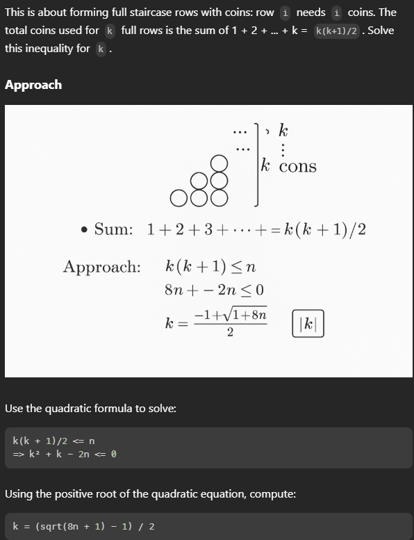

# Problems:

Total number of problems - 42

## Tips

>**Note :** When to use what `<=` is use when we want to store res somewhere while `<` is use when left and right intersects and we can simply return the intersection.

### Binary search logic - 
```java
public boolean isPerfectSquare(int num) {
    long left = 0;
    long right = num;
    while(left <= right){
        long mid = (right - left)/2 + left;
        if((int)mid * mid == num)return true;
        else if((int)mid * mid < num) left = mid + 1;
        else right = mid - 1;
    }
    return false;
}
```

if using less than logic - This is helpful in finding smallest element and stuff
```java
    public int peakIndexInMountainArray(int[] arr) {
        int start = 0;
        int end = arr.length - 1;
        while(start < end){
            // System.out.println("Hello");
            int middle = start + (end - start)/2;
            if(arr[middle] > arr[middle + 1]){
                end = middle;
            }else{
                start = middle + 1;
            }
        }
        return start;
    }
```
It is used if we dont have definitive return stmt but just want to rotate the window
```java
    public int findMin(int[] nums) {
        int left = 0, right = nums.length - 1;
        
        while (left < right) {
            int mid = left + (right - left) / 2;

            if (nums[mid] > nums[right]) {
                // Minimum must be in the right half
                left = mid + 1;
            } else {
                // Minimum is at mid or in the left half
                right = mid;
            }
        }
        
        // At the end, left == right pointing to the minimum
        return nums[left];
    }
```

2D Matrix 
```java
    int row = 0;
    int col = matrix[0].length - 1;
    while(row < matrix.length && col >= 0){
        if(matrix[row][col] == target){
            return matrix[row][col];
        }else if(matrix[row][col] < target){
            row ++;
        }else{
            col --;
        }
    }
    return -1;
```

## Easy
- [X] [Guess Number Higher or Lower](https://leetcode.com/problems/guess-number-higher-or-lower/)
- [X] [First Bad Version](https://leetcode.com/problems/first-bad-version/)
- [X] [Two Sum II - Input array is sorted](https://leetcode.com/problems/two-sum-ii-input-array-is-sorted/)
- [X] [Valid Perfect Square](https://leetcode.com/problems/valid-perfect-square/)
- [X] [Arranging Coins(Easy)](https://leetcode.com/problems/arranging-coins/)

    

    ```js
    var arrangeCoins = function(n) {
        return Math.floor((Math.sqrt(8 * n + 1) - 1) / 2);
    };
    ```

```java
    int row = 0;
    int col = matrix[0].length - 1;
    while(row < matrix.length && col >= 0){
        if(matrix[row][col] == target){
            return matrix[row][col];
        }else if(matrix[row][col] < target){
            row ++;
        }else{
            col --;
        }
    }
    return -1;
```
- [X] [Find Smallest Letter Greater Than Target](https://leetcode.com/problems/find-smallest-letter-greater-than-target/)
- [O] [Kth Missing Positive Number](https://leetcode.com/problems/kth-missing-positive-number/)

    >**Note :** Faced difficulty Good Question

- [X] [Search Insert Position](https://leetcode.com/problems/search-insert-position/)
- [X] [Peak Index in a Mountain Array](https://leetcode.com/problems/peak-index-in-a-mountain-array/)
- [X] [Count Negative Numbers in a Sorted Matrix](https://leetcode.com/problems/count-negative-numbers-in-a-sorted-matrix/)
- [X] [Intersection of Two Arrays](https://leetcode.com/problems/intersection-of-two-arrays/)
- [X] [Intersection of Two Arrays II](https://leetcode.com/problems/intersection-of-two-arrays-ii/)
- [ ] [Fair Candy Swap](https://leetcode.com/problems/fair-candy-swap/)

    https://leetcode.com/problems/fair-candy-swap/solutions/3442225/brute-force-binary-search-hashmap-by-irv-38ff/

- [X] [Check If N and Its Double Exist](https://leetcode.com/problems/check-if-n-and-its-double-exist/)
- [X] [Special Array With X Elements Greater Than or Equal X](https://leetcode.com/problems/special-array-with-x-elements-greater-than-or-equal-x/)
- [X] [Binary Search](https://leetcode.com/problems/binary-search/)

## Medium
- [X] [Find First and Last Position of Element in Sorted Array](https://leetcode.com/problems/find-first-and-last-position-of-element-in-sorted-array/)
- [O] [Single Element in a Sorted Array](https://leetcode.com/problems/single-element-in-a-sorted-array/)
        
- [X] [Search in Rotated Sorted Array](https://leetcode.com/problems/search-in-rotated-sorted-array/)
- [R] [Search in Rotated Sorted Array II](https://leetcode.com/problems/search-in-rotated-sorted-array-ii/)

    >**Note :**When duplicates are present, they break the clarity of deciding whether the left or right half is sorted. This is critical because binary search depends on identifying the sorted half to discard the other half.


- [R] [Find Minimum in Rotated Sorted Array](https://leetcode.com/problems/find-minimum-in-rotated-sorted-array/)
- [R] [Find Peak Element](https://leetcode.com/problems/find-peak-element/)
- [R] [Find Right Interval](https://leetcode.com/problems/find-right-interval/)

    >**Note :** This is how we sort 2D array with the use of comparator - `Arrays.sort(intervals, Comparator.comparingInt(arr -> arr[0]));` But this is not a solution crazy solution.

- [ ] [Reach a Number](https://leetcode.com/problems/reach-a-number/)

    >**Note :** Complex solution. [solution](https://leetcode.com/problems/reach-a-number/solutions/6711026/easy-java-solution-beats-100-both-with-a-cejc/). [video](https://www.youtube.com/watch?v=frjYWZRs624&ab_channel=TheLameCoder)

- [X] [Maximum Value at a Given Index in a Bounded Array](https://leetcode.com/problems/maximum-value-at-a-given-index-in-a-bounded-array/)

    We're building an array of length n with constraints:

    - All values ≥ 1
    - The sum ≤ maxSum
    - Maximize the value at index
    - This forms a pyramid shape centered at index. We use binary search on the max value at index, and simulate the total sum using arithmetic progression formulas on the left and right sides.

    [video](https://www.youtube.com/watch?v=dd2gFD6tlrU&ab_channel=AryanMittal)

- [X] [Koko Eating Bananas](https://leetcode.com/problems/koko-eating-bananas/)

    This is an integer math trick for ceil(pile / speed) without using floating point division.
    `hoursNeeded += (pile + (long)eatingSpeed - 1) /eatingSpeed;` 

- [F] [Minimum Absolute Sum Difference](https://leetcode.com/problems/minimum-absolute-sum-difference/)

    Almost solved but gives TLE.

    TreeSet solution -

    - Java's TreeSet is a self-balancing binary search tree (Red-Black tree under the hood).
    
    - It maintains sorted order of the elements.
    
    - The main reason for using TreeSet is to get the closest value to a target (nums2[i]) using binary search-like methods
    TreeSet gives us:
        treeSet.floor(x) → the largest number ≤ x
        treeSet.ceiling(x) → the smallest number ≥ x

- [X] [Search a 2D Matrix](https://leetcode.com/problems/search-a-2d-matrix/)
- [X] [Find a Peak Element II](https://leetcode.com/problems/find-a-peak-element-ii/)
    
    My solution in O(n^2)

    Binary Search solution is find a mid col find max row in that col and check if its left heavy or right heavy and move the window to the heavier side. No need to check up and down coz the element is already the max amongst the given column.

- [O] [Frequency of the Most Frequent Element](https://leetcode.com/problems/frequency-of-the-most-frequent-element/)

    https://leetcode.com/problems/frequency-of-the-most-frequent-element/solutions/4300738/more-than-one-waydetail-explanation-java-rg2k/
    
- [X] [Find the Duplicate Number](https://leetcode.com/problems/find-the-duplicate-number/)

    Solved using greedy

- [X] [Capacity To Ship Packages Within D Days](https://leetcode.com/problems/capacity-to-ship-packages-within-d-days/)
- [ ] [4 Sum](https://leetcode.com/problems/4sum/)

## Hard
- [X] [Median of Two Sorted Arrays](https://leetcode.com/problems/median-of-two-sorted-arrays/)

    [Video](https://www.youtube.com/watch?v=F9c7LpRZWVQ&ab_channel=takeUforward)
    
- [X] [Find Minimum in Rotated Sorted Array II](https://leetcode.com/problems/find-minimum-in-rotated-sorted-array-ii/)
    Find minimum in Rotated Sorted Array with <= solution.
    If mid, low and high all are same reduce low and high and compare if it's less than the stored ans.
- [ ] [Aggressive cows](https://www.spoj.com/problems/AGGRCOW/)
- [ ] [Book allocation](https://www.geeksforgeeks.org/allocate-minimum-number-pages/)

- [X] [Split Array Largest Sum](https://leetcode.com/problems/split-array-largest-sum/)
    Already solved

- [X] [Find in Mountain Array](https://leetcode.com/problems/find-in-mountain-array/)
    Already solved

- [X] [Count smaller number after Self](https://leetcode.com/problems/count-of-smaller-numbers-after-self/)

    Create Binary search tree from right to left the index of insertion specify number of number smaller than itself to the right

    Process from right to left ⬅️: We start from the end of the array and move leftwards. This allows us to maintain a sorted list of numbers we've already processed (which are to the right of the current number in the original array).

    Binary search insertion ✂️: For each number, we use binary search to find the correct position where it would be inserted in the sorted list. The index where it would be inserted gives us the count of numbers smaller than it in the processed portion (which corresponds to numbers to its right in the original array).

    Build result in reverse 🔄: Since we're processing from right to left, we add each count to a list and then reverse it at the end to match the original array's order.

- [ ] [Divide Chocolate Problem](https://curiouschild.github.io/leetcode/2019/06/21/divide-chocolate.html)