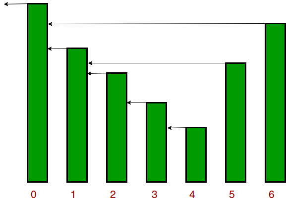

# Problems

## Easy
1. [X][Next greater element I](https://leetcode.com/problems/next-greater-element-i/) `leetcode`

	>**Note :** Great Optimized solution Monotonic Stack with Question constraint loved it.

1. [X][Valid Parentheses](https://leetcode.com/problems/valid-parentheses/) `leetcode`
1. [X][Min Stack](https://leetcode.com/problems/min-stack/) `leetcode`
1. [X][Remove Outermost Parentheses](https://leetcode.com/problems/remove-outermost-parentheses/) `leetcode`
1. [X][Remove All Adjacent Duplicates In String](https://leetcode.com/problems/remove-all-adjacent-duplicates-in-string/) `leetcode`
1. [X][Number of Recent Calls](https://leetcode.com/problems/number-of-recent-calls/) `leetcode`

	Had a hunch should have used simple array but used stack instead leading to least optimized solution
	
1. [X][Reverse First K elements of Queue](https://practice.geeksforgeeks.org/problems/reverse-first-k-elements-of-queue/1/) `GFG`
1. [X][Delete middle element of a stack](https://practice.geeksforgeeks.org/problems/delete-middle-element-of-a-stack/1/) `GFG`
1. [X][Inorder Traversal (Iterative)](https://practice.geeksforgeeks.org/problems/inorder-traversal-iterative/1/) `GFG` `Medium`
1. [X][Preorder traversal (Iterative)](https://practice.geeksforgeeks.org/problems/preorder-traversal-iterative/1/) `GFG`
1. [X][Flood fill](https://leetcode.com/problems/flood-fill/) `leetcode`
	Using BFS to solve the already solved problem
1. [X][Implement Queue using Stacks](https://leetcode.com/problems/implement-queue-using-stacks/) `leetcode`
	Use Another stack to push new value to bottom
## Medium
1. [X][Design a Stack With Increment Operation](https://leetcode.com/problems/design-a-stack-with-increment-operation/) `leetcode`

	Not much of stack used but fun question\

1. [X][Minimum Add to Make Parentheses Valid](https://leetcode.com/problems/minimum-add-to-make-parentheses-valid/) `leetcode`
1. [X][Decode String](https://leetcode.com/problems/decode-string/) `leetcode`

	>**Note :** `String rep = temp.toString().repeat(n)` multiply a string builder n times
	
1. [X][Asteroid Collision](https://leetcode.com/problems/asteroid-collision/) `leetcode`
1. [O][132 Pattern](https://leetcode.com/problems/132-pattern/) `leetcode`

	>**Note :** Crazy question traverse right to left keep a monotonic max to small and pop if it breaks but keep in storage as recent max if anything is found smaller than that max then true. 1, 3, 4, 0, 2. Stack - 2 ; stack - 2, 0;  Stack - 4, max - 2; Stack - 4, 3, max - 2; Thus 1 is found which is smaller than 2.

1. [X][Design circular Queue](https://leetcode.com/problems/design-circular-queue/) `leetcode`
1. [O][Find the Most Competitive Subsequence](https://leetcode.com/problems/find-the-most-competitive-subsequence/) `leetcode`
	>**Notes :** Crazy track the numbers to remove, loved it
1. [X][Design Front Middle Back Queue](https://leetcode.com/problems/design-front-middle-back-queue/) `leetcode`
	>**Note :** Crazy use of 2 Deque or Linkedlist. Once logic is figured out simple to implement.
1. [X][Circular tour](https://practice.geeksforgeeks.org/problems/circular-tour/1) [leetcode](https://leetcode.com/problems/gas-station/description/) `GFG` `Amex` `Amazon` `greedy`
	>**Note :** I used greedy to solved it almost found the solution but struggled at the end [NeetCode](https://www.youtube.com/watch?v=lJwbPZGo05A)
1. [X][Task Scheduler](https://leetcode.com/problems/task-scheduler/) `leetcode`
	>**Note :** Smart Question using Priority Queue and Queue [NeetCode](https://youtu.be/s8p8ukTyA2I?si=b99xyxvppkKKTLz5)
1. [X][Stock span problem](https://practice.geeksforgeeks.org/problems/stock-span-problem-1587115621/1/) `GFG`
	>**Note :** Good question needed little help Monotonic stack storing the index of last prev great
	
1. [X][Maximum Rectangular Area in a Histogram](https://practice.geeksforgeeks.org/problems/maximum-rectangular-area-in-a-histogram-1587115620/1/) `GFG`
	>**Note :** Always troubles me [Neetcode](https://www.youtube.com/watch?v=zx5Sw9130L0)
1. [X][Max Rectangle](https://practice.geeksforgeeks.org/problems/max-rectangle/1/) `GFG`
	Largest area in a histogram row-wise
	>**Note :** enumerate() returns (index, value) tuple. Traversing matrix for r in range(len(mat)): for c in range(len(mat[0])):
1. [X][The Celebrity Problem](https://practice.geeksforgeeks.org/problems/the-celebrity-problem/1/) `Google` `GFG`
1. [X][Binary Tree Right Side View](https://leetcode.com/problems/binary-tree-right-side-view/) `leetcode`
1. [X][Snake and Ladders](https://leetcode.com/problems/snakes-and-ladders/) `leetcode`
	>**Note :** Unexpected use of BFS for this question

## Hard
1. [X][Longest Valid Parantheses](https://leetcode.com/problems/longest-valid-parentheses/) `leetcode`
	Crazy solution - [Youtube](https://www.youtube.com/watch?v=vURq_xYGr-k)
1. [X][Sliding window maximum](https://leetcode.com/problems/sliding-window-maximum/) `leetcode`
	>**Note :** Monotonic Queue [Neetcode](https://www.youtube.com/watch?v=DfljaUwZsOk) remove front when window shifts and add back when new element is found. Very nice question
1. [X][Brace Expansion II](https://leetcode.com/problems/brace-expansion-ii/) `leetcode`
	Damn Difficult the complexity is really something used BFS thus deque
1. [ ][Card Rotation](https://practice.geeksforgeeks.org/problems/card-rotation5834/1/) `GFG`
1. [ ][Minimum steps to reach target by a Knight](https://www.geeksforgeeks.org/minimum-steps-reach-target-knight/) `GFG`
	Perform BFS and when target is hit return. Avoiding solving because weird indexing 1,1 representing n-1,n-1 and shit.  
1. [X][Count number of islands](https://leetcode.com/problems/number-of-islands/) `leetcode`