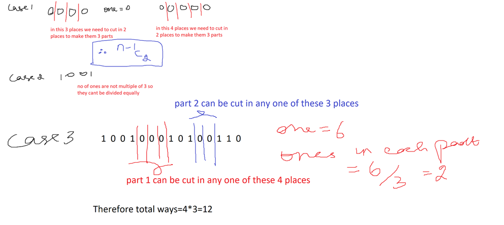
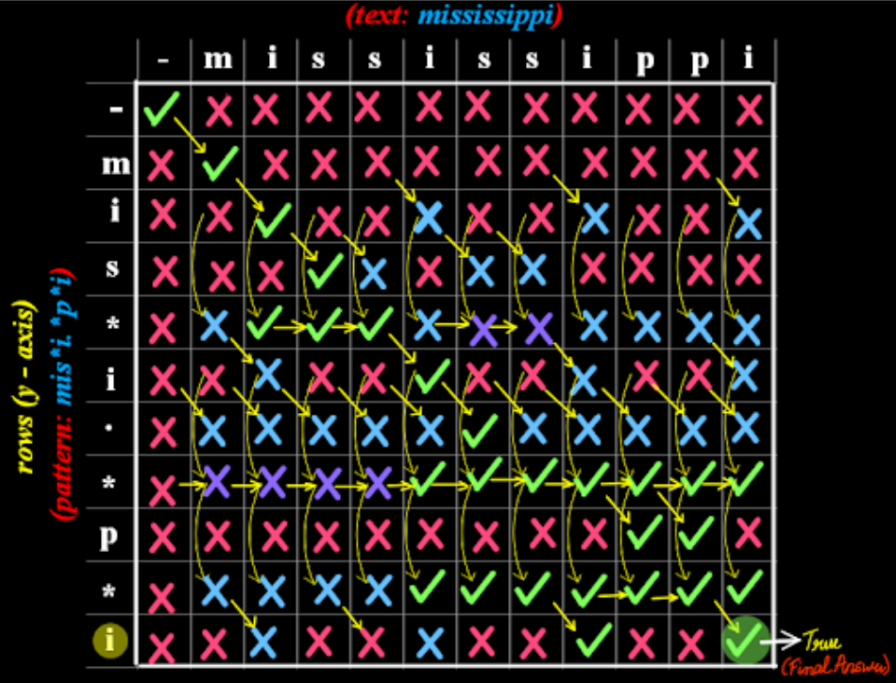

# [Strings][Video Link](https://youtu.be/zL1DPZ0Ovlo)

## Two Easy Questions + Two Medium Questions/ Day

Total Questions - 52

Completed Questions - 48

# Problems

## Notes

### ASCII Mapping

0-9 => 48-57
A-Z => 65-90
a-z => 97-122

## Easy

1. [X][Defanging an Ip address](https://leetcode.com/problems/defanging-an-ip-address/)

    String Builder methods and traversal
    ```java
        StringBuilder defangAddress = new StringBuilder(address);
        for(int i = 0; i < defangAddress.length(); i++){
            if(defangAddress.charAt(i) == '.'){
                defangAddress.replace(i, i + 1 ,"[ ][.]");
                i = i + 3;
            }
        }
        return defangAddress.toString();
    ```


1. [X][Shuffle String](https://leetcode.com/problems/shuffle-string/)

    Nice question assigning i to value is not what is asked instead index[i] is assigned to i

    ```java
        //Wrong assignment great question
        // shuffledString.setCharAt(i, s.charAt(indices[i]));
        shuffledString.setCharAt(indices[i], s.charAt(i));
    ```

    Using char[] instead of StringBuilder runs the code faster. 

1. [X][Goal Parser Interpretation](https://leetcode.com/problems/goal-parser-interpretation/)

    Used switch case which was fun

1. [X][Count Items Matching a rule](https://leetcode.com/problems/count-items-matching-a-rule/)

    ```java
        int index = ruleKey.equals("type")? 0 : ruleKey.equals("color")? 1 : 2;
        int matchCount = 0;
        for(List<String> item : items){
            if(item.get(index).equals(ruleValue))matchCount++;
        }
        return matchCount;
    ```

1. [X][Sorting the Sentence](https://leetcode.com/problems/sorting-the-sentence/)

    Fun little problem

1. [X][Check if two strings are equivalent](https://leetcode.com/problems/check-if-two-string-arrays-are-equivalent/)

    Good very good

1. [X][To Lower Case](https://leetcode.com/problems/to-lower-case/)

    - `s.toLowerCase();`
    - `if(s.charAt(i) >= 65 && s.charAt(i) <= 90) sb.append((char)(s.charAt(i) + 32));`
    - `sb.append(Character.toLowerCase(s.charAt(i)));`

1. [X][Determine if string halves are alike](https://leetcode.com/problems/determine-if-string-halves-are-alike/)
1. [X][Decrypt String from Alphabet to Integer Mapping](https://leetcode.com/problems/decrypt-string-from-alphabet-to-integer-mapping/)

    `int strToNumber = Integer.parseInt(str)` converts "12" -> 12 int

1. [X][Number of Strings That Appear as Substrings in Word](https://leetcode.com/problems/number-of-strings-that-appear-as-substrings-in-word/)
1. [X][Robot Return to Origin](https://leetcode.com/problems/robot-return-to-origin/)

    >**Note :** If cases are faster than switch

1. [X][Reverse Words in a String III](https://leetcode.com/problems/reverse-words-in-a-string-iii/)

    ```java
        StringBuilder ans=new StringBuilder();
        for(String st:s.split(" ")){
            StringBuilder sb=new StringBuilder();
            sb.append(st);
            sb.reverse();
            ans.append(sb);
            ans.append(" ");
        }
        ans.deleteCharAt(ans.length()-1);
    ```
    Easy way to solve the problem

1. [X][Excel Sheet Column Title](https://leetcode.com/problems/excel-sheet-column-title/)

    >**Note :** Excel works on Log26 - In base26 system, the number 58 is actually 26 * 2 + 6. Therefore, it is represented by the second letter + the sixth letter, which is 'BF' in this case. 'A' -> 1 this is one based indexing to tackle this we need to do `columnNumber--` always.

    >**Note :** StringBuilder doesn't have appendFirst instead we can use -> `sb.insert(0, "")`

1. [X][Implement strStr()](https://leetcode.com/problems/implement-strstr/)
1. [X][Long Pressed Name](https://leetcode.com/problems/long-pressed-name/)

    First match all the characters then push ahead

1. [X][Valid Palindrome](https://leetcode.com/problems/valid-palindrome/)

    `Character.isLetterOrDigit(s.charAt(left))` checks if its letterOrDigit

    `Character.toLowerCase(s.charAt(left));` is slower than `(s.charAt(left) >= 'A' && s.charAt(left) <= 'Z') ? (char) (s.charAt(left) + 32) : s.charAt(left);`

1. [X][Valid Palindrome II](https://leetcode.com/problems/valid-palindrome-ii/)
1. [X][Longest Common Prefix](https://leetcode.com/problems/longest-common-prefix/)

    Optimum Solution
    ```java
        while(strs[i].indexOf(prefix)!=0){
            prefix=prefix.substring(0,prefix.length()-1);
        }
    ```

    >**Note :** index of checks if substring exists or not and indexOf(prefix) == 0 makes sure its zeros so we keep on removing last element from the prefix till we find a prefix

1. [X][Maximum Repeating Substring](https://leetcode.com/problems/maximum-repeating-substring/)

    Optimum solution has good approach

1. [X][Check if Binary String Has at Most One Segment of Ones](https://leetcode.com/problems/check-if-binary-string-has-at-most-one-segment-of-ones/)

    Fuck all description it wants no "01" should exist

1. [X][Merge Strings Alternately](https://leetcode.com/problems/merge-strings-alternately/)

    Using char[] then converting to String using new String(arr, 0, length) is faster than StringBuilder

1. [X][Reverse Prefix of Word](https://leetcode.com/problems/reverse-prefix-of-word/)
1. [X][Roman to Integer](https://leetcode.com/problems/roman-to-integer/)
1. [X][Valid Parentheses](https://leetcode.com/problems/valid-parentheses/)
1. [X][Length of last word](https://leetcode.com/problems/length-of-last-word/)

## Medium

1. [X][Jump Game VII](https://leetcode.com/problems/jump-game-vii/)

    Almost there but missed a tiny logic tried solving without using extra space, but it is least optimized crazy solution and optimization suggested by AI.

1. [O][Split Two Strings to Make Palindrome](https://leetcode.com/problems/split-two-strings-to-make-palindrome/)

    Was almost there but twisted logic.

1. [X][Number of Ways to Split a String](https://leetcode.com/problems/number-of-ways-to-split-a-string/)

    *Code Explains it nicely*

1. [X][Sentence Similarity III](https://leetcode.com/problems/sentence-similarity-iii/)

    My approach was good but I was missing something important which chat GPT/claude nothing was able to fix the solution AI provided is kinda dumb but it works taking extra space

1. [X][Repeated String Match](https://leetcode.com/problems/repeated-string-match/)

    Logic was right just needed some help and hint

1. [O][Next Greater Element III](https://leetcode.com/problems/next-greater-element-iii/)

    `str.charAt(i) - '0'` to get integer mapping from char


1. [X][Swap Adjacent in LR String](https://leetcode.com/problems/swap-adjacent-in-lr-string/)

    Simple solution, overcomplicated it a bit and poor testcase.

1. [X][Maximum Number of Removable Characters](https://leetcode.com/problems/maximum-number-of-removable-characters/)

    >**Note :** Use Binary search
    O(n) gives TLE. thus we use Binary search to find till what index it isSubsequence.

1. [X][Multiply Strings](https://leetcode.com/problems/multiply-strings/)

    Not the optimum solution in MySolution, array wise approach which I thought of was the optimum.

1. [O][Basic Calculator II](https://leetcode.com/problems/basic-calculator-ii/)

    >**Note :** Learn the solution

1. [X][Minimum Length of String After Deleting Similar Ends](https://leetcode.com/problems/minimum-length-of-string-after-deleting-similar-ends/)
1. [X][Number of Substrings With Only 1s](https://leetcode.com/problems/number-of-substrings-with-only-1s/)

    Length of substring is continuous '1' n*(n+1)%2 

1. [X][Count Number of Homogenous Substrings](https://leetcode.com/problems/count-number-of-homogenous-substrings/)
1. [O][Get Equal Substrings Within Budget](https://leetcode.com/problems/get-equal-substrings-within-budget/)

    Logically looked sound but kept on failing

1. [X][Shifting Letters](https://leetcode.com/problems/shifting-letters/)

    One loop solution by processing data in backward direction

1. [X][Minimum Time Difference](https://leetcode.com/problems/minimum-time-difference/)

    Nice fun

1. [X][Find Kth Bit in Nth Binary String](https://leetcode.com/problems/find-kth-bit-in-nth-binary-string/)

    Good Question my solution is not optimized but teaches Reference and actual new variable, I generated the whole string, Recursive solution is Crazy https://www.youtube.com/watch?v=eWA0PPytQrI 


1. [X][Camelcase Matching](https://leetcode.com/problems/camelcase-matching/)

    `String[] patternSplit = pattern.split("(?=[A-Z])");` split on the basis of case (?=[A-Z]) is regex
    Easy solution existed made it complicated hehe

1. [X][Print Words Vertically](https://leetcode.com/problems/print-words-vertically/)

    `verticalStr.add(sb.toString().replaceAll("\\s+$", ""));` replace all white space \\s+$ is the regex
    Meaning of each part:
        - \s → matches any whitespace character (spaces, tabs, newlines).
        - + → means one or more of the preceding thing (so: one or more whitespace characters).
        - $ → matches the end of the string.

    Or Simply `String[] words = s.split(" ");` to split on the basis of spaces

## Hard

1. [O][Valid Number](https://leetcode.com/problems/valid-number/)

    Easy but needed little bit calm logic

1. [O][Regular Expression Matching](https://leetcode.com/problems/regular-expression-matching/)

    >**Notes :** Difficult 

    
    
    - Approach
        - If character
            - Right match just check previous diagonal if correct then its a match
            - dp[i][j] = dp[i - 1][j - 1]
        - If .
            - Copy diagonal elements
            - dp[i][j] = dp[i - 1][j - 1]
        - If *
            - If p[i - 1] == '.'
                - Match any character
            - If p[i - 1] != '.'
                - Match only prev char
            - dp[i][j] = dp[i][j - 2] || ((s[i-1] == p[j-2] || p[j-2] == '.') && dp[i - 1][j])
                - p[j-2] == '.' means b.a*c -> bc

1. [O][Last Substring in Lexicographical Order](https://leetcode.com/problems/last-substring-in-lexicographical-order/)

    >**Note:**  Lot of learning

    1. Brute force
        Generate all substring
        ```java
            for(int i = 0; i < n; i++){
                StringBuilder temp = new StringBuilder();
                for(int j = i; j < n; j++){
                    temp.append(s.charAt(j));
                    v.add(temp.toString());
                }
            }
        ```

        `Collections.sort` gives output in lexicographical order
    2. Brute Force with Set
        `Collections.sort` cannot be directly used on set
        ```java
        Set<String> v = new HashSet<>();
        List<String> tempV = new ArrayList<>(v);
        Collections.sort(tempV);
        ```

        >**Notes :** We can use SortedSet, but in SortedSet we can only get v.first() and v.last() mid values can't be fetched
        ```java
        SortedSet<String> v = new TreeSet<>();
        return v.last();
        ```

    3. Two pointer (Duval Algorithm)
        - We will carry i, j and k
        - i will be pointing to first big character
        - j will keep on looking for next big character
            - If j fails to find then substring from i to len is the lexicographical 
            - If j finds better character move i to j and j++
            - If i and j both are equal start traversing next characters using k to find the which is lexicographically superior.

1. [X][Basic Calculator](https://leetcode.com/problems/basic-calculator/)

    Easy hota thought also of the right approach but couldn't execute

1. [ ][Minimum Number of Operations to Make String Sorted](https://leetcode.com/problems/minimum-number-of-operations-to-make-string-sorted/)

    Couldn't even understand the solution - https://leetcode.com/problems/minimum-number-of-operations-to-make-string-sorted/solutions/1166535/java-66ms-no-complex-maths-100-explained-oa3w/

1. [ ][Check If String Is Transformable With Substring Sort Operations](https://leetcode.com/problems/check-if-string-is-transformable-with-substring-sort-operations/)

    Great solution try coming up with solution later - https://leetcode.com/problems/check-if-string-is-transformable-with-substring-sort-operations/solutions/843917/cjavapython-on-by-votrubac-l18z/

    The crux of this algorithm is lower numbers cannot jump above values higher than them. 778 can never become 787

1. [ ][Orderly Queue](https://leetcode.com/problems/orderly-queue/)

    Key catch point is if k > 1 then we can form the least lexicographically string easily

1. [ ][Special Binary String](https://leetcode.com/problems/special-binary-string/)

    Difficult to click

# Additionally

1. [ ][Click "Show problem tags" and do questions that have tags for things we have learnt so far only.](https://leetcode.com/tag/string/)