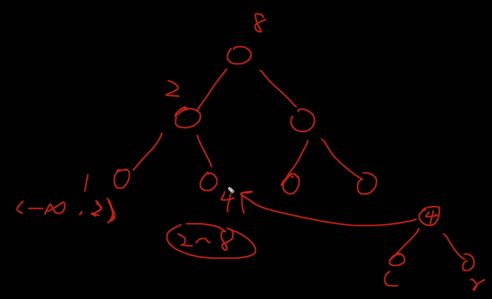

# Problems

## Concept

### Re-rooting

It is a technique of calculating answer for one node as root then finding changing pattern for adjacent nodes if they are considered as root 

Great Explanation - [Video](https://www.youtube.com/watch?v=5feZxOegb1c) 

## Easy

1. [X][Binary Tree Inorder Traversal](https://leetcode.com/problems/binary-tree-inorder-traversal/) `leetcode`
1. [X][Same Tree](https://leetcode.com/problems/same-tree/) `leetcode`
1. [X][Symmetric Tree](https://leetcode.com/problems/symmetric-tree/) `leetcode`
	Use of queue is such a smart move
1. [X][Maximum Depth of Binary Tree](https://leetcode.com/problems/maximum-depth-of-binary-tree/) `leetcode`
1. [X][Convert Sorted Array to Binary Search Tree](https://leetcode.com/problems/convert-sorted-array-to-binary-search-tree/) `leetcode`

	

1. [X][Balanced Binary Tree](https://leetcode.com/problems/balanced-binary-tree/) `leetcode`
	I wrote a solution for complete tree and not balanced tree. Calculate height and compare absolute subtracted value is not more than 2 for each node.
1. [X][Minimum Depth of Binary Tree](https://leetcode.com/problems/minimum-depth-of-binary-tree/) `leetcode`
	Use BFS to find first node whose left right is null
1. [X][Path Sum](https://leetcode.com/problems/path-sum/) `leetcode`
	Go on decreasing the target as we traverse down if target is zero and left and right is null then only true
1. [X][Binary Tree Preorder Traversal](https://leetcode.com/problems/binary-tree-preorder-traversal/) `leetcode`
1. [X][Binary Tree Postorder Traversal](https://leetcode.com/problems/binary-tree-postorder-traversal/) `leetcode`
1. [X][Invert Binary Tree](https://leetcode.com/problems/invert-binary-tree/) `leetcode`
1. [X][Binary Tree Paths](https://leetcode.com/problems/binary-tree-paths/) `leetcode`
1. [x][Sum of Left Leaves](https://leetcode.com/problems/sum-of-left-leaves/) `leetcode`
	Preorder is more optimized as compared to BFS
1. [X][Find Mode in Binary Search Tree](https://leetcode.com/problems/find-mode-in-binary-search-tree/) `leetcode`
	Solved using BFS which is not optimum, good inorder solution
	>**Note :** In python `nonlocal max_count` is used to refer global variable
	```py
	Class solution:
		def findMode(self, root: Optional[TreeNode]) -> List[int]:
			counts = {}
			max_count = 0
			modes = []

			def inorder(node):
				if not node:
					return
				inorder(node.left)

				nonlocal max_count, modes

				counts[node.val] = 1 + counts.get(node.val, 0)
				
				if counts[node.val] > max_count:
					max_count = counts[node.val]
					modes = [node.val]
				elif counts[node.val] == max_count:
					modes.append(node.val)

				inorder(node.right)

			inorder(root)

			return modes
	```
1. [X][Minimum Absolute Difference in BST](https://leetcode.com/problems/minimum-absolute-difference-in-bst/) `leetcode`
	**Any** Use Inorder to get sorted list and find the min absolute value
1. [X][Diameter of Binary Tree](https://leetcode.com/problems/diameter-of-binary-tree/) `leetcode`
	>**Note :** Won't click naturally needs calculate the height and then compute the diameters

## Medium

1. [O][Validate Binary Search Tree](https://leetcode.com/problems/validate-binary-search-tree/) `leetcode`
	>**Note :** Using global prev node brilliant
1. [O][All Nodes Distance K in Binary Tree](https://leetcode.com/problems/all-nodes-distance-k-in-binary-tree/) `leetcode`
	>**Note :** Can be easily solved using bi-directed graph to move backwards. But to replicate it we can use Parent map using levelOrder traversal and perform similar levelOrder traversal from target with the help of vis array to traverse in all the directions. [Striver goat](https://www.youtube.com/watch?v=i9ORlEy6EsI&t=410s) 
1. [X][Validate Binary Tree Nodes](https://leetcode.com/problems/validate-binary-tree-nodes/) `leetcode`
	Tried coding in python [neetcode](https://www.youtube.com/watch?v=Mw67DTgUEqk)
	Valid Binary tree has -
		- Has all nodes connected
		- No cycle
		- Undirected
1. [X][Longest Univalue Path](https://leetcode.com/problems/longest-univalue-path/) `leetcode`
	DFS only
1. [!][Closest Nodes Queries in a Binary Search Tree](https://leetcode.com/problems/closest-nodes-queries-in-a-binary-search-tree/) `leetcode`
	Dumb problem need to convert the tree in list and then find solution using binary search as trees are not balanced
1. [X][Maximum Width of Binary Tree](https://leetcode.com/problems/maximum-width-of-binary-tree/) `leetcode`
	Little struggle to normalize width and then calculate using 2*idx
1. [X][Linked List in Binary Tree](https://leetcode.com/problems/linked-list-in-binary-tree/) `leetcode`
	Search every node if it matches
1. [X][Operations on Tree](https://leetcode.com/problems/operations-on-tree/) `leetcode`
	>**Note :** Crazy Python functions `self.child = { i : [] for i in range(len(parent))}` Initialize a dictionary with empty array for the range(len(parent)) `q.extend(self.child[n])` Fetches all the nodes from self.child[n] -> [] and append at the end
1. [X][Verify Preorder Serialization of a Binary Tree](https://leetcode.com/problems/verify-preorder-serialization-of-a-binary-tree/) `leetcode`
	>**Note :** To split string to array based on delimiter: String[] preOrderArr = preorder.split(","); To compare string: if(preOrderArr[0].equals("#")) return false;
1. [X][Kth Largest Sum in a Binary Tree](https://leetcode.com/problems/kth-largest-sum-in-a-binary-tree/) `leetcode`
	>**Note :** Sort an array in reverse order `pq.sort(reverse=True)`
1. [O][Count Nodes With the Highest Score](https://leetcode.com/problems/count-nodes-with-the-highest-score/) `leetcode`
	Very difficult and complex Topics
1. [X][Path Sum III](https://leetcode.com/problems/path-sum-iii/) `leetcode`
	Brute Force also works, but we can keep a dict and check if the target_sum - curr_sum exists earlier or not
1. [X][Maximum Product of Splitted Binary Tree](https://leetcode.com/problems/maximum-product-of-splitted-binary-tree/) `leetcode`
1. [X][Most Profitable Path in a Tree](https://leetcode.com/problems/most-profitable-path-in-a-tree/) `leetcode`
	Performing DFS in this type of input needed use of graph
1. [X][Step-By-Step Directions From a Binary Tree Node to Another](https://leetcode.com/problems/step-by-step-directions-from-a-binary-tree-node-to-another/) `leetcode`
	>**Note :** Crazy and interesting question Finding Last Common ancestor was the key 
1. [X][Logical OR of Two Binary Grids Represented as Quad-Trees](https://leetcode.com/problems/logical-or-of-two-binary-grids-represented-as-quad-trees/) `leetcode`
	Pre-requisite [Construct Quad Tree](https://leetcode.com/problems/construct-quad-tree/description/) [Neet Code](https://www.youtube.com/watch?v=UQ-1sBMV0v4). Little headache [Video](https://www.youtube.com/watch?v=j2wuN6ziswE&t=5s)
1. [X][Flip Binary Tree To Match Preorder Traversal](https://leetcode.com/problems/flip-binary-tree-to-match-preorder-traversal/) `leetcode`
	Interesting Question needed bit help but was interesting

## Hard

Hard questions of tree has lot of dependencies on the graph questions

1. [X][Kth Ancestor of a Tree Node](https://leetcode.com/problems/kth-ancestor-of-a-tree-node/) `leetcode`
	>**Note :** **Binary Lifting** Implementation. Memorize the solution. [Concept](https://www.youtube.com/watch?v=oib-XsjFa-M) for code refer [Python](./KthAncestorOfATreeNode.py)
1. [O][Difference Between Maximum and Minimum Price Sum](https://leetcode.com/problems/difference-between-maximum-and-minimum-price-sum/) `leetcode`
	>**Note :** Re-route Algo cannot find proper solution
1. [X][Merge BSTs to Create Single BST](https://leetcode.com/problems/merge-bsts-to-create-single-bst/) `leetcode`
	>**Note :** Very Messed up, must visit later. [Video](https://www.youtube.com/watch?v=tMPUGvlHBXY). [Solution](./MergeBSTsToCreateSingleBST.py) maintained with proper code comment.
	
1. [X][Frog Position After T Seconds](https://leetcode.com/problems/frog-position-after-t-seconds/) `leetcode`
	>**Note :** All correct assumption cases, little wrong implementation. Learnt edges to tree. Fetch all neighbors except root
	```py
        graph = collections.defaultdict(list)
        for u,v in edges:
            graph[u].append(v)
            graph[v].append(u)
		children = [nei for nei in graph[node] if nei != parent]
	```
1. [X][Height of Binary Tree After Subtree Removal Queries](https://leetcode.com/problems/height-of-binary-tree-after-subtree-removal-queries/) `leetcode`
	>**Note :** Crazy logic [Video](http://youtube.com/watch?v=eEfW7CLbhvU) all [solutions](./HeightOfBinaryTreeAfterSubtreeRemovalQueries.py), ChatGPT`dfs2(node.right, depth + 1, max(max_height_from_above, depth + 1 + left_h))`
1. [O][Collect Coins in a Tree](https://leetcode.com/problems/collect-coins-in-a-tree/) `leetcode`
	>**Note :** If we are not using collections.defaultdict(list) to construct tree over edges
	```py
		graph = {}
		for u, v in edges:
			graph.setdefault(u, []).append(v)
			graph.setdefault(v, []).append(u)
	```
	>**Note :** Very Important question asked a lot [Ref Video](https://www.youtube.com/watch?v=wUmuRsTGQxs&t=2265s). In Out DP, Re-rooting. Optimized solution in code [Code](./CollectCoinsInATree.py).
	>**Note :** Make copy of list `new_list = list` copies pointer and edits original list `new_list = list[:]` creates a copy or `new_list = list.copy()`
1. [X][Binary Tree Maximum Path Sum](https://leetcode.com/problems/binary-tree-maximum-path-sum/) `leetcode`
1. [X][Tree of Coprimes](https://leetcode.com/problems/tree-of-coprimes/) `leetcode`
	Very Nice Question
	Steps
		- Pre-Calculate CoPrimes 1-50
		- Create Graph Adj List
		- Store Ancestor as we go down
		- Do DFS
			- Find the best depth GCD ancestor
		- Traceback ancestor list as we go upward
1. [X][Maximum Sum BST in Binary Tree](https://leetcode.com/problems/maximum-sum-bst-in-binary-tree/) `leetcode`
1. [X][Minimize the Total Price of the Trips](https://leetcode.com/problems/minimize-the-total-price-of-the-trips/) `leetcode`
	Lovely Question Precompute Paths, then for each node calculate half and not half and find min. Finding path by returning True/False is also beauty
1. [O][Number Of Ways To Reconstruct A Tree](https://leetcode.com/problems/number-of-ways-to-reconstruct-a-tree/) `leetcode`
	What the fuck is this I just can't understand any solution. [Optimized Solution](./NumberOfWaysToReconstructATree.py) is Placed Go through it later might understand.
1. [X][Smallest Missing Genetic Value in Each Subtree](https://leetcode.com/problems/smallest-missing-genetic-value-in-each-subtree/) `leetcode`
	>**Note :** `for i, p in enumerate(parents):` to get i and value of i
1. [X][Vertical Order Traversal of a Binary Tree](https://leetcode.com/problems/vertical-order-traversal-of-a-binary-tree/) `leetcode`
	>**Note :** Used Tree Map, it is primarily used when you need to maintain a set of key-value pairs in a specific, sorted order based on their keys. `colMap.computeIfAbsent(col, x -> new ArrayList<>()).add(val);` If an array fails to exist for that column it creates one on the go and add the new value
1. [X][Binary Tree Cameras](https://leetcode.com/problems/binary-tree-cameras/) `leetcode`
	Easy and Simple solution [Youtube](https://www.youtube.com/watch?v=VBxiavZYfoA)
1. [X][Number of Ways to Reorder Array to Get Same BST](https://leetcode.com/problems/number-of-ways-to-reorder-array-to-get-same-bst/) `leetcode`
	>**Note :** Very Math heavy problem [Video](https://www.youtube.com/watch?v=_ZcQLiyQ3yM) Ways to find nCr -> python `comb(n,r)`. But java 
	```java
		table=new long[n+1][n+1];
		for (int i = 0; i < n + 1; ++i) {
			Arrays.fill(table[i],1);
			for (int j = 1; j < i; ++j) {
				table[i][j] = (table[i - 1][j - 1] + table[i - 1][j]) % mod;
			}
		}
	```
1. [X][Count Number of Possible Root Nodes](https://leetcode.com/problems/count-number-of-possible-root-nodes/) `leetcode`
	Video in Re-rooting example
1. [X][Count Ways to Build Rooms in an Ant Colony](https://leetcode.com/problems/count-ways-to-build-rooms-in-an-ant-colony/) `leetcode`
	>**Note :** Way more harder version of Number of ways to reorder array to get sane BST. [Video](https://www.youtube.com/watch?v=MGKLPpR6NKI).
	```py
        # Competitve way to find nCr just Learn it
		# combinations = math.comb(curNodeCnt+subTreeNodeCnt, curNodeCnt)
		# combinations = (fact[curNodeCnt+subTreeNodeCnt]*invFact[curNodeCnt]*invFact[subTreeNodeCnt])%mod
        mod = 10**9+7
        n = len(prevRoom)
        fact = [0]*n
        fact[0] = 1
        invFact = [0]*n
        invFact[0] = pow(1, mod - 2, mod)

        for i in range(1, n):
            fact[i] = (i*fact[i - 1])%mod
            invFact[i] = pow(fact[i], mod - 2, mod)
	```
1. [X][Minimum Score After Removals on a Tree](https://leetcode.com/problems/minimum-score-after-removals-on-a-tree/) `leetcode`
	>**Note :** Great Question, [great explanation](https://www.youtube.com/watch?v=3IomMslYOOY). Story Board - 
		1. Assume root is 0
		2. n^2 is acceptable time complexity, Thus we will traverse all the node pairs who we can split
		3. Pre Subtree XoR calculation keeps the complexity n^2 (Individual Question on its own XOR of subtree)
		4. Tricky party if the split is amongst Ancestor and Descendant then issue of duplicate XoR values. Follow time based approach to keep track of Ancestor Descendant (Individual Question is Ancestor Descendant)

1. [X][Create Components With Same Value](https://leetcode.com/problems/create-components-with-same-value/) `leetcode`
	Bit Easy Question [Youtube](https://www.youtube.com/watch?v=ZmyVX4FT9m4)
1. [X][Serialize and Deserialize Binary Tree](https://leetcode.com/problems/serialize-and-deserialize-binary-tree/) `leetcode`
1. [X][Longest Path With Different Adjacent Characters](https://leetcode.com/problems/longest-path-with-different-adjacent-characters/) `leetcode`
	>**Note :** In python `candidate = heapq.nlargest(2, candidate)` fetches top 2 values from the list in this case candidate = [0, 2, 3, 5] then after nlargest candidate = [3, 5]