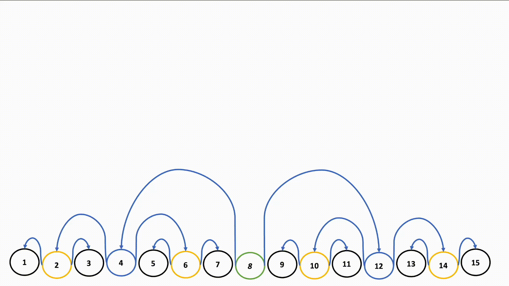

# Problems

## Easy

1. [X][Binary Tree Inorder Traversal](https://leetcode.com/problems/binary-tree-inorder-traversal/) `leetcode`
1. [X][Same Tree](https://leetcode.com/problems/same-tree/) `leetcode`
1. [X][Symmetric Tree](https://leetcode.com/problems/symmetric-tree/) `leetcode`
	Use of queue is such a smart move
1. [X][Maximum Depth of Binary Tree](https://leetcode.com/problems/maximum-depth-of-binary-tree/) `leetcode`
1. [X][Convert Sorted Array to Binary Search Tree](https://leetcode.com/problems/convert-sorted-array-to-binary-search-tree/) `leetcode`

	

1. [X][Balanced Binary Tree](https://leetcode.com/problems/balanced-binary-tree/) `leetcode`
	I wrote a solution for complete tree and not balanced tree. Calculate height and compare absolute subtracted value is not more than 2 for each node.
1. [X][Minimum Depth of Binary Tree](https://leetcode.com/problems/minimum-depth-of-binary-tree/) `leetcode`
	Use BFS to find first node whose left right is null
1. [X][Path Sum](https://leetcode.com/problems/path-sum/) `leetcode`
	Go on decreasing the target as we traverse down if target is zero and left and right is null then only true
1. [X][Binary Tree Preorder Traversal](https://leetcode.com/problems/binary-tree-preorder-traversal/) `leetcode`
1. [X][Binary Tree Postorder Traversal](https://leetcode.com/problems/binary-tree-postorder-traversal/) `leetcode`
1. [X][Invert Binary Tree](https://leetcode.com/problems/invert-binary-tree/) `leetcode`
1. [X][Binary Tree Paths](https://leetcode.com/problems/binary-tree-paths/) `leetcode`
1. [x][Sum of Left Leaves](https://leetcode.com/problems/sum-of-left-leaves/) `leetcode`
	Preorder is more optimized as compared to BFS
1. [X][Find Mode in Binary Search Tree](https://leetcode.com/problems/find-mode-in-binary-search-tree/) `leetcode`
	Solved using BFS which is not optimum, good inorder solution
	>**Note :** In python `nonlocal max_count` is used to refer global variable
	```py
	Class solution:
		def findMode(self, root: Optional[TreeNode]) -> List[int]:
			counts = {}
			max_count = 0
			modes = []

			def inorder(node):
				if not node:
					return
				inorder(node.left)

				nonlocal max_count, modes

				counts[node.val] = 1 + counts.get(node.val, 0)
				
				if counts[node.val] > max_count:
					max_count = counts[node.val]
					modes = [node.val]
				elif counts[node.val] == max_count:
					modes.append(node.val)

				inorder(node.right)

			inorder(root)

			return modes
	```
1. [X][Minimum Absolute Difference in BST](https://leetcode.com/problems/minimum-absolute-difference-in-bst/) `leetcode`
	**Any** Use Inorder to get sorted list and find the min absolute value
1. [X][Diameter of Binary Tree](https://leetcode.com/problems/diameter-of-binary-tree/) `leetcode`
	>**Note :** Won't click naturally needs calculate the height and then compute the diameters

## Medium

1. [O][Validate Binary Search Tree](https://leetcode.com/problems/validate-binary-search-tree/) `leetcode`
	>**Note :** Using global prev node brilliant
1. [O][All Nodes Distance K in Binary Tree](https://leetcode.com/problems/all-nodes-distance-k-in-binary-tree/) `leetcode`
	>**Note :** Can be easily solved using bi-directed graph to move backwards. But to replicate it we can use Parent map using levelOrder traversal and perform similar levelOrder traversal from target with the help of vis array to traverse in all the directions. [Striver goat](https://www.youtube.com/watch?v=i9ORlEy6EsI&t=410s) 
1. [X][Validate Binary Tree Nodes](https://leetcode.com/problems/validate-binary-tree-nodes/) `leetcode`
	Tried coding in python [neetcode](https://www.youtube.com/watch?v=Mw67DTgUEqk)
	Valid Binary tree has -
		- Has all nodes connected
		- No cycle
		- Undirected
1. [X][Longest Univalue Path](https://leetcode.com/problems/longest-univalue-path/) `leetcode`
	DFS only
1. [!][Closest Nodes Queries in a Binary Search Tree](https://leetcode.com/problems/closest-nodes-queries-in-a-binary-search-tree/) `leetcode`
	Dumb problem need to convert the tree in list and then find solution using binary search as trees are not balanced
1. [X][Maximum Width of Binary Tree](https://leetcode.com/problems/maximum-width-of-binary-tree/) `leetcode`
	Little struggle to normalize width and then calculate using 2*idx
1. [X][Linked List in Binary Tree](https://leetcode.com/problems/linked-list-in-binary-tree/) `leetcode`
	Search every node if it matches
1. [X][Operations on Tree](https://leetcode.com/problems/operations-on-tree/) `leetcode`
	>**Note :** Crazy Python functions `self.child = { i : [] for i in range(len(parent))}` Initialize a dictionary with empty array for the range(len(parent)) `q.extend(self.child[n])` Fetches all the nodes from self.child[n] -> [] and append at the end
1. [X][Verify Preorder Serialization of a Binary Tree](https://leetcode.com/problems/verify-preorder-serialization-of-a-binary-tree/) `leetcode`
	>**Note :** To split string to array based on delimiter: String[] preOrderArr = preorder.split(","); To compare string: if(preOrderArr[0].equals("#")) return false;
1. [X][Kth Largest Sum in a Binary Tree](https://leetcode.com/problems/kth-largest-sum-in-a-binary-tree/) `leetcode`
	>**Note :** Sort an array in reverse order `pq.sort(reverse=True)`
1. [O][Count Nodes With the Highest Score](https://leetcode.com/problems/count-nodes-with-the-highest-score/) `leetcode`
	Very difficult and complex Topics
1. [X][Path Sum III](https://leetcode.com/problems/path-sum-iii/) `leetcode`
	Brute Force also works, but we can keep a dict and check if the target_sum - curr_sum exists earlier or not
1. [X][Maximum Product of Splitted Binary Tree](https://leetcode.com/problems/maximum-product-of-splitted-binary-tree/) `leetcode`
1. [ ][Most Profitable Path in a Tree](https://leetcode.com/problems/most-profitable-path-in-a-tree/) `leetcode`
1. [ ][Step-By-Step Directions From a Binary Tree Node to Another](https://leetcode.com/problems/step-by-step-directions-from-a-binary-tree-node-to-another/) `leetcode`
1. [ ][Logical OR of Two Binary Grids Represented as Quad-Trees](https://leetcode.com/problems/logical-or-of-two-binary-grids-represented-as-quad-trees/) `leetcode`
1. [ ][Flip Binary Tree To Match Preorder Traversal](https://leetcode.com/problems/flip-binary-tree-to-match-preorder-traversal/) `leetcode`

## Hard

1. [ ][Kth Ancestor of a Tree Node](https://leetcode.com/problems/kth-ancestor-of-a-tree-node/) `leetcode`
1. [ ][Difference Between Maximum and Minimum Price Sum](https://leetcode.com/problems/difference-between-maximum-and-minimum-price-sum/) `leetcode`
1. [ ][Merge BSTs to Create Single BST](https://leetcode.com/problems/merge-bsts-to-create-single-bst/) `leetcode`
1. [ ][Frog Position After T Seconds](https://leetcode.com/problems/frog-position-after-t-seconds/) `leetcode`
1. [ ][Height of Binary Tree After Subtree Removal Queries](https://leetcode.com/problems/height-of-binary-tree-after-subtree-removal-queries/) `leetcode`
1. [ ][Collect Coins in a Tree](https://leetcode.com/problems/collect-coins-in-a-tree/) `leetcode`
1. [ ][Binary Tree Maximum Path Sum](https://leetcode.com/problems/binary-tree-maximum-path-sum/) `leetcode`
1. [ ][Tree of Coprimes](https://leetcode.com/problems/tree-of-coprimes/) `leetcode`
1. [ ][Maximum Sum BST in Binary Tree](https://leetcode.com/problems/maximum-sum-bst-in-binary-tree/) `leetcode`
1. [ ][Minimize the Total Price of the Trips](https://leetcode.com/problems/minimize-the-total-price-of-the-trips/) `leetcode`
1. [ ][Number Of Ways To Reconstruct A Tree](https://leetcode.com/problems/number-of-ways-to-reconstruct-a-tree/) `leetcode`
1. [ ][Smallest Missing Genetic Value in Each Subtree](https://leetcode.com/problems/smallest-missing-genetic-value-in-each-subtree/) `leetcode`
1. [ ][Vertical Order Traversal of a Binary Tree](https://leetcode.com/problems/vertical-order-traversal-of-a-binary-tree/) `leetcode`
1. [ ][Binary Tree Cameras](https://leetcode.com/problems/binary-tree-cameras/) `leetcode`
1. [ ][Number of Ways to Reorder Array to Get Same BST](https://leetcode.com/problems/number-of-ways-to-reorder-array-to-get-same-bst/) `leetcode`
1. [ ][Count Number of Possible Root Nodes](https://leetcode.com/problems/count-number-of-possible-root-nodes/) `leetcode`
1. [ ][Count Ways to Build Rooms in an Ant Colony](https://leetcode.com/problems/count-ways-to-build-rooms-in-an-ant-colony/) `leetcode`
1. [ ][Minimum Score After Removals on a Tree](https://leetcode.com/problems/minimum-score-after-removals-on-a-tree/) `leetcode`
1. [ ][Create Components With Same Value](https://leetcode.com/problems/create-components-with-same-value/) `leetcode`
1. [ ][Serialize and Deserialize Binary Tree](https://leetcode.com/problems/serialize-and-deserialize-binary-tree/) `leetcode`
1. [ ][Longest Path With Different Adjacent Characters](https://leetcode.com/problems/longest-path-with-different-adjacent-characters/) `leetcode`