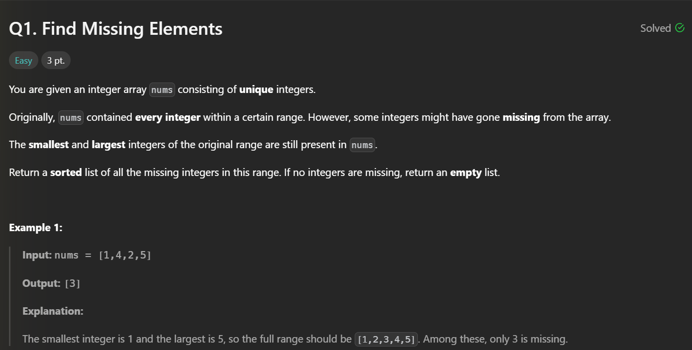
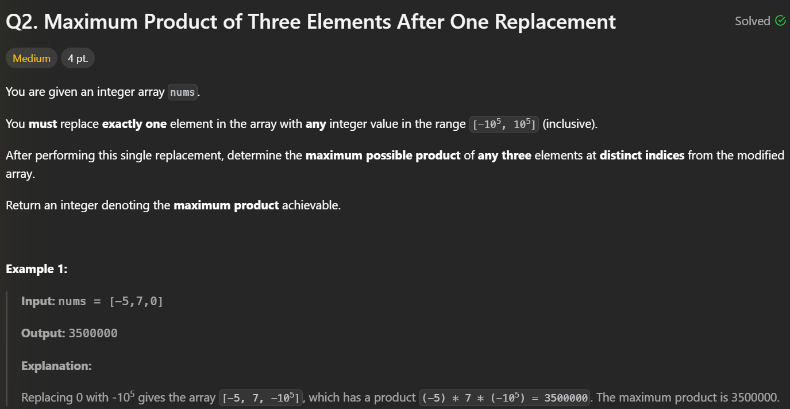
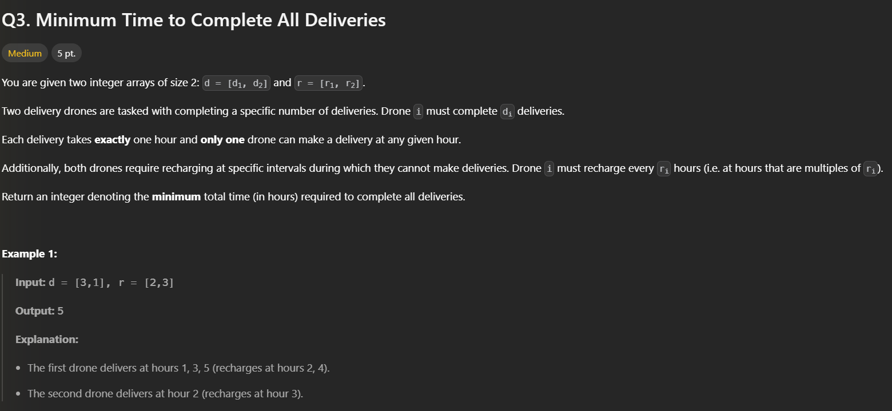
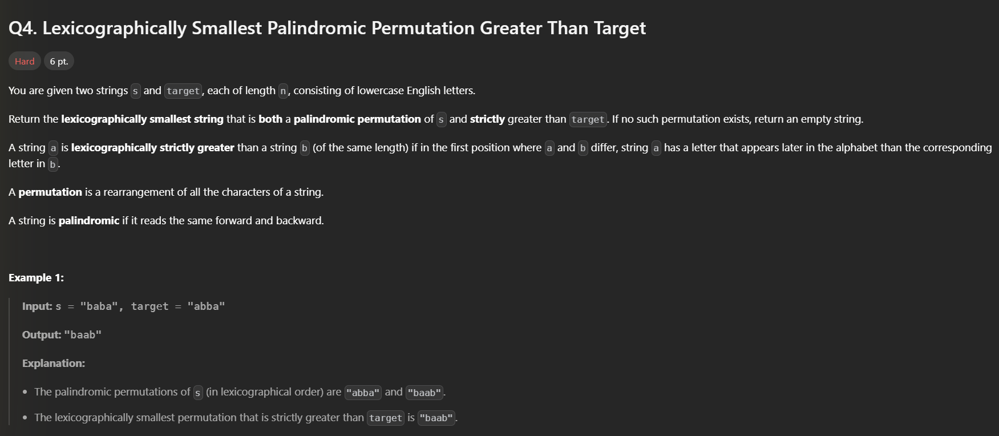
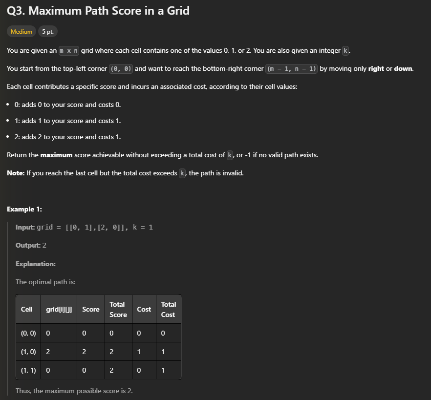
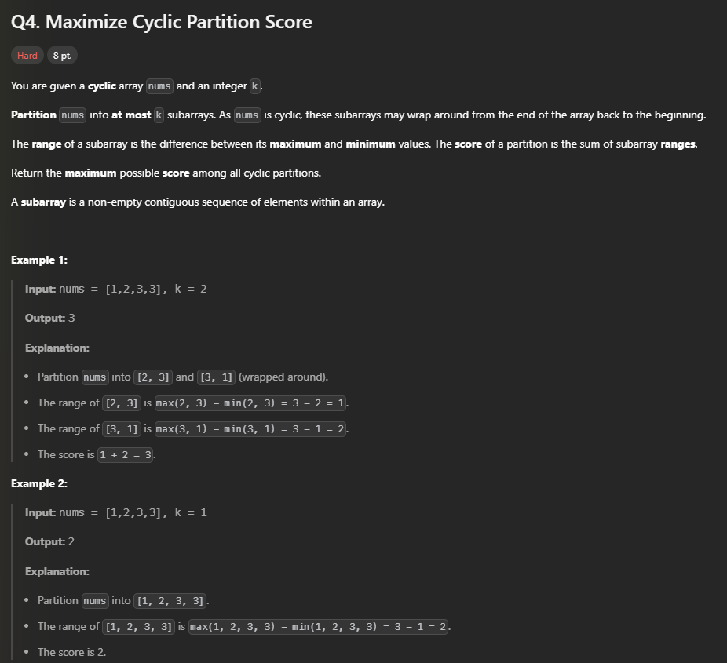
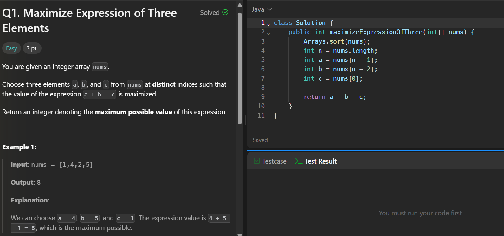
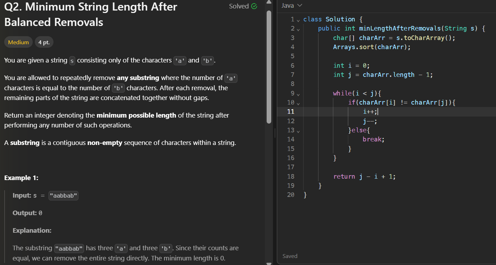
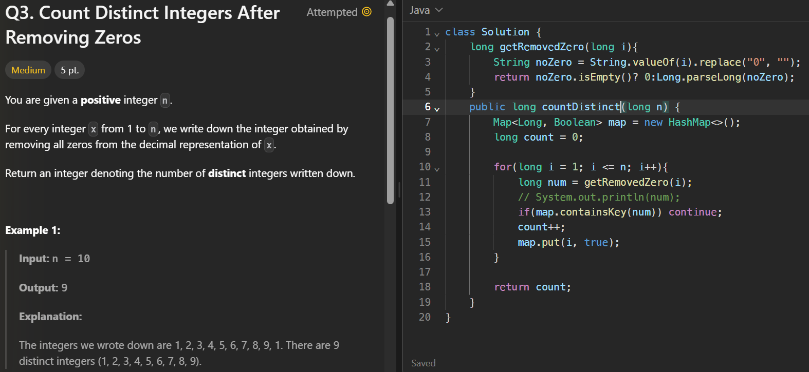
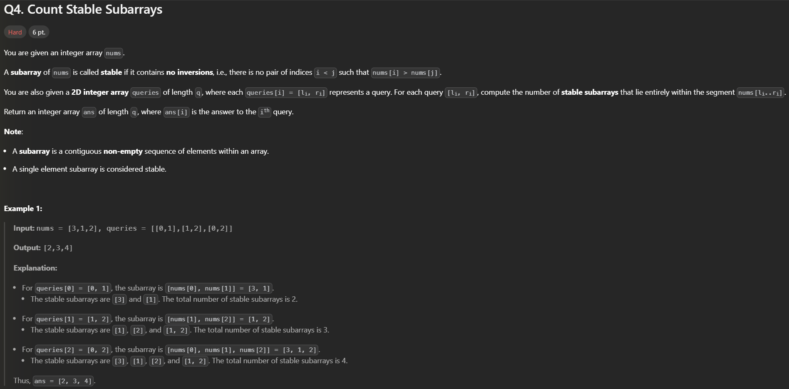

# List of LeetCode Contests

## November 2nd, 2025

### Q1. 

Solution

```java
class Solution {
    public List<Integer> findMissingElements(int[] nums) {
        int min = nums[0];
        int max = nums[0];
        for(int i = 1; i < nums.length; i++){
            min = Math.min(min, nums[i]);
            max = Math.max(max, nums[i]);
        }
        int[] map = new int[max - min + 1];

        for(int num : nums){
            map[num - min] = 1;
        }
        List<Integer> missingNumbers = new ArrayList<>();
        for(int i = 0; i < map.length; i++){
            if(map[i] == 1) continue;
            missingNumbers.add(min + i);
        }

        return missingNumbers;
    }
}©leetcode
```

### Q2.  

```
class Solution {
    public long maxProduct(int[] nums) {
        int max = Integer.MIN_VALUE, secondMax = Integer.MIN_VALUE;
        int maxIndex = -1;

        for(int i = 0; i < nums.length; i++){
            int absNum = Math.abs(nums[i]);
            if(max == Integer.MIN_VALUE || absNum > Math.abs(max)){
                // System.out.println("Entered first loop for " + nums[i]);
                secondMax = max;
                max = nums[i];
                maxIndex = i;
            }
            else if(absNum > Math.abs(secondMax) || secondMax == Integer.MIN_VALUE){
                // System.out.println("Entered second loop for " + nums[i]);
                if(i != maxIndex) secondMax = nums[i];
            }
        }

        if(secondMax == Integer.MIN_VALUE) secondMax = max;

        // System.out.println(max +" " + secondMax);

        long prod = (long)max*secondMax;

        if(prod < 0) prod *= (-1);

        prod *= 100000;

        return prod;
    }
}©leetcode
```

### Q3. 

Attempted but failed

```
class Solution {
    public long minimumTime(int[] d, int[] r) {
        int time = 0;
        while(d[0] > 0 || d[1] > 0){
            time++;
            //Check if its rest time
            int rest1 = r[0];
            int rest2 = r[1];
            if(time % rest1 == 0 && time % rest2 == 0){
                //Rest interval for both drone
                continue;
            }else if(time % rest1 == 0){
                //Drone 1 resting time Drone 2 delivers
                d[1]--;
            }else if(time % rest2 == 0){
                //Drone 2 resting time Drone 1 delivers
                d[0]--;
            }else{
                //Non resting span
                //Take the largest and deliver it X
                //Take the smartest
                int nextRest1 = r[0] - (time%r[0]);
                int nextRest2 = r[1] - (time%r[1]);

                if(nextRest1 <= nextRest2){
                    if(d[0] > 0) d[0]--;
                    else d[1]--;
                }else{
                    if(d[1] > 0) d[1]--;
                    else d[0]--;
                }
            }

            System.out.println("Time " + time + " : " + d[0] + " " + d[1]);
        }
        return time;
    }
}©leetcode
```

### Q4. 

## November 3rd

### Q1 and Q2


```java
class Solution {
    public int minimumDistance(int[] nums) {
        HashMap<Integer, List<Integer>> map = new HashMap<>();
		for(int i = 0; i < nums.length; i++){
			List<Integer> currList;
			if(!map.containsKey(nums[i])){
				// index, distance.
				currList = new ArrayList<>();
			}else{
				currList = map.get(nums[i]);
			}
			currList.add(i);
			map.put(nums[i], currList);
		}

		int minDistance = Integer.MAX_VALUE;
		for(var el:map.keySet()){
			List<Integer> currList = map.get(el);
            int n = currList.size();
			if(n >= 3){
                for(int i = 0; i + 3 <= n; i++)
    				minDistance = Math.min(minDistance, Math.abs(currList.get(i + 0) - currList.get(i + 1)) + Math.abs(currList.get(i + 1) - currList.get(i + 2)) + Math.abs(currList.get(i + 0) - currList.get(i + 2)));
			}
		}
        return (minDistance == Integer.MAX_VALUE)? -1:minDistance;
    }
}©leetcode
```
### Q3


```java
class Solution {
    int m,n,K;
    int[][] grid;
    int[][][] dp;
    int helperSol(int i, int j, int cost){
        //EdgeCase
        if(i >= m || j >= n) return Integer.MIN_VALUE;

		// System.out.println(i + " " + j);
        int currScore = grid[i][j];
        int currCost = cost + ((currScore > 0) ? 1:0);
        if(currCost > K) return Integer.MIN_VALUE;

        //Base Case
        if(i == m - 1 && j == n - 1){
            return (currCost <= K) ? currScore:Integer.MIN_VALUE;
        }

        //Memoization
        if(dp[i][j][currCost] != -1) return dp[i][j][currCost];
        //move right;
        int right = helperSol(i, j + 1, currCost);
        //move down;
        int down = helperSol(i + 1, j, currCost);

        int best = Math.max(right, down);
        if(best == Integer.MIN_VALUE)
            dp[i][j][currCost] = Integer.MIN_VALUE;
        else
            dp[i][j][currCost] = currScore + best;

        return dp[i][j][currCost];
        
    }
    public int maxPathScore(int[][] grid, int k) {
        this.m = grid.length;
        this.n = grid[0].length;
        this.K = k;
        this.grid = grid;
        dp = new int[m][n][k + 1];
		for (int i = 0; i < m; i++) {
            for (int j = 0; j < n; j++) {
                for (int l = 0; l <= k; l++) {
                    dp[i][j][l] = -1;
                }
            }
        }
        int ans = helperSol(0, 0, 0);
        return (ans == Integer.MIN_VALUE)? -1 :ans;
    }
}©leetcode
```
### Q4


## November 16

### Q1


### Q2


### Q3 - TLE



### Q4

