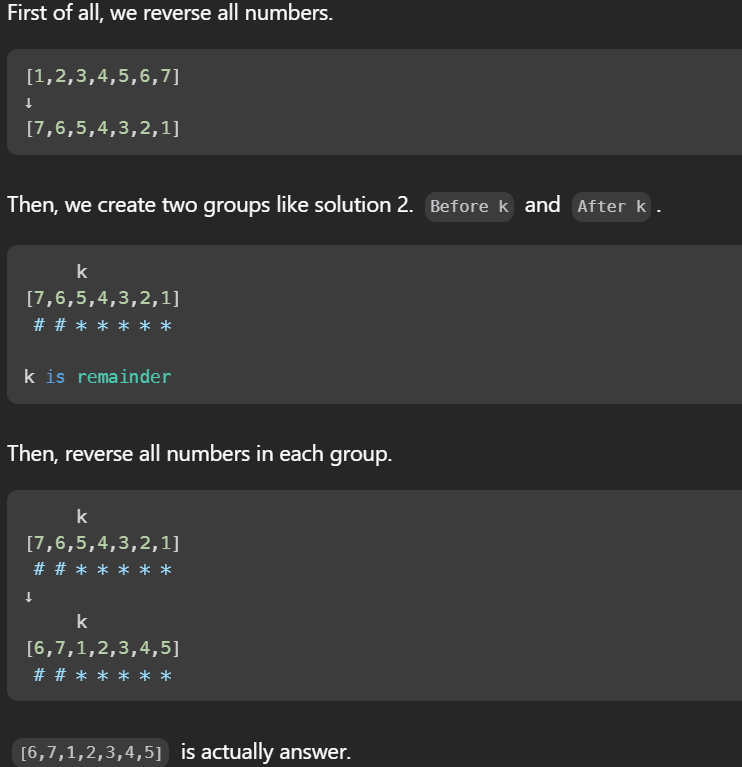

#Top Interview 150

## 5. Majority Element

### Moore Voting Algorithm - 
The intuition behind the Moore's Voting Algorithm is based on the fact that if there is a majority element in an array, it will always remain in the lead, even after encountering other elements.

```java
    public int majorityElementLC2(int[] nums) {
        int count = 0;
        int candidate = 0;
        
        for (int num : nums) {
            if (count == 0) {
                candidate = num;
            }
            
            if (num == candidate) {
                count++;
            } else {
                count--;
            }
        }
        
        return candidate;
    }
```

## 6. Rotate Array

### Optimum solution



```java
    public void rotate(int[] nums, int k) {
        k %= nums.length;

        reverse(nums, 0, nums.length - 1);
        reverse(nums, 0, k - 1);
        reverse(nums, k, nums.length - 1);
    }

    private void reverse(int[] nums, int left, int right) {
        while (left < right) {
            int temp = nums[left];
            nums[left] = nums[right];
            nums[right] = temp;
            left++;
            right--;
        }
    }
```

## 7. Best Time To Buy And Sell Stock

### Kadane's Algorithm

Kadane's Algorithm is a dynamic programming technique used to find the maximum subarray sum in an array of numbers. The algorithm maintains two variables: max_current represents the maximum sum ending at the current position, and max_global represents the maximum subarray sum encountered so far. At each iteration, it updates max_current to include the current element or start a new subarray if the current element is larger than the accumulated sum. The max_global is updated if max_current surpasses its value.

```java
    public static int maxProfit(int[] prices) {
        int profit = 0;
        int buy = prices[0];
        
        for(int i = 1; i < prices.length; i++){
            if(prices[i] < buy){
                buy = prices[i];
            }else if(prices[i] - buy > profit){
                profit = prices[i] - buy;
            }
        }

        

        return profit;
    }
```

## 7. Best Time To Buy And Sell Stock

### Greedy algorithms

Greedy algorithms are a class of algorithms that make locally optimal choices at each step with the hope of finding a global optimum solution. In these algorithms, decisions are made based on the information available at the current moment without considering the consequences of these decisions in the future. The key idea is to select the best possible choice at each step, leading to a solution that may not always be the most optimal but is often good enough for many problems.

- Profit Calculation:

     - Within the loop, there's an if statement checking if the current price (prices[i]) is greater than the buying price (start). If true, it indicates a potential profit opportunity.
    - The difference between the current price and the buying price (prices[i] - start) is calculated and added to max. This step simulates selling the stock bought at start price, capturing the profit, and then considering the current price as a new buying price for potential future transactions.
    - Regardless of whether a profit was made or not, the start is updated to the current price (prices[i]). This step prepares for the next iteration, considering the current day's price as the new buying price

```java
    public int maxProfit(int[] prices) {
        int max = 0;
        int buy = prices[0];
        for(int i = 1; i < prices.length; i++){
            if(buy < prices[i]){
                max += prices[i] - buy;
            }
            buy = prices[i];
        }
        return max;  
    
    }
```