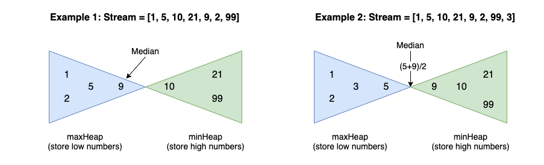

# Heap Questions

https://takeuforward.org/dsa/strivers-a2z-sheet-learn-dsa-a-to-z

## Easy

1. [X][Implement Min Heap](https://www.geeksforgeeks.org/problems/min-heap-implementation/1)
	>**Note :** We create a tree using array using parent /2 and all logic. [CodeHelp 16:00](https://www.youtube.com/watch?v=NKJnHewiGdc) -> Log n Magic
2. [X][Does array represent Heap](https://www.geeksforgeeks.org/problems/does-array-represent-heap4345/1)
	>**Note :** Heap means parent is always greatest amongst left and right subtree
3. [X][Convert Min Heap to Max Heap](https://www.geeksforgeeks.org/problems/convert-min-heap-to-max-heap-1666385109/1)
	>**Note :** Last Non leaf node - [(n // 2) - 1] which translates to -> (n-2)//2. Reverse loop in python `for i in range((N-2)//2, -1, -1)` swap elements `arr[i], arr[largest] = arr[largest], arr[i]`

## Medium

1. [X][Kth largest Element in an Array](https://leetcode.com/problems/kth-largest-element-in-an-array/description/)
	heappush, heappop
2. [X][Kth Smallest](https://www.geeksforgeeks.org/problems/kth-smallest-element5635/1)
3. [X][Sort K sorted array](https://takeuforward.org/data-structure/sort-k-sorted-array)
	Very Nice
4. [X][Replace Elements By Their Rank](https://leetcode.com/problems/rank-transform-of-an-array/description/)
5. [X][Task Scheduler](https://leetcode.com/problems/task-scheduler/)
	>**Note :** `count = Counter(tasks)` Stores count and value in form of key value pair dictionary. Proper Code with code comment saved
6. [X][Hand of Straights](https://leetcode.com/problems/hand-of-straights/)
	>**Note :** Excellent use of MinHeap [Neet Code](https://www.youtube.com/watch?v=amnrMCVd2YI) Get good idea on how to use `Counter()`

## Hard
1. [X][Merge k sorted Lists](https://leetcode.com/problems/merge-k-sorted-lists/description/)
2. [X][Design Twitter](https://leetcode.com/problems/design-twitter/)
3. [X][Minimum Cost to Connect Sticks](https://takeuforward.org/plus/dsa/problems/minimum-cost-to-connect-sticks?source=strivers-a2z-dsa-track)
4. [X][Kth Largest Element In a stream of running integers](https://leetcode.com/problems/kth-largest-element-in-a-stream/#:~:text=Implement%20KthLargest%20class%3A,largest%20element%20in%20the%20stream.)
	>**Note :** Keeping the priority queue of only k length, simple yet couldn't click
5. [X][Maximum Sum Combination](https://www.geeksforgeeks.org/problems/maximum-sum-combination/0)
	>**Note :** Coded Dumb Brute Force, Optimized -> Search right and one down for optimum result
6. [X][Find Medain from Data Stream](https://leetcode.com/problems/find-median-from-data-stream/)
	>**Note :** Brute Force `self.arr = SortedList()` to have an array which is sorted no need to use .sort(), Optimized Solution with very [nice explanation](https://leetcode.com/problems/find-median-from-data-stream/solutions/1330646/cjavapython-minheap-maxheap-solution-pic-dhpm/)
	
7. [X][Top k Frequent Elements](https://leetcode.com/problems/top-k-frequent-elements/description/)
