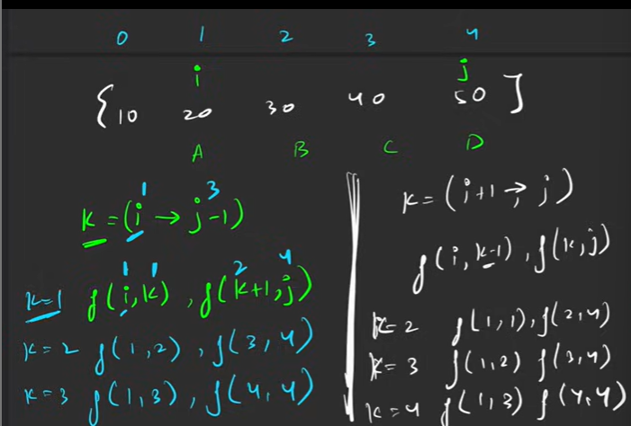
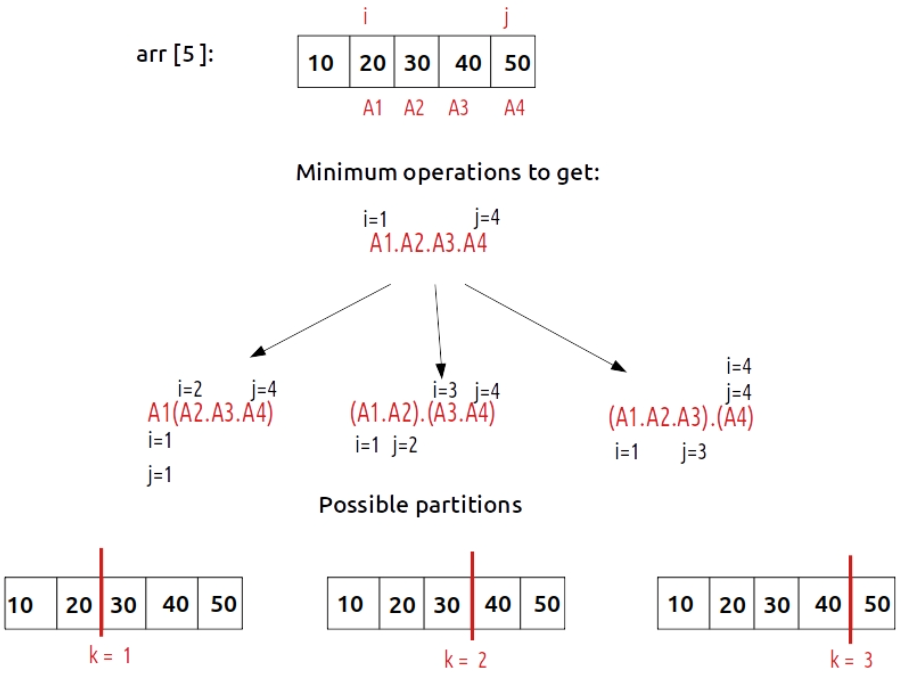
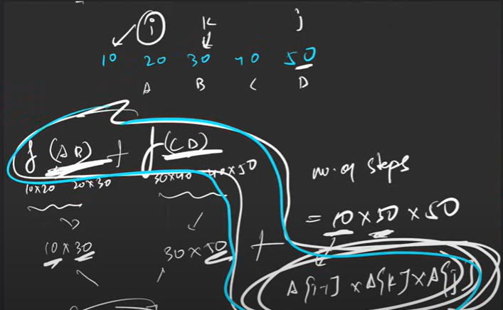
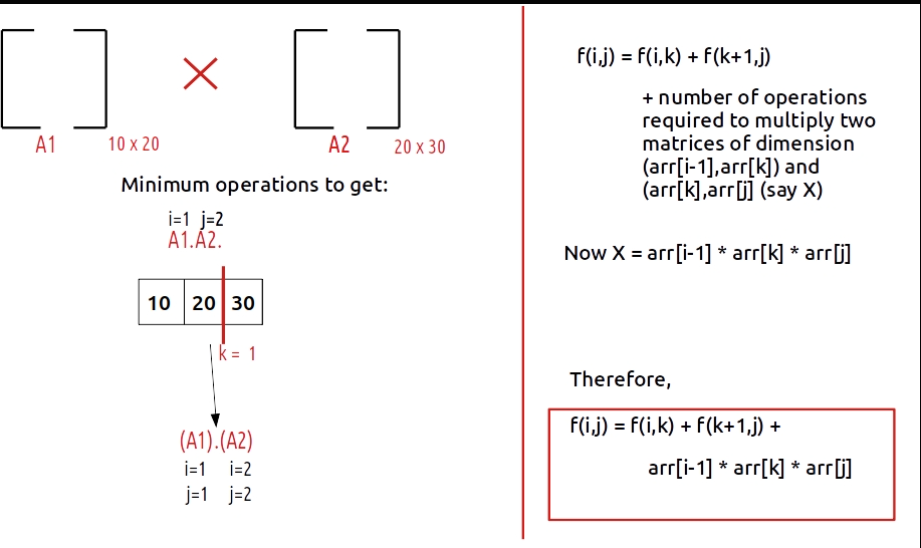
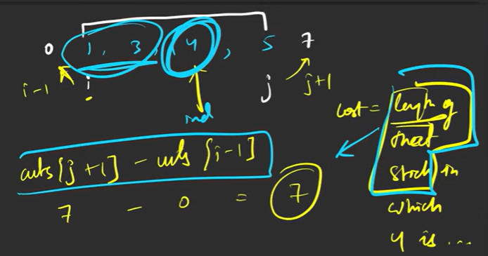
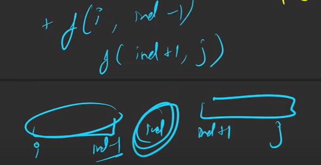
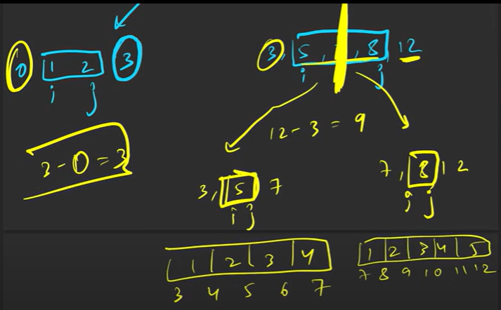
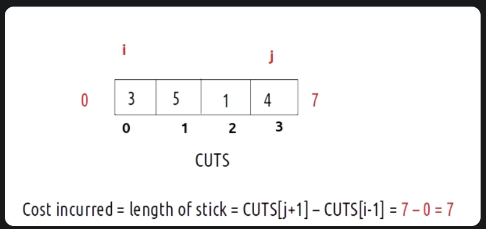

# Dynamic Programming

> Those who cannot remember the past are condemned to repeat it.

## Methods

1. ### Tabulation - Bottom up

Start from Base case and try to fetch for desired answer.

**Steps**
- Creating a DP array with all the possible sub-problem - `int[] dp = new int[n + 1];Arrays.fill(dp, -1);`.
- Compute the base cases - `dp[0] = 0;dp[1] = 1;`.
- From base case to solution convert recursion to a looping logic - `for(int i = 2; i <=n; i++) dp[i] = dp[i - 1] + dp[i - 2];`.
- 1st recursion call (most of the time last index) holds the ans - `return dp[n];`

**Complexity**
TC - O(n)
SC - O(n) *dp array*

2. ### Memorization - Top Down

>**Note :** It is found that Memorization is the fast solution.

We tend to store the value of sub problems in some map/ table. 

**Steps**
- Creating a DP array with all the possible sub-problem - `int[] dp = new int[n + 1];Arrays.fill(dp, -1);`.
- Store the ans before returning - `return dp[n] = f(n - 1, dp) + f(n - 2, dp);`.
- Before calling recursion check if there exists a prior solution - `if(dp[n] != -1) return dp[n];`.

**Complexity**
TC - O(n)
SC - O(2*n) *recursion stack space + dp array*

3. ### Space Optimization

Finding dependency recurring pattern of variables rather than whole array of variables. 

```java
int prev = 1;

for(int i=2; i<=n; i++){
    int cur_i = prev2+ prev;
    prev2 = prev;
    prev= cur_i;
}
return prev;
```

>**Note :** Whenever we use Space optimization always see if curr is be used in computation of curr. If not then it can be further optimized using only one array. See [0/1 Knapsack](../Knapsack01.java) or [Distinct Subsequence](../LeetCode/DistinctSubsequences.java)


**Complexity**
TC - O(n)
SC - O(1)

## When to use DP

1. Multiple ways to get a solution. Counting ways/ Figuring out the best way. This are recursion problems.

2. Converting Problem to Recursion 
    - Try to represent the problem in terms of index.
    - Do all possible stuff on that index according to problem statement.
    - Sum of all stuffs if its count or Min(all the stuff) for find minimum.

3. Convert Recursion to DP.

## Recursion Basics

Whenever it states all possible ways apply recursion.
Steps for recursion - 
1. Express everything in index
2. Do/Explore all stuffs
3. Sum up all ways or Max/Min.
    - Calculating Minimum => when destination is reached return the value at that point as we want to include in that path. But when we are going out of bound return very large number **Integer.MAX_VAL shouldn't be written as it is added with some integer which results in overflow and makes the value negative which is minimum always written 1e8** so that that path is never included.

>**Note :** Base Cases are of 2 types Out of bound and destination always write out of bound before destination.

If we want to count ways => In base case return 1 or 0 and then count for left and right and return left + right.

>**Note :** For Grid Questions Mem gives best TC and for Subsequence Tab gives the best TC.

## DP on grid

### Complexity for shuttle problem 0,0 -> n-1, m-1

1. Recursion - 
    - TC -> O(2^(m*n)) as each block has 2 options. 
    - SC O(path length) path length = (m - 1) + (n - 1)

2. Memorization - 
    - TC - All the calls will be made only once O(m*n)
    - SC - O((m - 1) + (n - 1)) + O(n*m)[Stack space]

>**Note :** Though Memorization and Tabulation takes equal time but Memorization is way faster than tabulation.

3. Tabulation - 
    - TC - O(n*m)
    - SC - O(n*m)

4. Space Optimization
    - TC - O(n*m)
    - SC - O(m)


## DP on Subsequence/ Subset

Subsequence/sub-array - Any contagious or non contagious is known as subsequence -> [1, 2, 3] has subsequence as [1, 2], [1, 3] but [3, 1] cannot be a subsequence.

1. Express(index, target) - For defining everything w.r.t index we will define problem on the basis of index and target. f(n-1, target) in entire array if there exist any index with target.
2. Explore possibilities of that Index i.e. part of subsequence/ not part of subsequence.
3. Return true or false.

In Memorization - DP size can go at maz to dp[index constraint  + 1][target constraint + 1]

In Tabulation - **It's tricky**
```java
    boolean[][] dp = new boolean[n][sum + 1];
    for(boolean[] ar: dp) Arrays.fill(ar, false);
    //For all the index where target is 0 its true
    for(int i = 0; i < n; i++) dp[i][0] = true;
    //For 0th index only if the target is a[0] we can find it n thus true.
    dp[0][arr[0]] = true;
```

Space optimization - **Tricky as well**
```java
    int[] dpPrev = new int[k + 1];
    //Every k = 0 is true;
    dpPrev[0] = 1;
    //For 0th index num[0] will only return true
    if(k >= num[0]) dpPrev[num[0]] = 1;

    for(int i = 1; i < n; i++){
        int[] dpCurr = new int[k + 1];
        //This is important initialization as copying curr to prev it wont have 1 at 0th.
        dpCurr[0] = 1;
        for(int target = 1; target < k; target++){
```

>**Note :** If we are declaring curr before for loop then while coping prev = curr wont work we will simply point prev to curr which will be used in next loop. Instead we have to use `prev = curr.clone()`

OR We Can use

```java
    int[] dpPrev = new int[k + 1];
    //Every k = 0 is true;
    dpPrev[0] = 1;
    //For 0th index num[0] will only return true
    if(k >= num[0]) dpPrev[num[0]] = 1;

    for(int i = 1; i < n; i++){
        int[] dpCurr = new int[k + 1];
        //If starting this loop from 0 it will fetch prev value from prevDP[0].
        for(int target = 0; target < k; target++){
```

### If Values are negative

DP can store from 0 to upwards. For tackling negative index and it's value we can use HashMap with something like this `map<pair<int,int>,int>`

### Infinite supply / Multiple use

In such cases the notTake remains the same but take stays on the same index as after taking we can still take it just add a condition that the term which is been taken is less than the target.

**Complexity of Recursion**

Time - Here time complexity becomes complex as it's no longer O(2^n), it is way greater than this as we can stay at the same index for a while so we simply state its *Exponential Time Complexity*.

Space - Auxiliary Recursion Stack space is no longer O(n) as the call can be made target times if lets say take is 1 for target t. Thus auxiliary stack space becomes O(target).

## DP on String.

Common Pattern Comparison or replaces/edit.

1. Comparison -
    Here it will be match/non match
    - Match - 1 + f(i - 1, j - 1) Move both indexes when match is found.
    - Non Match - Two possibilities
        - 0 + f(i - 1, j) and 0 + f(i, j - 1) => 0 + Max(f(i - 1, j), f(i, j - 1)) if max is specified.

    - Complexity Recursion - 
        - TC - O(2^n * 2^m)
        - SC - Auxiliary stack space - O(n + m)

>**Note :** As we have -1 in base case thus we can't write this in dp thus we uses index shifting. It is called as 1 based indexing.

## DP on stocks

Buy Sell Logic -

```java
    //Buy
    if(buy ==  1){
        // take means money gets negative, turn buy to 0
        int take = -prices[i] + helperRec(i + 1, 0, prices);
        //Not take - buy stays the same will buy next day
        int notTake = 0 + helperRec(i + 1, 1, prices);

        return Math.max(take, notTake);
    }else{
        //Sell - prices added Next time open to buy
        int sell = +prices[i] + helperRec(i + 1, 1, prices);

        //Still on sell flag will sell another day
        int notSell = 0 + helperRec(i + 1, 0, prices);
            
        return Math.max(sell, notSell);
    }
```

Modified Memoization

```java
    for(int i = n - 1; i >= 0; i--){
        int take = -prices[i] + dp[i + 1][0];
        int notTake = 0 + dp[i + 1][1];

        //For buy this will run
        dp[i][1] = Math.max(take, notTake);
        
        int sell = +prices[i] + dp[i + 1][1];
        int notSell = 0 + dp[i + 1][0];

        // for sell this will be responsible
        dp[i][0] = Math.max(sell, notSell);
    }
```

Space optimization can be done using variables also rather than 2 array.

```java
    int aheadSell = 0, aheadBuy = 0, currBuy, currSell;
    for(int i = n - 1; i >= 0; i--){
        for(int buy = 0; buy <= 1; buy++){
            
            //Math.max(Buy, NotBuy)
            currBuy = Math.max(-prices[i] + aheadSell, 0 + aheadBuy);
            //Math.max(Sell, NotSell)
            currSell = Math.max(prices[i] + aheadBuy, 0 + +aheadSell);

            aheadBuy = currBuy;
            aheadSell = currSell;
        }
    }

    return aheadBuy;
```

Transaction Number tracking logic even is buy odd is sell. After every buy - sell cycle only transaction is completed.

```java
    //Even we buy
    if(txnNo % 2 == 0){
        return Math.max( -prices[i] + helperRec(i + 1, txnNo + 1, prices, n), 0 + helperRec(i + 1, txnNo, prices, n));
    }
    //Sell
    return Math.max(+prices[i] + helperRec(i + 1, txnNo + 1, prices, n), 0 + helperRec(i + 1, txnNo, prices, n));
```

## DP on Longest Increasing Subsequence

Index becomes -> f(ind, prevInd);

HelperTab -> index goes from n - 1 to 0 and prevInd from n - 2 to -1 but actually prevInd always goes from index - 1 to -1

```java
    for(int ind = n - 1; ind >= 0; ind--)
        for(int prevInd = ind - 1; prevInd >= -1; prevInd--)
```

Printing the subsequence -> We use different type of tabulation which keeps a track of longest subsequence till that index including itself and a hash to store the parent of each index

```java
    //dp[i] -> Signifies the longest increasing substring that ends at index i
    int[] dp = new int[n];
    //Even if  there is nothing before that element LIS of that element is going to be 1 including itself.
    Arrays.fill(dp, 1);
    int maxi = 1;

    //For printing LIS. Hash will store the parent of that element
    int[] hash = new int[n];
    int lastIndex = 0;

    for(int i = 0; i < n; i++){
        //Initially the parent will be the element itself
        hash[i] = i;
        for(int prev = 0; prev < i; prev++){
            //Or whatever the condition is for LDS nums[i] % nums[prev] == 0
            if(nums[i] > nums[prev] && 1 + dp[prev] > dp[i]){
                dp[i] = 1 + dp[prev];
                hash[i] = prev;
            }
        }
        if(dp[i] > maxi){
            maxi = Math.max(maxi, dp[i]);
            lastIndex = i;
        }
    }
    List<Integer> LIS = new ArrayList<>();
    LIS.addLast(nums[lastIndex]);
    while(hash[lastIndex] != lastIndex){
        lastIndex = hash[lastIndex];
        LIS.addLast(nums[lastIndex]);
    }
```

## Partition DP

Multiple options in every call.

From entire array different partitions needs to be calculated where each partition will return different answer. (Complex Question)[https://www.youtube.com/watch?v=vRVfmbCFW7Y&list=PLgUwDviBIf0qUlt5H_kiKYaNSqJ81PMMY&index=49&ab_channel=takeUforward]






[Code](../MatrixChainMultiplication.java) contains good explanation.

Minimum cost to cut the stick - 





Cut logic





### Front partition - 

Start from start and check if partition is possible. Example - 
[Palindrome Partition II](https://www.youtube.com/watch?v=_H8V5hJUGd0&list=PLgUwDviBIf0qUlt5H_kiKYaNSqJ81PMMY&index=54&ab_channel=takeUforward) 

[Partition Array For Maximum Sum](https://www.youtube.com/watch?v=PhWWJmaKfMc&list=PLgUwDviBIf0qUlt5H_kiKYaNSqJ81PMMY&index=55&ab_channel=takeUforward)

## Questions

1. Minimum Falling Path Sum

The grid has negative values thus filling dp with -1 will crash the code. `for(int[] arr: dp) Arrays.fill(arr, Integer.MIN_VALUE);`.
As we have no start or no end so calculate for all the possible ans.

```java
//Memo in base function
for(int i = 0; i < n; i++){
    min = Math.min(min, helperMem(m - 1, i, n,matrix, dp));
}

//Tab in Tab function
int maxi = Integer.MAX_VALUE;
for(int j = 0; j < m; j++)
    maxi = Math.min(maxi, dp[n - 1][j]);
return maxi;
```

2. Cherry Pickup 2 - [link](https://www.youtube.com/watch?v=QGfn7JeXK54&list=PLgUwDviBIf0qUlt5H_kiKYaNSqJ81PMMY&index=14&ab_channel=takeUforward)

We have to handle two movement simultaneously. Both will reach destination at the same time as every movement move to next row thus we can use one i only. For all the paths there are actually 9 possible combination for every one move other could have moved in three combination.

As 3 variables are the dependant one we use 3D dp.

```java
int[][][] dp = new int[n][m][m];
for(int[][] twoD: dp){
    for(int[] oneD : twoD) Arrays.fill(oneD, -1);
}
```

[Tabulation code](../LeetCode/CherryPickupII.java) is also tricky.

Complexity - Time => O(3^n * 3^n) Space => O(n) Auxiliary stack space.

3. [Partition Array Into Two Arrays To Minimize Sum Difference](https://www.youtube.com/watch?v=GS_OqZb2CWc&list=PLgUwDviBIf0qUlt5H_kiKYaNSqJ81PMMY&index=17&ab_channel=takeUforward)

Great Question with unique approach and in-depth tabulation flow and logic explained in the video. Leetcode question is not solved, Striver's solution works only for positive elements. 

4. Count Partitions with given difference. 

If can become a sum of count a subset with sum k with modified sum like 

S1 > S2 Thus S1 = TotalSum - S2;

S1 - S2 = D, Therefore TotalSum - S2 - S2 = D;

S2 = (TotalSum - D)/2; Will be the required Sum.

Thus question becomes find subsets with sum equal to modified sum. But it increases few cases TotalSum - D >= 0 and as it is been divided by 2 thus the value should be even.

This has the modified solution to count a subset with sum k.

5. 0/1 KnapSack

Super optimization using single array is achieved.

```java
    static int helperSOO(int[] wt, int[] val, int n, int W){

        // As dependency is on index - 1 and wt or wt - 1;
        // So if we go from wt -> 0 we can use the values to LHS
        int[] dpSO = new int[W + 1];
        //Another way to initialize the dp array where all the weights above wt[0] for first row will return value.
        for(int w = wt[0]; w <= W; w++) dpSO[w] = val[0];

        for(int index = 1; index < n; index++){
            for(int w = W; w >= 0; w--){

                int notTake = 0 + dpSO[w];
                int take = Integer.MIN_VALUE;
                if(wt[index] <= w)
                    take = val[index] + dpSO[w - wt[index]];

                dpSO[w] = Math.max(take, notTake);
            }
        }

        return dpSO[W];
    }
```

6. Coin Change

The take and notTake part is modified to adjust the questions need. Take stays in the same index to compute if the updated amount can be formed staying there only.

>**Note :** Whenever the question states as Infinite Supply or Multiple use the index will stay there itself in case of take.

Complexity for Normal Recursion -
- TC - O(>>2^n) As we stay there even after taking thus We just say Exponential
- SC - >>O(n) As way more recursion call can be made at max O(amount)

7. Target Sum [Question](../LeetCode/TargetSum.java).

**Crazy approach** we can assign +/- to any number and count the ways in which target can be achieved. We have already done [Count Partitions With Given Difference](../CountPartitionsWithGivenDifference.java). 

E.g. [1, 2, 3, 1] , target 3 -> +3 +2 -1 -1, +3 -2 +1 +1

Which can be written as (3, 2) - (1, 1) i.e **Partition Subarray with difference 3**

8. [Print Longest Common Substring](https://www.youtube.com/watch?v=_wP9mWNPL5w&list=PLgUwDviBIf0qUlt5H_kiKYaNSqJ81PMMY&index=28&ab_channel=takeUforward) & [Print Longest Common Subsequence](https://youtu.be/-zI4mrF2Pb4?si=Qncsh8pkq4w5pazw) & [Shortest Common Supersequence](https://www.youtube.com/watch?v=xElxAuBcvsU&list=PLgUwDviBIf0qUlt5H_kiKYaNSqJ81PMMY&index=32&ab_channel=takeUforward)

Subsequence need not to be continuous but it needs to be in order. Substring needs to be continuous string.

Video explains beautifully how substring Tabulation works. But Tabulation method can only be used if there is only 1 potential solution.

Shortest Common Supersequence is leetcode hard but it uses printing LCS so brilliantly.

9. Longest Palindromic Subsequence

Seems like difficult question where we might have to calculate all the potential subsequence and find out which are palindrome and which has the highest length.

But we can simply solve it using Longest common subsequence where S1 is normal string and S2 is reversed string.

Best method to reverse a string

```java
    StringBuilder s2 = new StringBuilder(s);
    s2.reverse();
    return helperSO(s, s2.toString());
```

10. Minimum Insertion Steps to Make a String Palindrome

This is DP hard, but its very easy keep the longest palindromic subsequence. and all the rest needs to be added to make the string palindrome. It has two concepts first to figure out how to calculate longest palindromic subsequence by reversing original string. Then figuring out that length - length of longest palindromic subsequence gives the answer.

10. [Longest Increasing Subsequence](../LeetCode/LongestIncreasingSubsequence.java)

Crazy logics like tabulation and hashing to print Longest Increasing Subsequence. Binary search approach to further optimized.

>**Note :** `Collections.binarySearch(arr, target);` it returns ind if found but if not found returns negative value where the target must be inserted to keep the order intact.

```java
    int ind = Collections.binarySearch(temp, nums[i]);
    if (ind < 0) ind = -ind - 1;
    temp.set(ind, nums[i]);
```

[Largest Divisible Subset](../LeetCode/LargestDivisibleSubset.java) Gives crazy logic of sorted divisibility.

>**Note :** [Longest String Chain](../LeetCode/LongestStringChain.java) `Comparator<String> strComparator = (s1, s2) -> s1.length() - s2.length();` this is how comparators are written always a lambda function.

11. [Burst Balloons](https://www.youtube.com/watch?v=Yz4LlDSlkns&list=PLgUwDviBIf0qUlt5H_kiKYaNSqJ81PMMY&index=52&t=96s&ab_channel=takeUforward)

Simple partitioning won't work as after popping ballon its RHS and LHS become dependant on each other. Crazy logics moving in opposite direction and all for making sub-problem independent.

