# Graph

## Nomenclature

1. Nodes - Numbered data structure which will store the data.
2. Vertex/Edge - connection between the nodes.

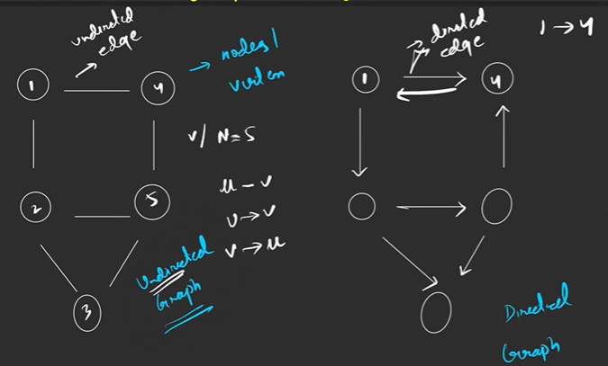

3. Undirected Graph - Directionless vertex/edge.
4. Directed Graph - Ever edge has direction it can be single or bidirectional.

5. Tree can also be called a graph.

6. Undirected cyclic graph - Graph with atleast one close structure.
7. Directed Acyclic graph (DAG) - No edge completes a cycle.
    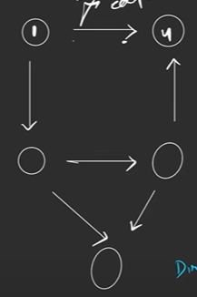

8. Path - Contains lot of nodes where each of them are reachable and node cannot have multiple occurrence of single node.

9. Degree of node - 

    - Undirected 
        - Number of edges attached to it.
        - Total degree of graph = 2*Edge .

        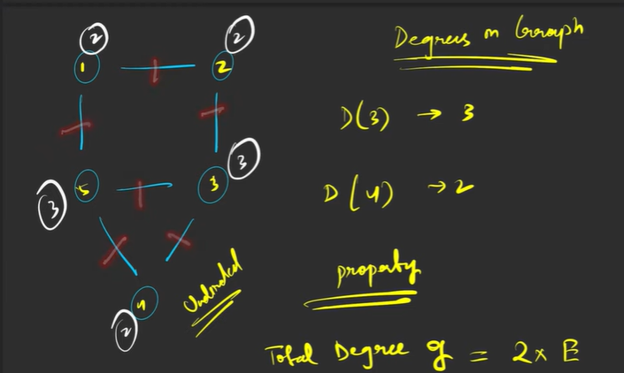
    - Directed
        - Indegree - Number of incoming edges.
        - Outdegree - Number of outgoing edges.

10. Edge weights - If weights are not assigned we assume it to be unit weight.

    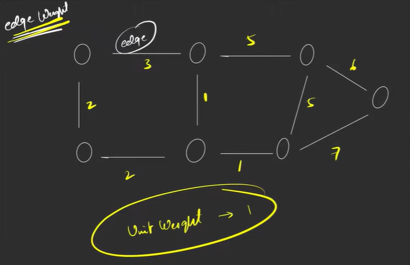

## Graph Representation


Input(5, 6) n - nodes and m - edges.

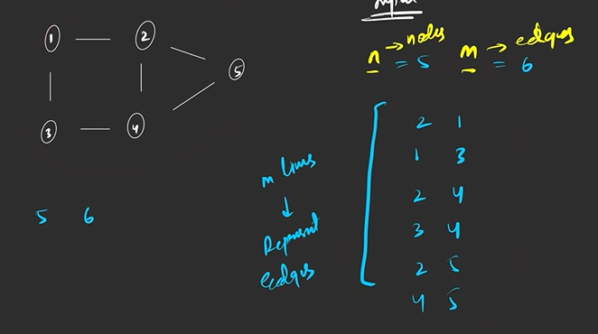

**Two methods to store** 

1. Matrix - Costly

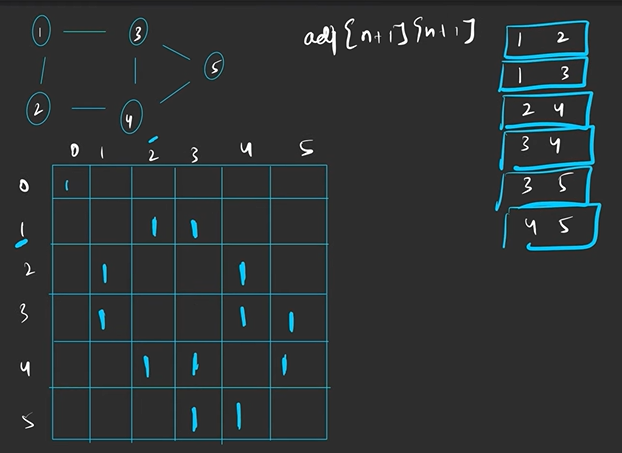
```c++
int main(){
    int n, m;
    cin >> n >> m;
    int adj[n + 1][m + 1];
    for(int i = 0; i < m; i++){
        int u, v;
        cin>>u>>v;
        //For weighted insert the weight instead of 1
        adj[u][v] = 1;
        adj[v][u] = 1;
    }
    return 0;
}
```


2. List - Adjacency list more efficient SC - O(2E)
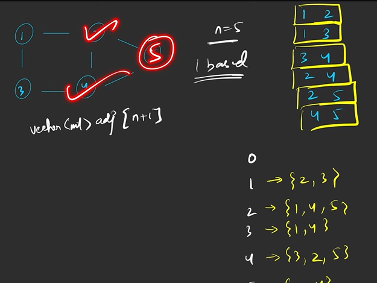

For directed just specify one link
```c++
int main(){
    int n, m;
    cin >> n >> m;
    vector<int> adj[n + 1];
    for(int i = 0; i < m; i++){
        int u, v;
        cin>>u>>v;
        //For weighted store pair with node and its weight
        adj[u].push_back(v);
        //omit next for directed
        adj[v].push_back(u);
    }
    return 0;
}
```

## Connected Components

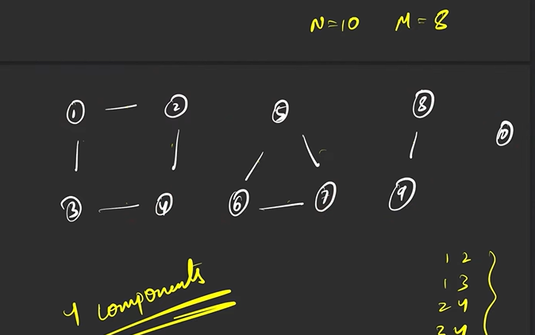*4 components of a single graph*

For each traversal we carry a visited array which keeps the track of each node and for all the unvisited nodes we will start traversal from that node.

## Traversal Technique

>**Note :** Both takes Time complexity of O(n + 2*E) where e is number of edges.

1. BFS - Breadth first search.

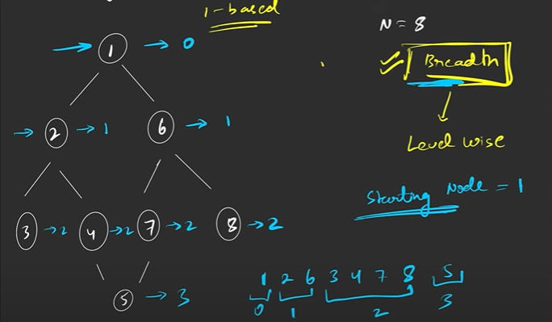

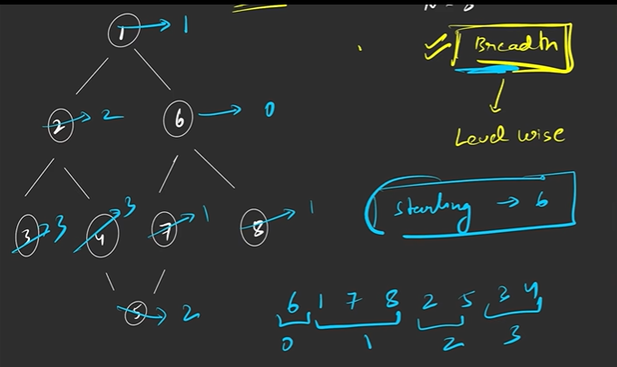

Use Queue and visited array.

2. DFS

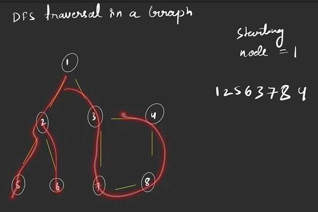

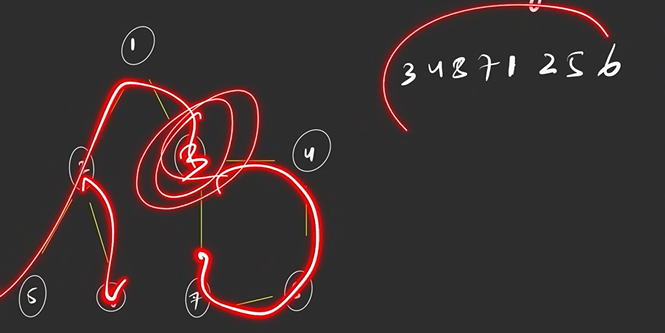

## Questions

Good Questions - 
1. Number of Distinct Islands - [Video](https://www.youtube.com/watch?v=7zmgQSJghpo&list=PLgUwDviBIf0oE3gA41TKO2H5bHpPd7fzn&index=16&ab_channel=takeUforward) [Code](../NumberOfDistinctIsland.java)

2. Find Eventual Safe State - using TopoSort - [Video](https://youtu.be/2gtg3VsDGyc?si=WYejcfeFU36sjoeh) [Code](../Leetcode/FindEventualSafeStates.java)

3. Shortest Path In Binary Matrix - As weight is unit it goes on increasing in linear fashion thus using Queue instead of priority queue is better solution as it saves log(n) for adjusting PQ. 

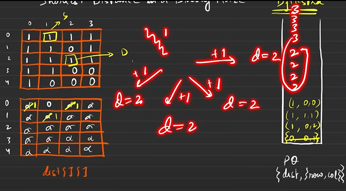

4. Cheapest Flights within K stops = [Video](https://www.youtube.com/watch?v=9XybHVqTHcQ&list=PLgUwDviBIf0oE3gA41TKO2H5bHpPd7fzn&index=38&ab_channel=takeUforward)

Normal dist[] array for judgement clashes with stops to cost ratio and restricts the access to optimum path. We will fetch priority queue on the basis of stops and for stops there is unit incrimination thus no need of priority queue, queue is sufficient.

5. Number of ways to arrive at destination - [Video](https://www.youtube.com/watch?v=_-0mx0SmYxA&list=PLgUwDviBIf0oE3gA41TKO2H5bHpPd7fzn&index=40&ab_channel=takeUforward)

Directly counting number of ways to destination wont be correct approach

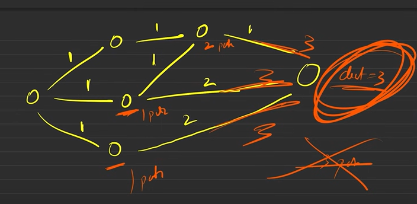*Normal approach gives 2 but actual ans is 3*

We need to count the ways arriving at nodes and count accordingly.

6. Accounts Merge

*While merging add all the emails to ultimate parent*

This is how its initialize like and array crazy - `ArrayList<String>[] mergeMail = new ArrayList[n];`

7. Number of Islands II

[Video](https://www.youtube.com/watch?v=Rn6B-Q4SNyA&list=PLgUwDviBIf0oE3gA41TKO2H5bHpPd7fzn&index=51&ab_channel=takeUforward)

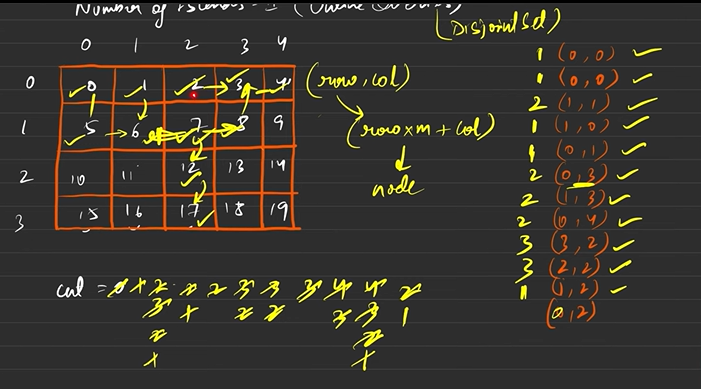

This is how we fetch map Entries
```java
for(Map.Entry<String, Integer> it: mapMailNode.entrySet()){
    String mail = it.getKey();
    //Crazy Step
    int node = ds.findUPar(it.getValue());
    mergeMail[node].add(mail);
}
```

8. Most Stones Removed with Same Row or Column

[Vide](https://www.youtube.com/watch?v=OwMNX8SPavM&list=PLgUwDviBIf0oE3gA41TKO2H5bHpPd7fzn&index=53&t=3s&ab_channel=takeUforward)

Every stone can be removed except one stone. Thus we can derive

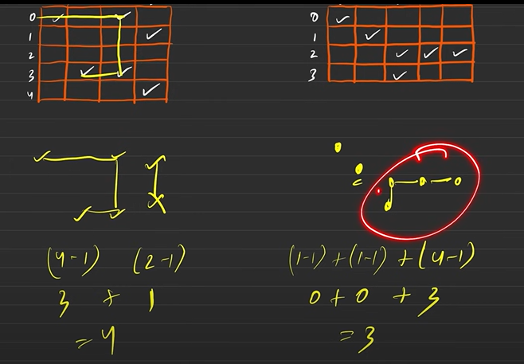

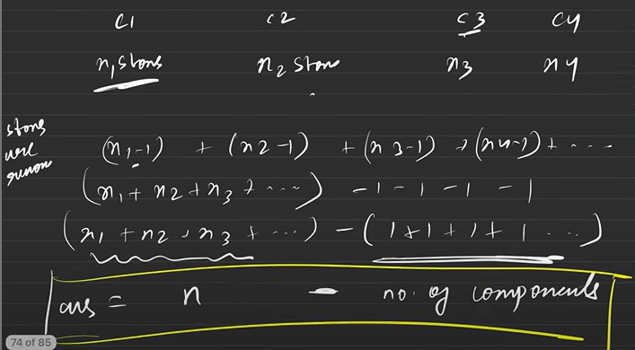

Weird mapping technique.

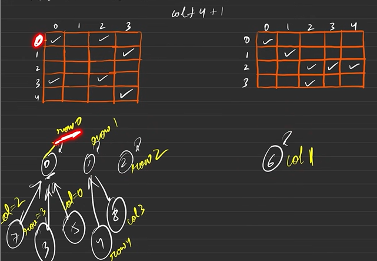

9. Critical Connections in a network

[Video](https://www.youtube.com/watch?v=qrAub5z8FeA&list=PLgUwDviBIf0oE3gA41TKO2H5bHpPd7fzn&index=55&ab_channel=takeUforward)


Complex DFS

## Bipartite Graph

Color the graph with 2 colors such that no adjacent nodes have same color.

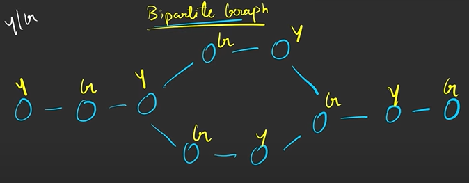

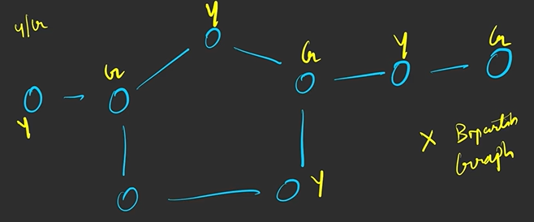

Linear graph with no cycle are always bipartite.
Any Graph with even cycle length are bipartite.
Thus graph with odd cycle length is not bipartite.

## Topological Sorting 

Linear ordering of vertices such that if there is an edge between u & v, u appears before v in that ordering. It occurs only for directed acyclic graph. There can be multiple valid linear ordering.

>**Note :** Whenever there is order of operation involved topo sort can be used.

1. DFS - Keep a track of vis and path vis can be vis but not path vis.

### Kahn's Algorithm

2. BFS - Kahn's Algorithm - Keep the track of inDegree of nodes.

## Dijkstra's Algorithm - Shortest Path

It doesn't work on negative wights/graph with cyclic negative weight.

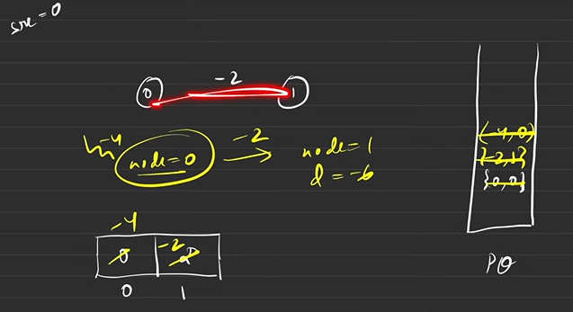

Time Complexity - E log(V)

It has difficult derivation - 

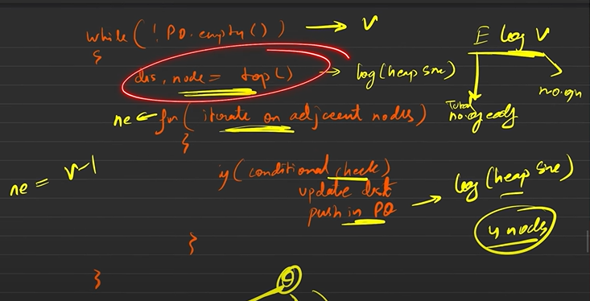*Considering dense graph where each node is connected to every node thus adj list will have V - 1 iterations.*

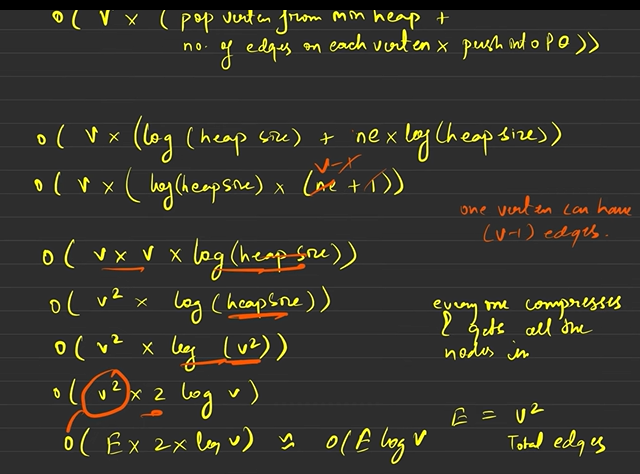*Heap size is consider v*v as assuming every time every node is pushing all the dense connections and V*V is E if we apply logic*

Implementation is possible by - 
1. Priority Queue
    - Queue can also be used.
    - Takes greater larger time.
    - Uses minHeap - stores {dist, node} 


### Queue vs Priority Queue

For Queue also it works. But we traverse unnecessary path and compute potential answer for these path. It is kind of brute force. Priority queue gives kind of greedy approach.

2. Set - In java using TreeSet or HashSet it is not possible only Cpp solution.
    - Best for time complexity.
    - Set store unique values which store data in **ascending order**
    - Stores {dist, node}, once we encounter visited node with better distance delete it from set and replace with better solution. 
    
    >**Note :**set.erase() takes log n but saves excessive recursive call. 

    ```cpp
    vector<int> dijkstra(int V, vector<vector<int>> adj[], int S){
        set<pair<int, int>> st;
        vector<int> dist(V, le9);

        st.insert({0, S});
        dist[S] = 0;

        while(!st.empty()){
            auto it = *(st.begin());
            int node = it.second;
            int dis = it.first;
            st.erase(it);

            for(auto it: adj[node]){
                int adjNode = it[0];
                int edgW = it[1];

                if(dis + edgW < dist[adjNode]){
                    //erase if it existed
                    if(dist[adjNode] != le9)
                        st.erase({dist[adjNode], adjNode});

                    dist[adjNode] = dis + edgW;
                    st.insert({dist[adjNode], adjNode});
                }
            }
        }
        return dist;
    }
    ```

## Bellman Ford Algorithm

It tackles the issue of negative wight and negative cycle. Helps to detect negative cycles.

It is applicable only for directed graph. For undirected graph we can use following method.


Relax all the edges n - 1 times sequentially.

Relax means -> if(dist[u] + wt < dist[V]) dist[V] = dist[u] + wt
this needs to be done n - 1 times.

1st Iteration - 

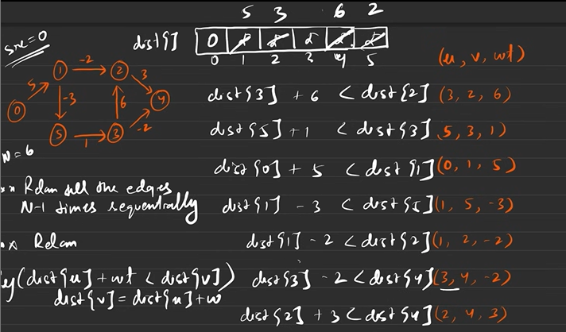*Carry out same process n -1 times*

### Why n - 1?

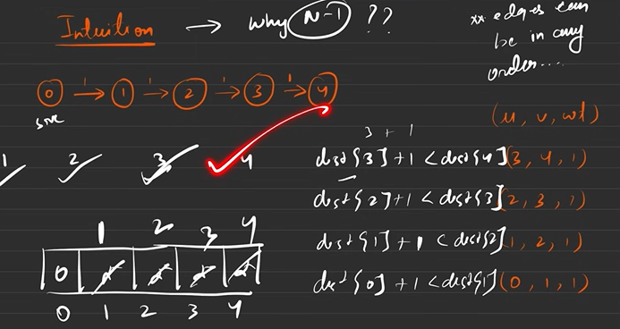*Each iteration fetches values for next node*

Since in a graph with N nodes, in worst case you will take N-1 edges to reach from the first to last, thereby we iterate for N-1 iterations.

### How to detect negative cycle

On Nth iteration relaxation is done and dist[] is reduced then we are present in an infinite negative loop as we seen above that n - 1 is suffice to relax complete dist[] array.

>**Note :** Time Complexity is V*E while Dijkstra took V log(E) thus Dijkstra is time efficient. Thus bellman is used only for negative graph.

## Floyd Warshall Algorithm

Multi source shortest path algorithm doesn't calculate shortest path from single source. Detects negative cycles. We use adjacency matrix method to store the graph. Cost matrix is used to store the weights.

### Logic - 

Try all the paths for i -> j => Min(d[i][k] + d[k][j]);

We use dynamic programming logic for pre computed data. 

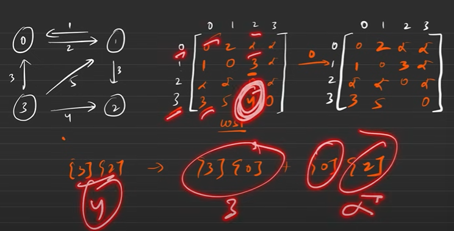*All paths via 0*

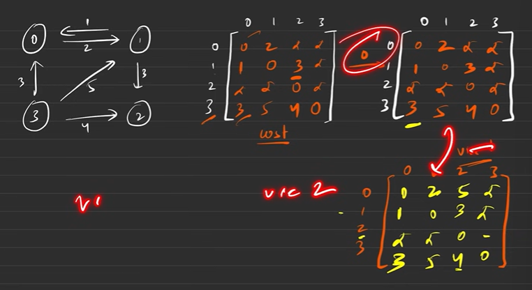

### Pseudo Code

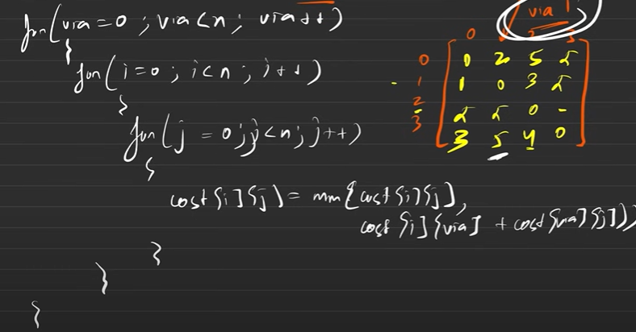

### How to detect negative cost

If cost[i][i] < 0 its a negative cycle because it should always be 0;

### Complexity

TC - O(E^3) SC - O(E^2)

>**Note :** In case of applying Dijkstra Algorithm for each Node TC - EV*Log(E) 

## Minimum Spanning tree - 

Spanning Tree => A tree in which we have N nodes and N-1 edges and all nodes are reachable from each other. Minimum total weight spanning tree is Minimum spanning tree. 

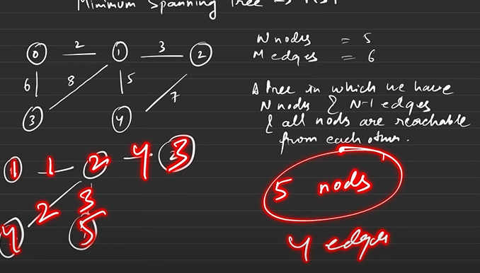

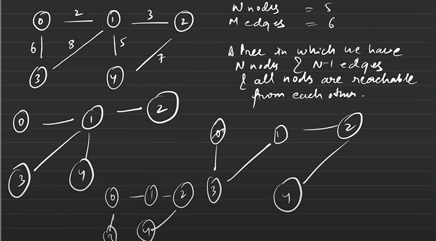

Algorithms - 

### Prim's Algorithm

Requirement - Priority Queue (wt, node, parent) with least wight on top and Vis array vis array to be marked post poll() and not while offer(). Intuition is greedy Algorithm.

[Code](../PrimsAlgorithm.java)

Time Complexity - E Log E

### Kruskal's Algorithm

1. Sort all the edges according to the weight.
2. Use [Disjoint Set](#disjoint-set) on the sorted edges.
    - It will keep on adding non connected nodes.
    - As array is sorted so Least to max edge weight will be added.

## Disjoint Set

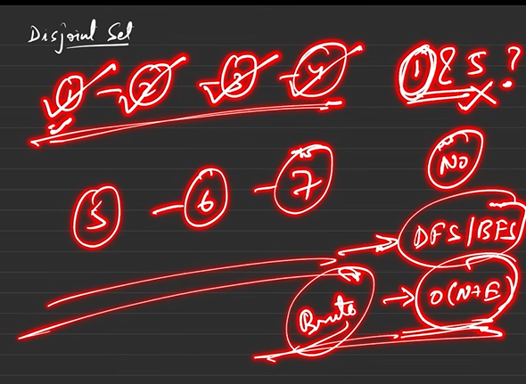

Disjoint graph fetches if two nodes are part of same graph or not in constant time. They are part of dynamic graphs.

## Function

1. FindParent() -> returns ultimate parent.
2. Union
    - Rank
    - Size

Initially all the nodes are isolated, union connects the node.

### Union By Rank - Union(u, v)

1. Find ultimate parent of u and v -> pu and pv.
2. Find rank of ultimate parent -> pu and pv.
3. Connect smaller rank to larger rank.

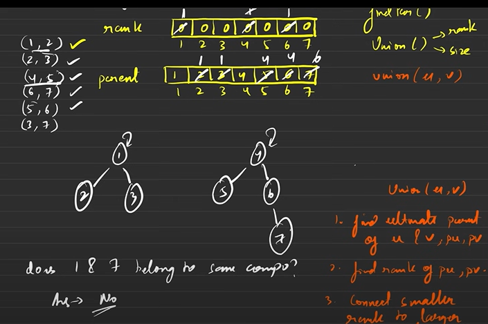

>**Note :** log(n) time is needed theoretically.

### Path Compression -

We omit the links - 

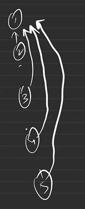

But path compression can hampers the rank.

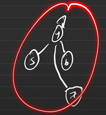*Rank of 4 is 2 but after path compression it becomes 1*

Thus in path compression we don't hamper, rank and therefore they are called rank and not height.

Time complexity - O(4*alpha) alpha is almost constant thus we consider time complexity as constant.

### Why connect smaller to larger

If we connect larger to smaller height increases and larger path compression will occur.

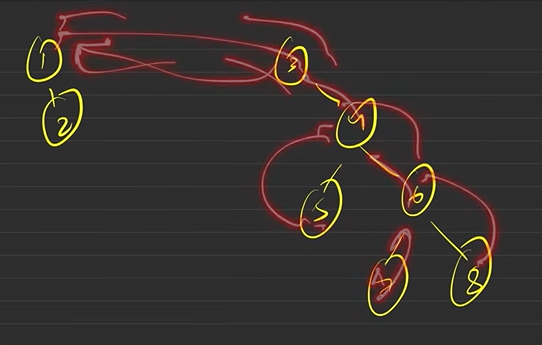
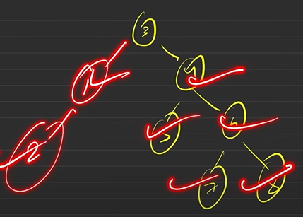

### Union by Size

Keeps a track of whats the size of parent. It is more intuitive

## Strongly connected graph

Valid only for directed graph.

## Korsraju's Algorithm

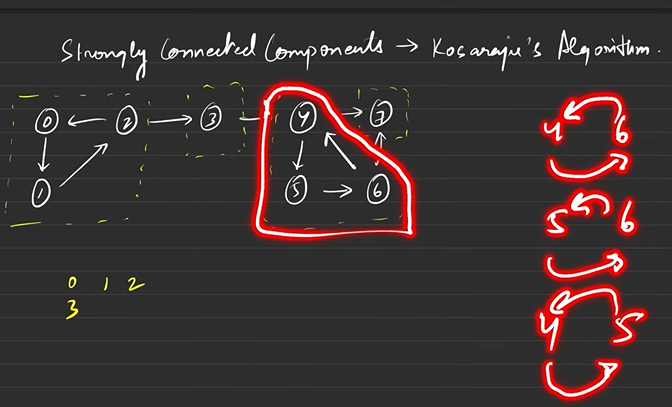

### Intuition - 

1. Each SCC are connected to each other.
2. Reverse the edges. SCC's connection will break but all nodes inside SCC will still be connected to each other.

### Steps -

1. Sort all the edges according to finish time. Perform DFS.
2. Reverse the graph.
3. Do a DFS.

### Time Complexity - O(3(E + V))

## Critical Connections - Tarjan's Algorithm

Connections on whose removal graph gets split into 2 or more components.

Bridges in a Graph using time in and low time - [Video](https://www.youtube.com/watch?v=qrAub5z8FeA&list=PLgUwDviBIf0oE3gA41TKO2H5bHpPd7fzn&index=55&ab_channel=takeUforward), [Question](../Leetcode/CriticalConnectionsInANetwork.java)

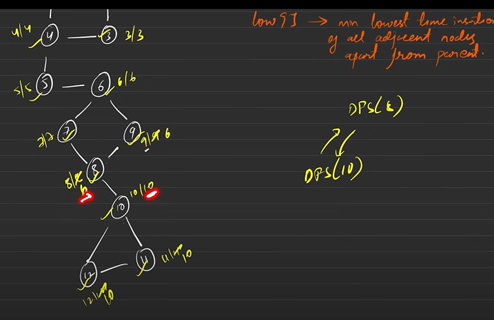

>**Note :** In low -> ignore parent

>**Note :** Complex DFS, Thus time complexity is O(V+E)

## Articulation Points

Nodes on whose removal the graph breaks into multiple components. 0 can never be articulation point.

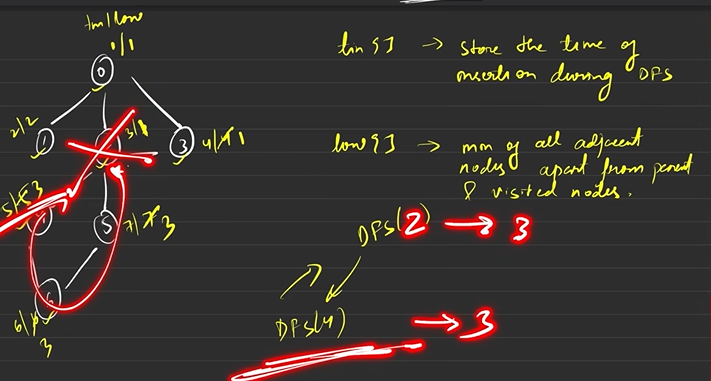*Can reach 2 only through 2*

>**Node :** Do not apply same logic to root. Add Logic as it root has multiple children its articulation point.

>**Note :** In low -> ignore visited and parents low. For visited take it's tin. We can encounter same articulation point multiple times.
