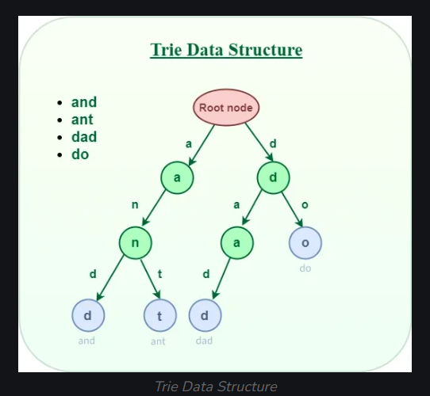
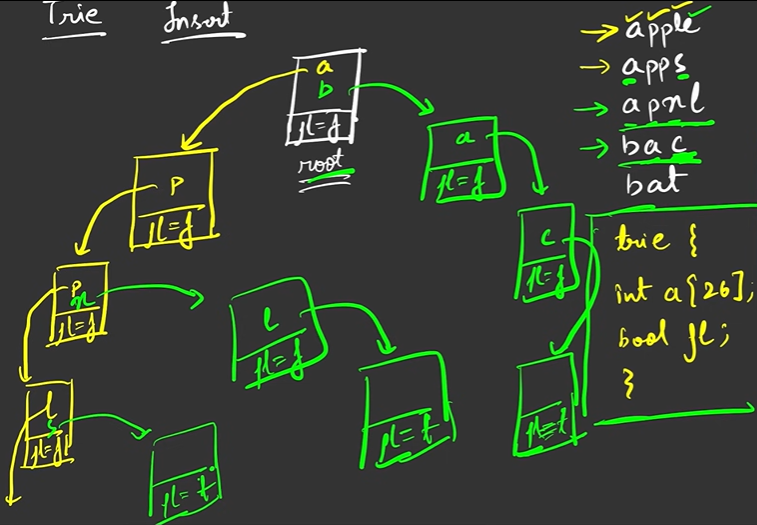
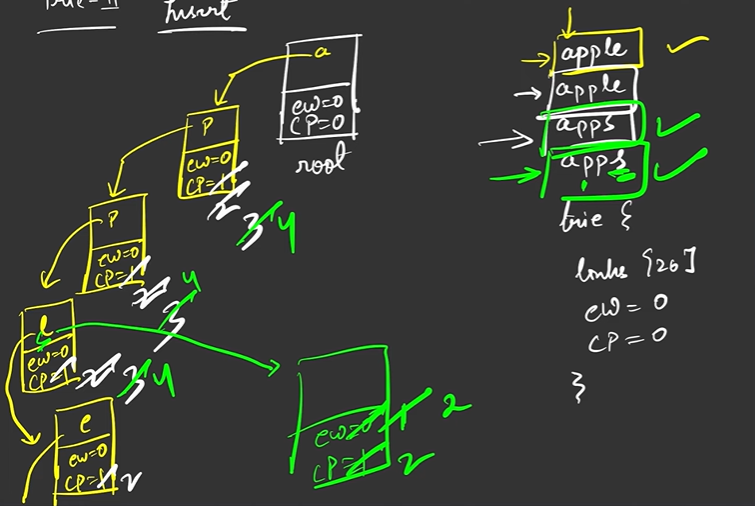
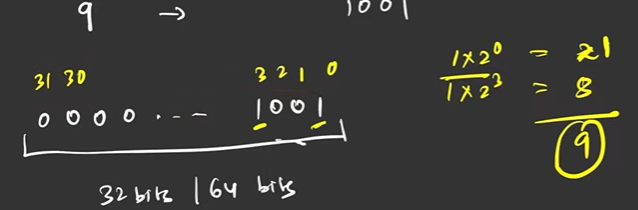
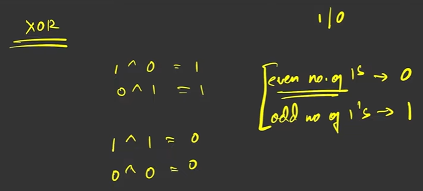
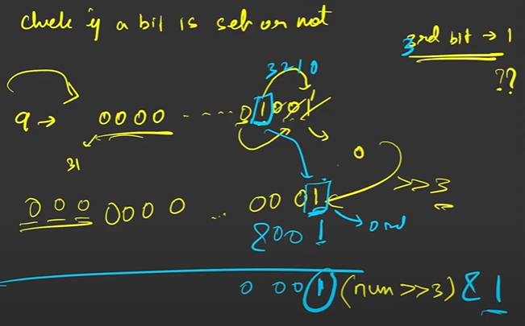
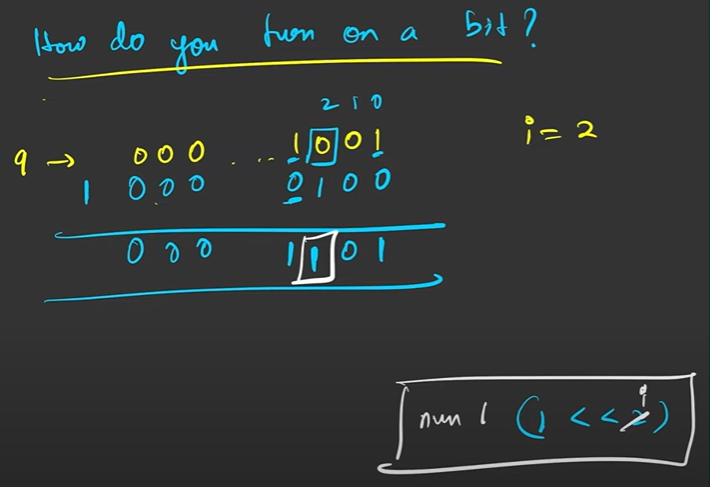
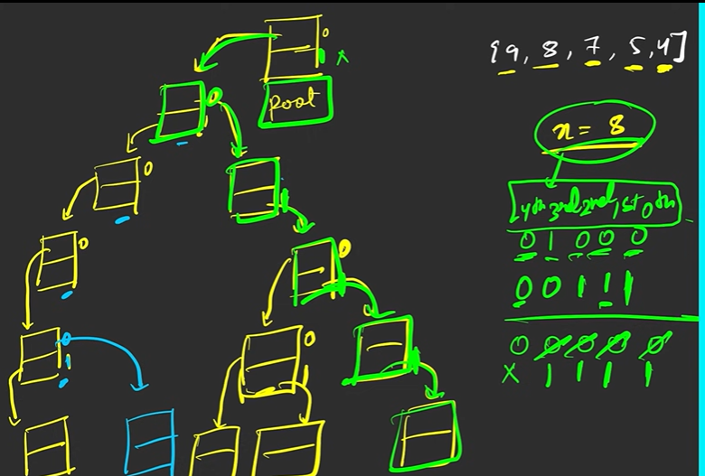

# Trie

It is a class which have two variables. Array of size 26 and boolean flag. It as a root.

## Function

1. Insert
    Whenever inserting start with root and ask if the character doesn't exist insert it and make it point to another trie go on doing it recursively until whole word is inserted. When the word is completed mark the flag as true.

    

    *Implementation 1*

    *Implementation 2*

2. Search
    Start from the root and traverse through the tree to check if the word exist then check if the next flag is true or not to signify that the word ended.

3. StartsWith
    Start from the root and traverse through the tree to check if the word exist then check if the next flag is false which confirms there are characters after that.

## Bit Perquisites for Tries

