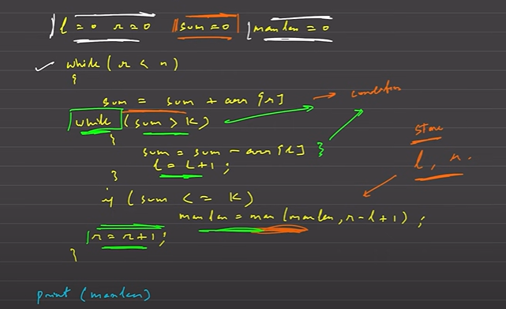
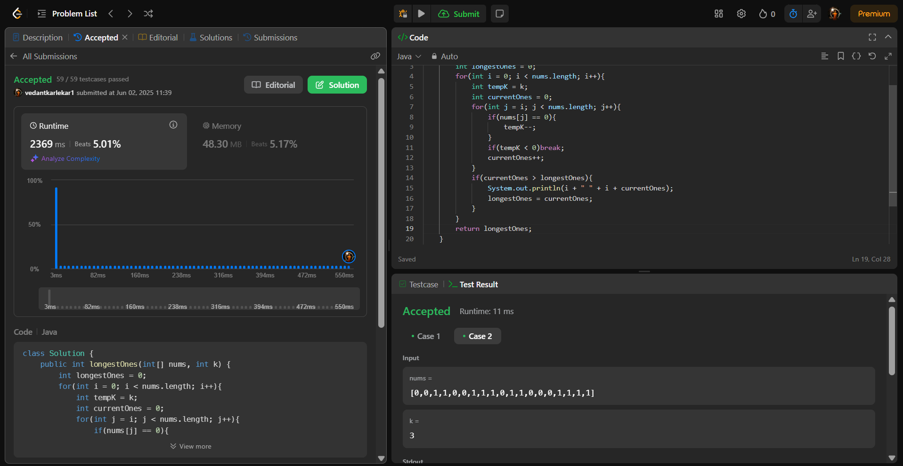

# Two Pointer and Sliding Window

## Problems

1. Constant Window
2. Longest Subarray/ Substring where Condition. O(N + N)
    - Brute force
        - Generate all subarray i & j. O(n^2).
    - Better 2 pointer and sliding window
        - Start with window size of 1.
        - Expand right and shrink left.
    - More optimize O(N)
        - Tackling shrinking issue.
        - Dont shrink beyond the maxLen keep that length constant till more better ans is not found, if maxLen is to be found but finding subarray wont suffice this condition.
3. No of subarray where condition
    - Using pattern 2. e.g. [PS1](../LeetCode/SubarraysWithKDifferentIntegers.java) , [PS2](../LeetCode/CountNumberOfNiceSubArray.java), [PS3](../LeetCode/BinarySubarraysWithSum.java)
    - Eg. No of subarray with sum = k
        - Find the number of subarray where sum <= k
        - Find the subarray where sum <= k - 1
        - Subtract both.
4. Finding shortest/minimum window condition.

## Template -

1. Initialize the condition and size of window.
2. While right < arr.length
3. If window is valid expand right pointer.
4. Make window valid till condition is satisfied by shrinking left pointer.

 *White and part of green are constant*

## Time complexity -

At max left will move to O(n) and right might also move at worst O(n)
TC - O(N)

Worst Solution Achievement - 

